# 12 Weeks Ftp Builder

## Overview

- **Total Weeks:** 12
- **Total Workouts:** 58
- **Total TSS:** 4259
- **Total Hours:** 76.8
- **Average TSS/Week:** 355
- **Average Hours/Week:** 6.4

## Intensity Distribution

- **Recovery (<60% FTP):** 24.9%
- **Endurance (60-75% FTP):** 51.0%
- **Tempo (76-87% FTP):** 5.2%
- **Threshold (88-105% FTP):** 17.7%
- **VO2max (>105% FTP):** 1.1%

## Program Calendar

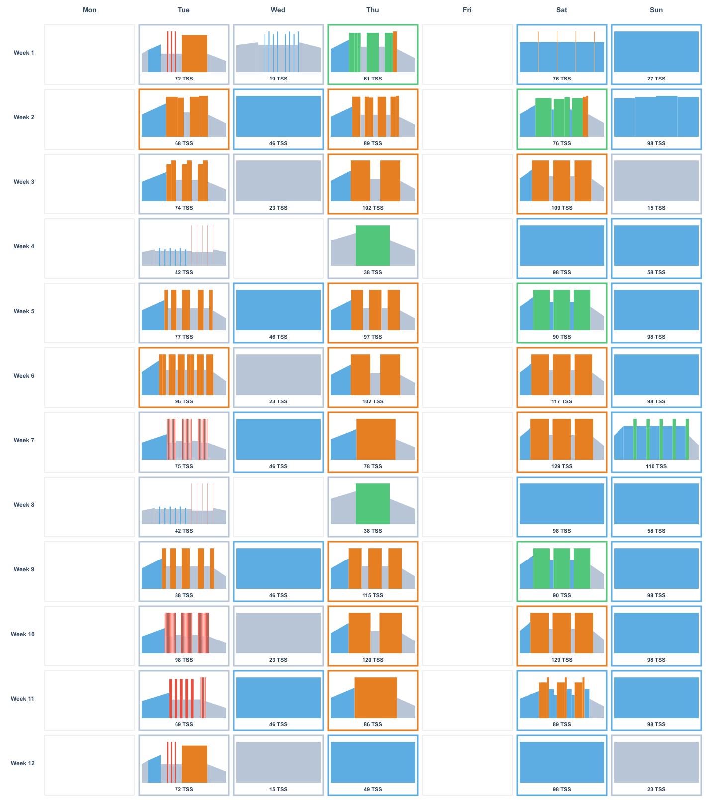

## Progression Analysis

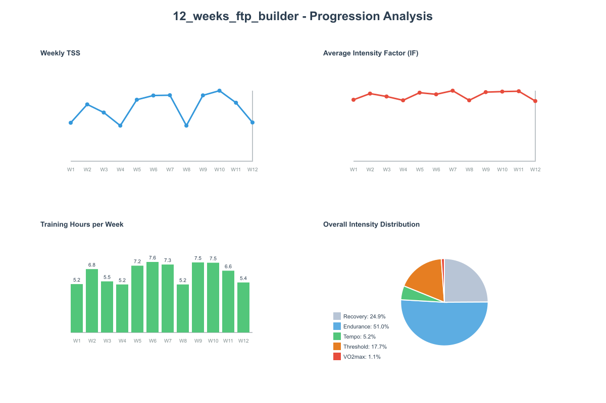

## Weekly Breakdown

### Week 1

**Weekly Total:** 255 TSS, 5.2 hours

| Day | Workout | Details |
| --- | ------- | ------- |
| **Tuesday** | **FTP Test**  | • 67 min · 72 TSS · IF 0.81 |
| **Wednesday** | **Recovery**  | • 39 min · 19 TSS · IF 0.54 |
| **Thursday** | **Tempo** 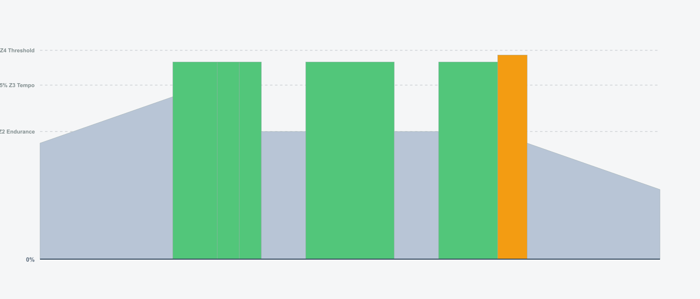 | • 70 min · 61 TSS · IF 0.72 |
| **Saturday** | **Endurance** 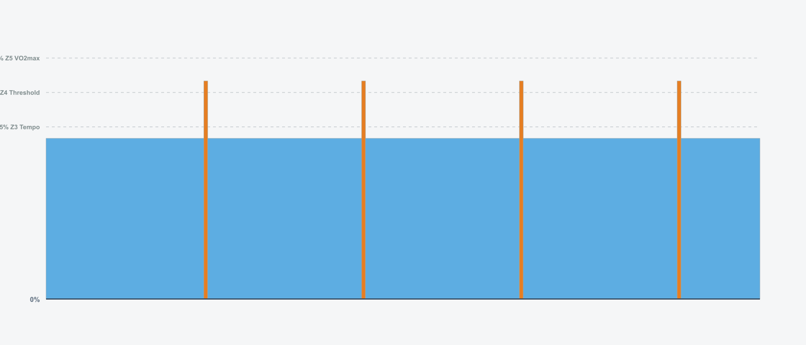 | • 91 min · 76 TSS · IF 0.71 |
| **Sunday** | **Recovery** 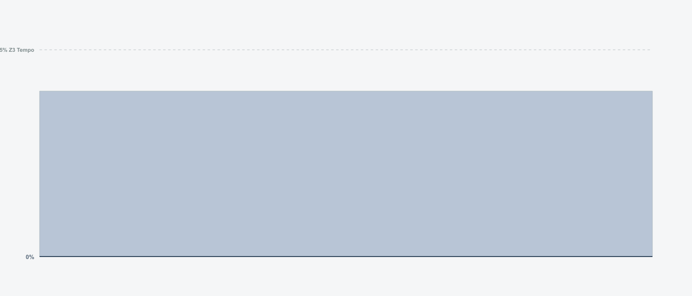 | • 45 min · 27 TSS · IF 0.60 |

### Week 2

**Weekly Total:** 377 TSS, 6.8 hours

| Day | Workout | Details |
| --- | ------- | ------- |
| **Tuesday** | **Sweet Spot** 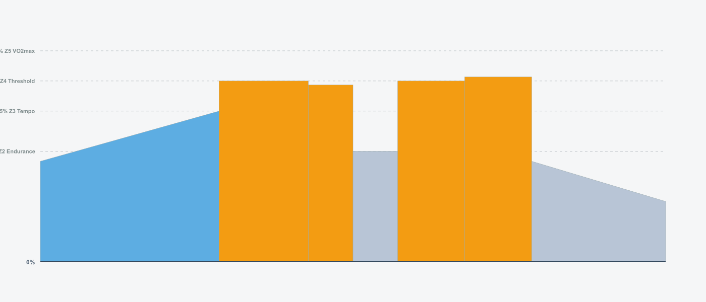 | • 70 min · 68 TSS · IF 0.76 |
| **Wednesday** | **Easy Spin** 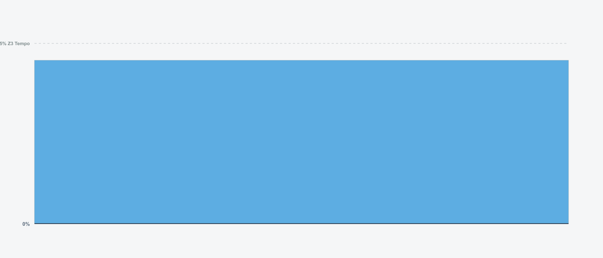 | • 60 min · 46 TSS · IF 0.68 |
| **Thursday** | **FTP Intervals** 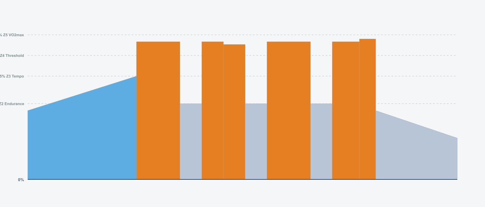 | • 79 min · 89 TSS · IF 0.82 |
| **Saturday** | **Tempo Endurance**  | • 79 min · 76 TSS · IF 0.76 |
| **Sunday** | **Long Endurance** 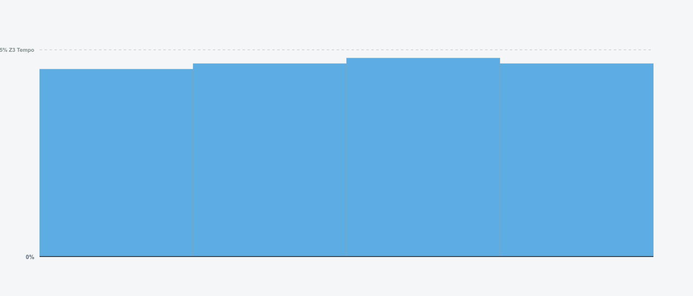 | • 120 min · 98 TSS · IF 0.70 |

### Week 3

**Weekly Total:** 323 TSS, 5.5 hours

| Day | Workout | Details |
| --- | ------- | ------- |
| **Tuesday** | **Over Unders** 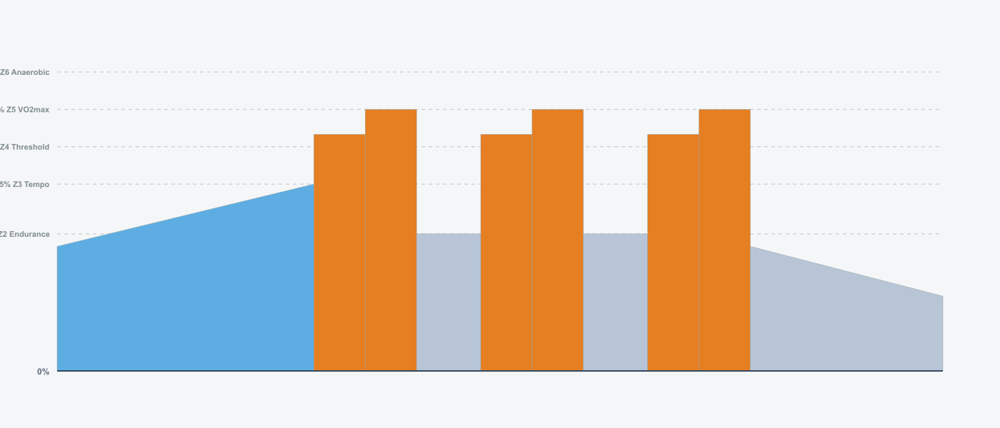 | • 69 min · 74 TSS · IF 0.80 |
| **Wednesday** | **Recovery**  | • 45 min · 23 TSS · IF 0.55 |
| **Thursday** | **Extended Threshold** 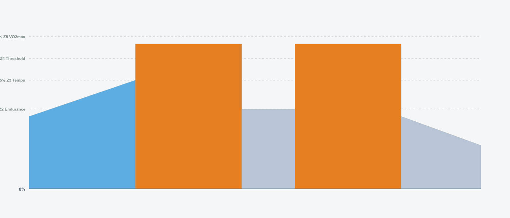 | • 85 min · 102 TSS · IF 0.85 |
| **Saturday** | **Sweet Spot Progression**  | • 100 min · 109 TSS · IF 0.81 |
| **Sunday** | **Easy Spin**  | • 30 min · 15 TSS · IF 0.55 |

### Week 4

**Weekly Total:** 236 TSS, 5.2 hours

| Day | Workout | Details |
| --- | ------- | ------- |
| **Tuesday** | **Recovery Cadence** 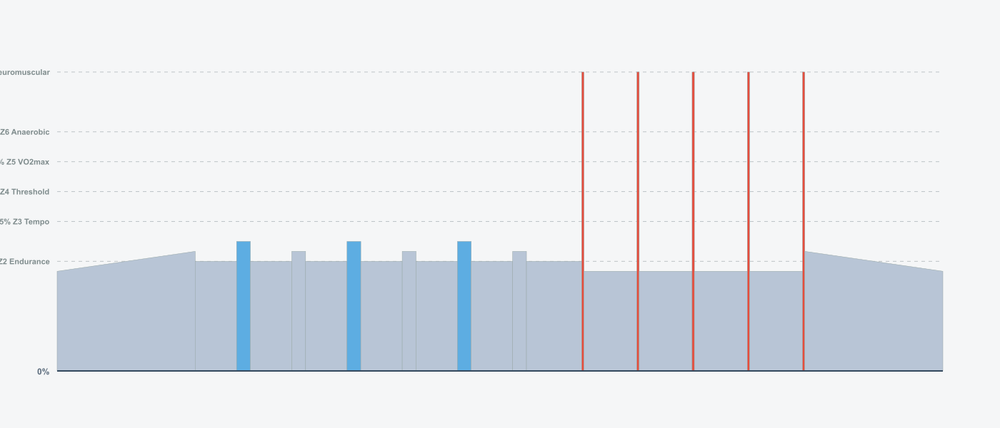 | • 64 min · 42 TSS · IF 0.63 |
| **Thursday** | **Light Tempo**  | • 50 min · 38 TSS · IF 0.67 |
| **Saturday** | **Easy Endurance**  | • 120 min · 98 TSS · IF 0.70 |
| **Sunday** | **Recovery**  | • 75 min · 58 TSS · IF 0.68 |

### Week 5

**Weekly Total:** 408 TSS, 7.2 hours

| Day | Workout | Details |
| --- | ------- | ------- |
| **Tuesday** | **Pyramid Intervals** 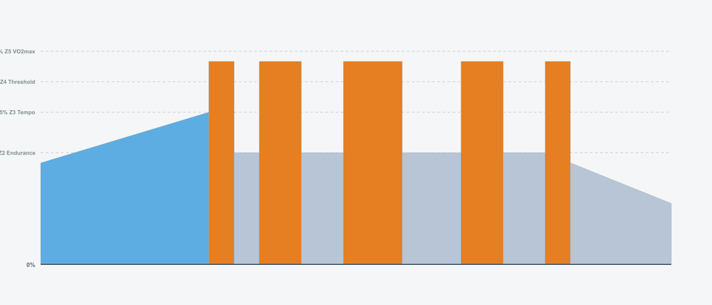 | • 75 min · 77 TSS · IF 0.78 |
| **Wednesday** | **Easy Spin**  | • 60 min · 46 TSS · IF 0.68 |
| **Thursday** | **Progressive Threshold** 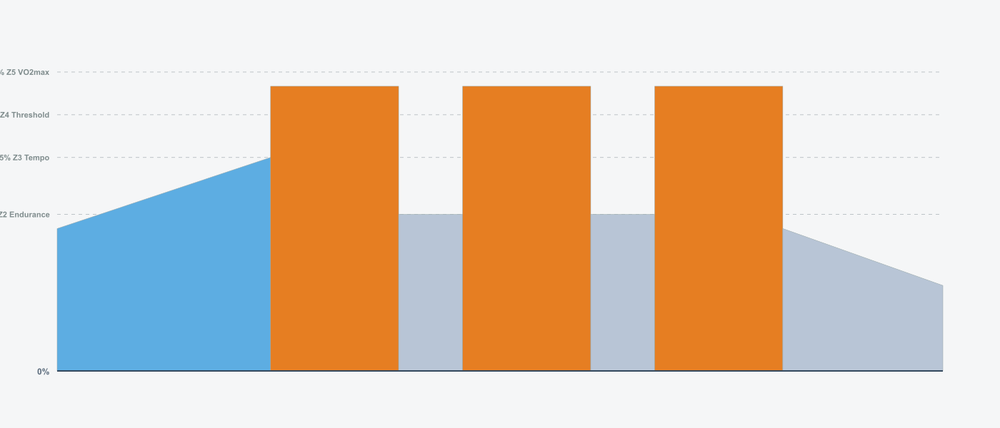 | • 83 min · 97 TSS · IF 0.84 |
| **Saturday** | **Tempo Endurance Long**  | • 92 min · 90 TSS · IF 0.77 |
| **Sunday** | **Long Endurance**  | • 120 min · 98 TSS · IF 0.70 |

### Week 6

**Weekly Total:** 436 TSS, 7.6 hours

| Day | Workout | Details |
| --- | ------- | ------- |
| **Tuesday** | **Push and Pull** 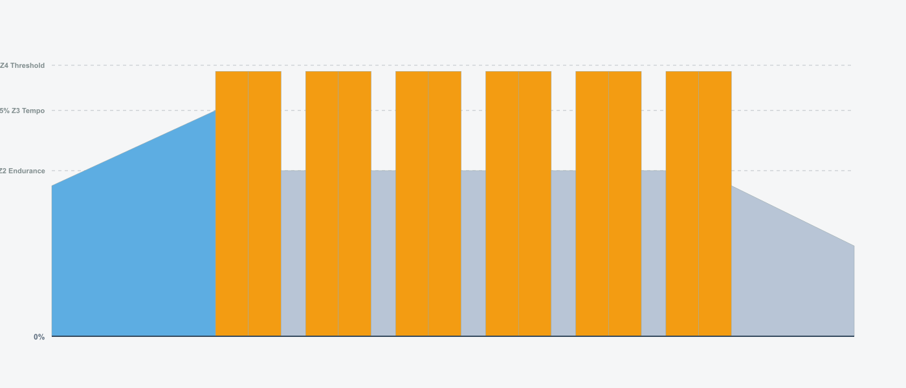 | • 98 min · 96 TSS · IF 0.77 |
| **Wednesday** | **Recovery**  | • 45 min · 23 TSS · IF 0.55 |
| **Thursday** | **FTP 2x20**  | • 85 min · 102 TSS · IF 0.85 |
| **Saturday** | **Sweet Spot 3x22**  | • 106 min · 117 TSS · IF 0.81 |
| **Sunday** | **Endurance**  | • 120 min · 98 TSS · IF 0.70 |

### Week 7

**Weekly Total:** 438 TSS, 7.3 hours

| Day | Workout | Details |
| --- | ------- | ------- |
| **Tuesday** | **VO2max 30 30s** 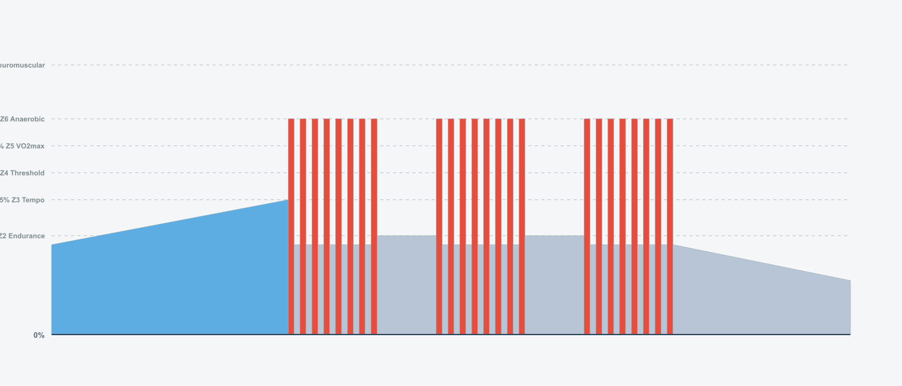 | • 68 min · 75 TSS · IF 0.82 |
| **Wednesday** | **Easy Spin**  | • 60 min · 46 TSS · IF 0.68 |
| **Thursday** | **FTP 30min**  | • 65 min · 78 TSS · IF 0.85 |
| **Saturday** | **Sweet Spot 3x25**  | • 115 min · 129 TSS · IF 0.82 |
| **Sunday** | **Endurance Tempo**  | • 130 min · 110 TSS · IF 0.71 |

### Week 8

**Weekly Total:** 236 TSS, 5.2 hours

| Day | Workout | Details |
| --- | ------- | ------- |
| **Tuesday** | **Recovery Cadence**  | • 64 min · 42 TSS · IF 0.63 |
| **Thursday** | **Light Tempo**  | • 50 min · 38 TSS · IF 0.67 |
| **Saturday** | **Easy Endurance**  | • 120 min · 98 TSS · IF 0.70 |
| **Sunday** | **Recovery**  | • 75 min · 58 TSS · IF 0.68 |

### Week 9

**Weekly Total:** 437 TSS, 7.5 hours

| Day | Workout | Details |
| --- | ------- | ------- |
| **Tuesday** | **Pyramid Intervals** 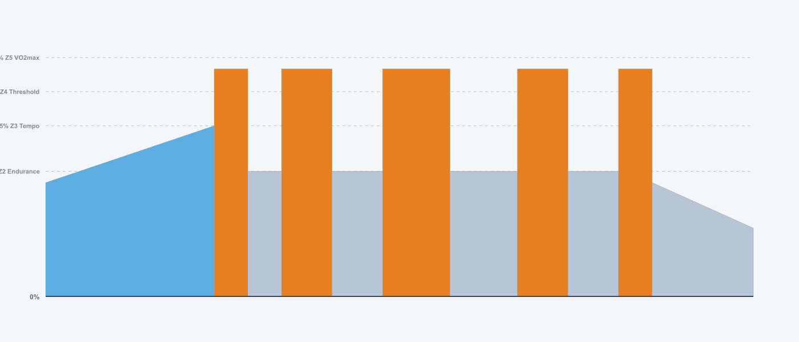 | • 84 min · 88 TSS · IF 0.80 |
| **Wednesday** | **Easy Spin**  | • 60 min · 46 TSS · IF 0.68 |
| **Thursday** | **FTP 3x15** 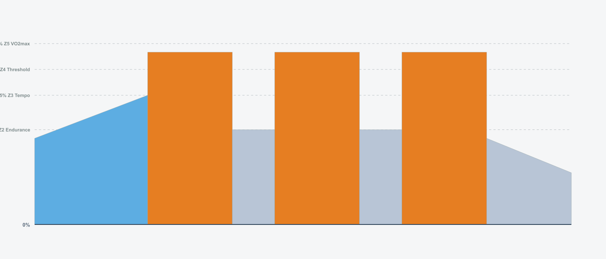 | • 95 min · 115 TSS · IF 0.85 |
| **Saturday** | **Tempo Endurance**  | • 92 min · 90 TSS · IF 0.77 |
| **Sunday** | **Long Endurance**  | • 120 min · 98 TSS · IF 0.70 |

### Week 10

**Weekly Total:** 468 TSS, 7.5 hours

| Day | Workout | Details |
| --- | ------- | ------- |
| **Tuesday** | **VO2max 40 20s** 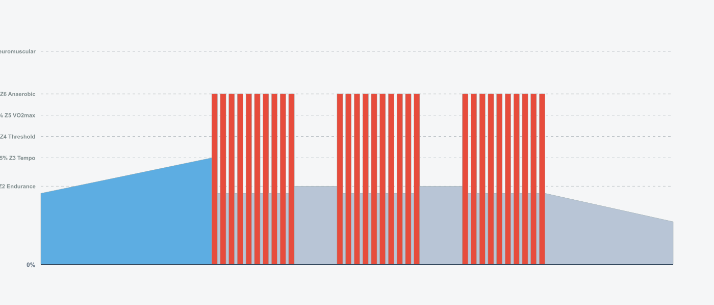 | • 74 min · 98 TSS · IF 0.89 |
| **Wednesday** | **Recovery**  | • 45 min · 23 TSS · IF 0.55 |
| **Thursday** | **FTP 2x25**  | • 95 min · 120 TSS · IF 0.87 |
| **Saturday** | **Sweet Spot 3x25**  | • 115 min · 129 TSS · IF 0.82 |
| **Sunday** | **Endurance**  | • 120 min · 98 TSS · IF 0.70 |

### Week 11

**Weekly Total:** 388 TSS, 6.6 hours

| Day | Workout | Details |
| --- | ------- | ------- |
| **Tuesday** | **VO2max Mixed** 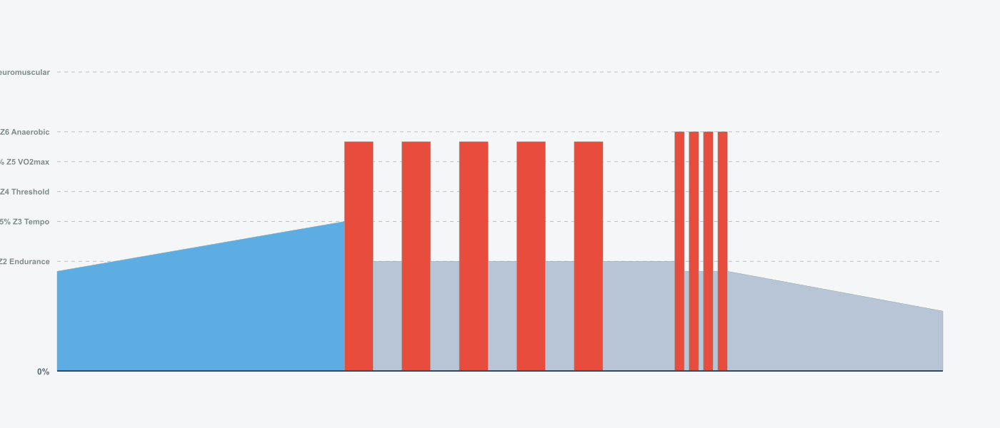 | • 62 min · 69 TSS · IF 0.82 |
| **Wednesday** | **Easy Spin**  | • 60 min · 46 TSS · IF 0.68 |
| **Thursday** | **FTP 35min** 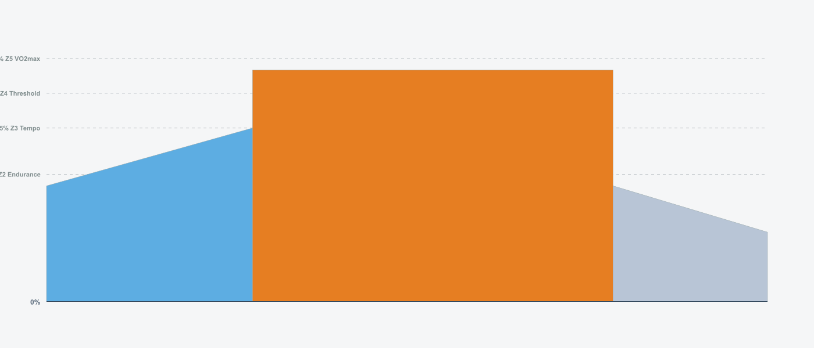 | • 70 min · 86 TSS · IF 0.86 |
| **Saturday** | **Race Simulation** 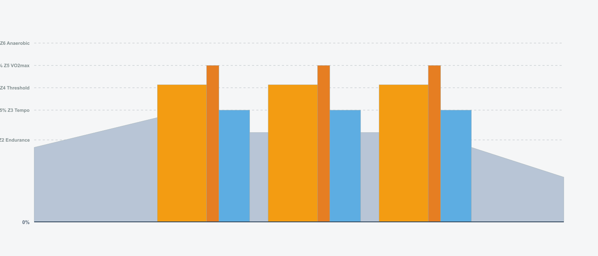 | • 86 min · 89 TSS · IF 0.79 |
| **Sunday** | **Endurance**  | • 120 min · 98 TSS · IF 0.70 |

### Week 12

**Weekly Total:** 257 TSS, 5.4 hours

| Day | Workout | Details |
| --- | ------- | ------- |
| **Tuesday** | **Final FTP Test**  | • 67 min · 72 TSS · IF 0.81 |
| **Wednesday** | **Easy Spin**  | • 30 min · 15 TSS · IF 0.55 |
| **Thursday** | **Victory Lap**  | • 60 min · 49 TSS · IF 0.70 |
| **Saturday** | **Celebration Ride**  | • 120 min · 98 TSS · IF 0.70 |
| **Sunday** | **Recovery**  | • 45 min · 23 TSS · IF 0.55 |

## Usage

### Import ZWO Files

The `.zwo` files in the `zwo_files/` directory can be imported into:

- **Zwift** - Import custom workouts
- **MyWhoosh** - Import workout files
- **TrainingPeaks** - Upload ZWO files
- Any other platform that supports the ZWO format

### Interactive Viewer

Open `docs/index.html` in your browser for an interactive workout calendar and statistics dashboard.
