# 12-Week FTP Builder Program v2.0

## Training Plan Overview

- **Duration:** 12 weeks
- **Weekly Hours:** 6-8 hours (4.5 hours during recovery weeks)
- **Structure:** Flexible recovery approach - recovery days every 3-4 days
- **Key Sessions:** Tuesday & Thursday (intensity), Saturday (long/intensity), Sunday (endurance)
- **Rest Days:** Monday + Friday + strategic Wednesday/Sunday recovery

---

## BLOCK 1: Foundation Building (Weeks 1-4)

| **Week**       | **Monday** | **Tuesday**                                                                                                                                                                                               | **Wednesday**                                                                                                                            | **Thursday**                                                                                                                                                                                   | **Friday** | **Saturday**                                                                                                                                                                                      | **Sunday**                                                                                                                                                                        |
| -------------- | ---------- | --------------------------------------------------------------------------------------------------------------------------------------------------------------------------------------------------------- | ---------------------------------------------------------------------------------------------------------------------------------------- | ---------------------------------------------------------------------------------------------------------------------------------------------------------------------------------------------- | ---------- | ------------------------------------------------------------------------------------------------------------------------------------------------------------------------------------------------- | --------------------------------------------------------------------------------------------------------------------------------------------------------------------------------- |
| **Week 1**     | REST       | **FTP Test** 60 min · 60 TSS · IF 0.75 20-min test effort Establish baseline 💡 _Pre-load: Carbs 2-3hrs before_  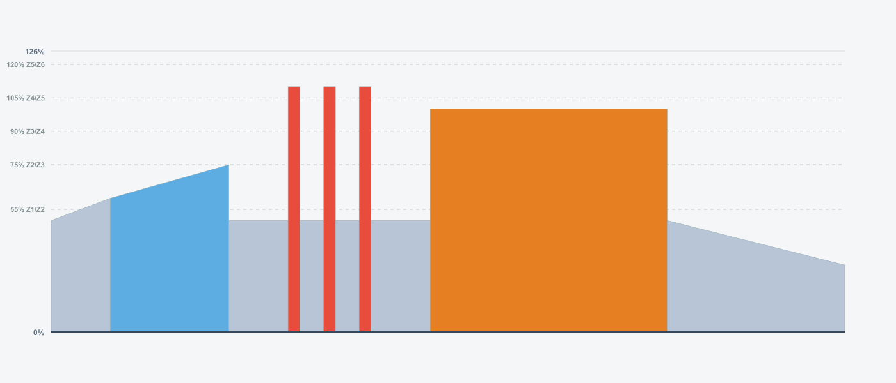                    | **Active Recovery** 45 min · 23 TSS · IF 0.50 Zone 1-2 Easy spin  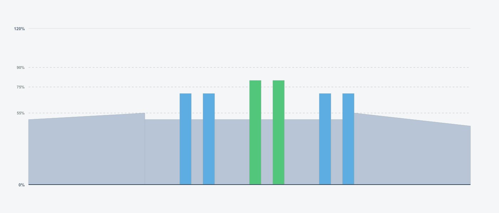    | **Tempo Building** 75 min · 65 TSS · IF 0.82 3 x 10min @ 85% Zone 3 work 💡 _Consume 30-40g carbs/hr_                       | REST       | **Base Endurance** 90 min · 55 TSS · IF 0.65 Zone 2 + accelerations Aerobic base 💡 _Consume 60g carbs/hr_  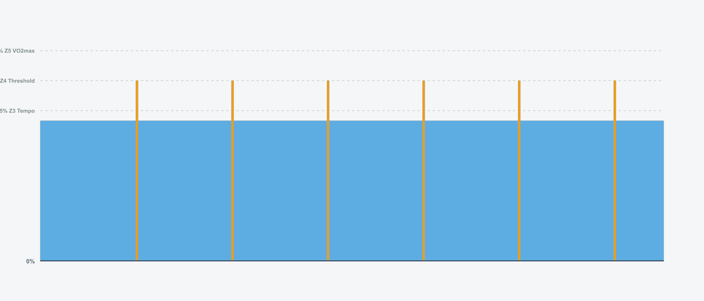               | **Active Recovery** 30-45 min · 18 TSS · IF 0.45 Zone 1-2 Optional                                                |
| **Week 2**     | REST       | **Sweet Spot** 70 min · 68 TSS · IF 0.88 2 x 15min @ 90% Building power  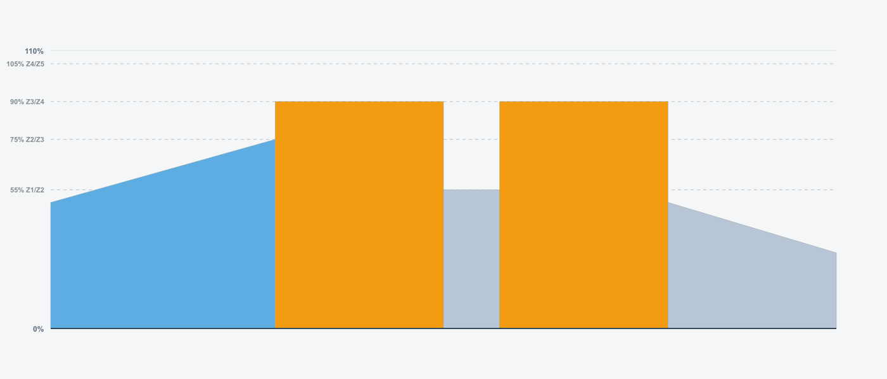                                                              | **Easy Spin** 30 min · 12 TSS · IF 0.40 Zone 1 only Recovery focus   | **FTP Intervals 4x8** 85 min · 82 TSS · IF 0.95 4 x 8min @ 100% Threshold work 💡 _Pre-load: Carbs 2-3hrs before_   | REST       | **Tempo Endurance** 90 min · 72 TSS · IF 0.83 3 x 15min @ 85% Zone 3 💡 _Consume 60g carbs/hr_  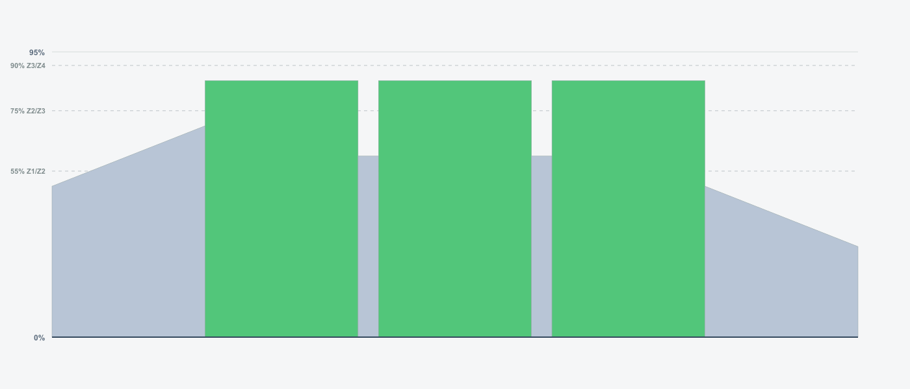                     | **Long Endurance** 120 min · 70 TSS · IF 0.65 Zone 2 Aerobic development 💡 _Consume 60-90g carbs/hr_   |
| **Week 3**     | REST       | **Over/Unders** 85 min · 84 TSS · IF 0.92 3 x 8min (95%/105%) Lactate clearance 💡 _Pre-load: Carbs 2-3hrs before_                | **Active Recovery** 45 min · 23 TSS · IF 0.50 Zone 1-2 Easy spin  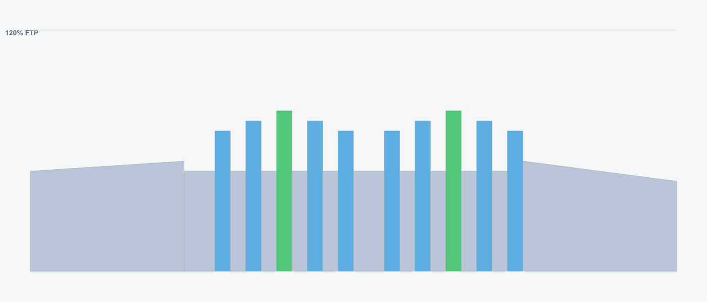    | **Extended Threshold** 95 min · 95 TSS · IF 1.00 2 x 20min @ 100% FTP endurance 💡 _Consume 60-90g carbs/hr_  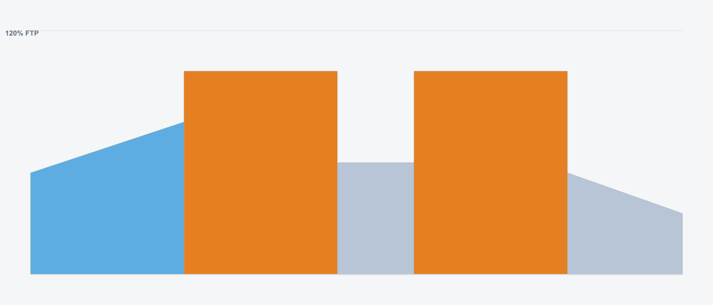 | REST       | **Sweet Spot 3x20** 100 min · 92 TSS · IF 0.90 3 x 20min @ 90% Peak sweet spot 💡 _Consume 60-90g carbs/hr_  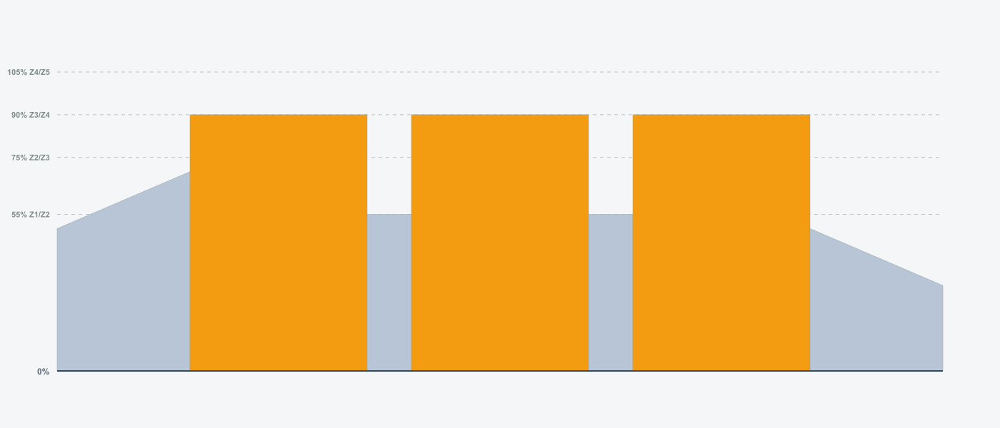 | **Easy Spin** 30 min · 12 TSS · IF 0.40 Zone 1 only Recovery priority                                            |
| **Week 4**     | REST       | **Recovery Cadence + Sprints** 60 min · 35 TSS · IF 0.58 Zone 1-2 + cadence drills + 5x10sec sprints Neuromuscular maintenance  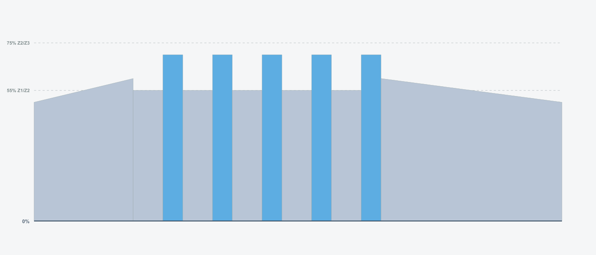 | REST                                                                                                                                     | **Light Tempo** 50 min · 38 TSS · IF 0.75 20min @ 80% Easy intensity  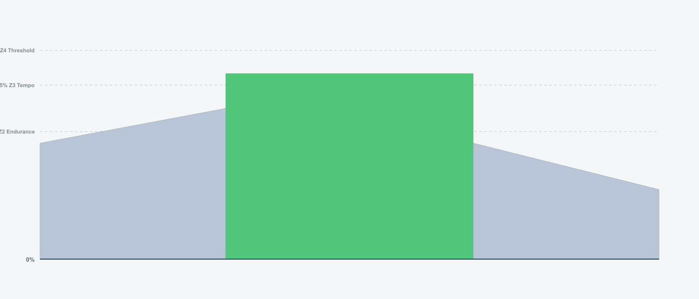                                                    | REST       | **Relaxed Endurance** 75 min · 45 TSS · IF 0.60 Zone 2 No structure 🍖 _Recovery nutrition focus_                     | **Active Recovery** 30-45 min · 18 TSS · IF 0.45 Optional rest 🍖 _Recovery nutrition focus_                      |
| **Week Total** |            |                                                                                                                                                                                                           |                                                                                                                                          |                                                                                                                                                                                                |            |                                                                                                                                                                                                   | **Week 1:** 6.5h · 231 TSS **Week 2:** 7.0h · 304 TSS **Week 3:** 7.0h · 306 TSS **Week 4 (Recovery):** 4.5h · 136 TSS                                                |

---

## BLOCK 2: Threshold Development (Weeks 5-8)

| **Week**       | **Monday** | **Tuesday**                                                                                                                                                                                                                      | **Wednesday**                                                                                                                               | **Thursday**                                                                                                                                                                                             | **Friday** | **Saturday**                                                                                                                                                                                     | **Sunday**                                                                                                                                                                               |
| -------------- | ---------- | -------------------------------------------------------------------------------------------------------------------------------------------------------------------------------------------------------------------------------- | ------------------------------------------------------------------------------------------------------------------------------------------- | -------------------------------------------------------------------------------------------------------------------------------------------------------------------------------------------------------- | ---------- | ------------------------------------------------------------------------------------------------------------------------------------------------------------------------------------------------ | ---------------------------------------------------------------------------------------------------------------------------------------------------------------------------------------- |
| **Week 5**     | REST       | **Pyramid Intervals** 80 min · 78 TSS · IF 0.90 3-5-7-5-3 min @ 100% FTP (equal rest) Mental toughness 💡 _Pre-load: Carbs 2-3hrs before_  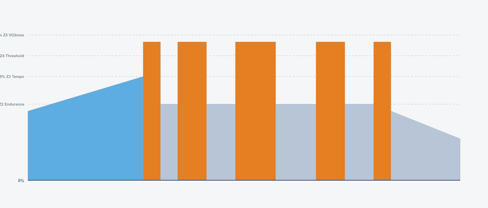        | **Easy Spin** 30 min · 12 TSS · IF 0.40 Zone 1 only Recovery focus      | **Progressive Threshold** 90 min · 88 TSS · IF 0.95 3 x 12min @ 100% Building duration 💡 _Consume 60-90g carbs/hr_  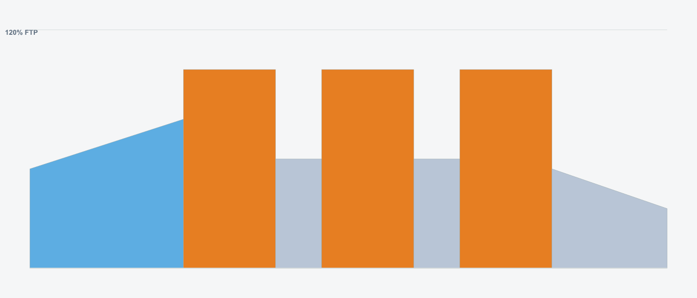 | REST       | **Extended Tempo** 100 min · 80 TSS · IF 0.83 3 x 18min @ 85% Tempo progression 💡 _Consume 60-90g carbs/hr_  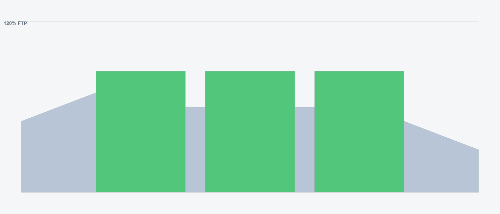 | **Long Endurance** 120 min · 70 TSS · IF 0.65 Zone 2 Aerobic base 💡 _Consume 60-90g carbs/hr_                 |
| **Week 6**     | REST       | **Push & Pull** 95 min · 75 TSS · IF 0.82 6 x (4min high cadence 100rpm + 4min low cadence 60rpm) @ 88% Muscle recruitment 💡 _Consume 60g carbs/hr_  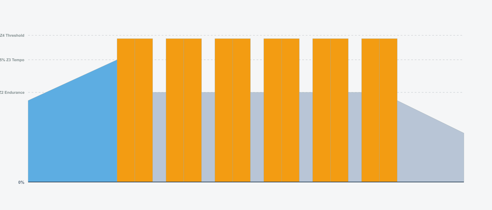 | **Active Recovery** 45 min · 23 TSS · IF 0.50 Zone 1-2 Easy spin  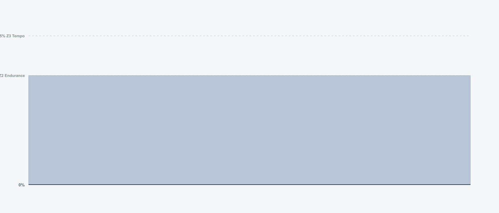       | **FTP 2x20** 90 min · 88 TSS · IF 0.95 2 x 20min @ 100% Threshold progression 💡 _Pre-load: Carbs 2-3hrs before_  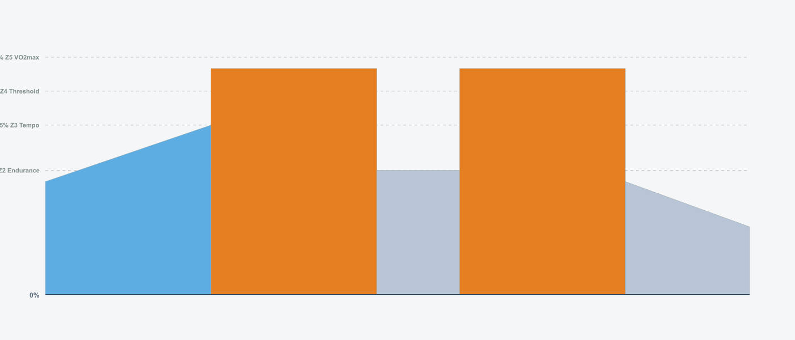                 | REST       | **Sweet Spot 3x22** 105 min · 98 TSS · IF 0.90 3 x 22min @ 90% Progression 💡 _Consume 60-90g carbs/hr_  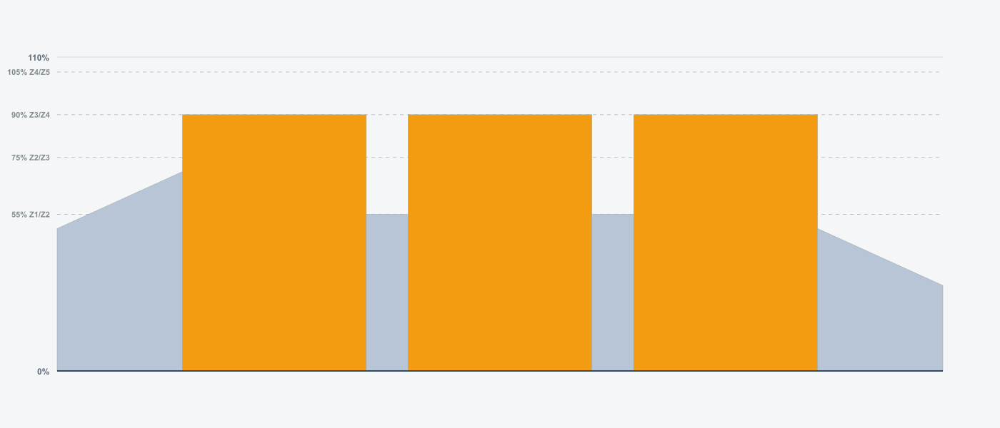           | **Endurance** 120 min · 70 TSS · IF 0.65 Zone 2 Steady volume 💡 _Consume 60-90g carbs/hr_                          |
| **Week 7**     | REST       | **VO2max 30/30s** 75 min · 72 TSS · IF 0.88 3 x (8 x 30sec @ 120% / 30sec @ 50%) High intensity 💡 _Pre-load: Carbs 2-3hrs before_  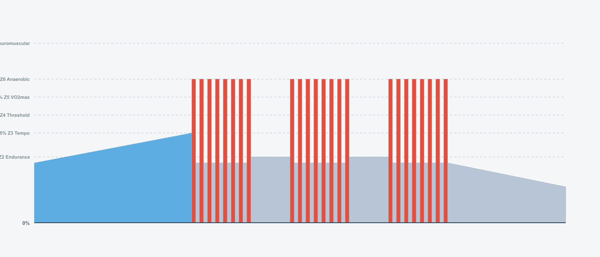                   | **Easy Spin** 30 min · 12 TSS · IF 0.40 Zone 1 only Recovery priority   | **Continuous 30min** 85 min · 85 TSS · IF 0.98 30min @ 100% Peak threshold 💡 _Consume 60g carbs/hr_  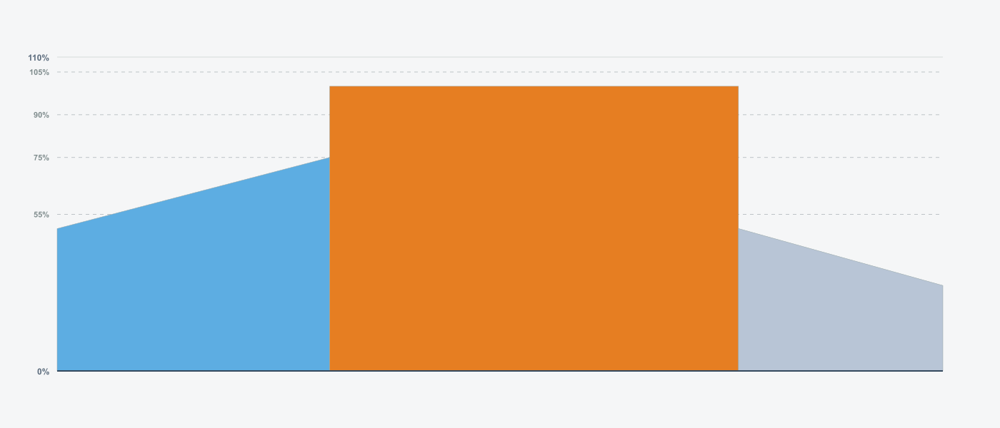                            | REST       | **Sweet Spot 3x25** 110 min · 102 TSS · IF 0.90 3 x 25min @ 90% Peak volume 💡 _Consume 60-90g carbs/hr_  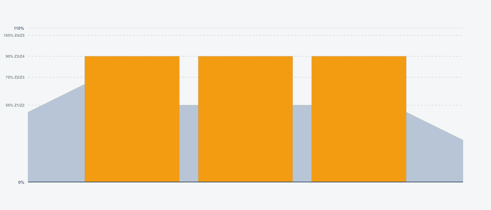          | **Endurance + Tempo** 120 min · 75 TSS · IF 0.70 Zone 2 + 5x5min Z3 Mixed work 💡 _Consume 60-90g carbs/hr_  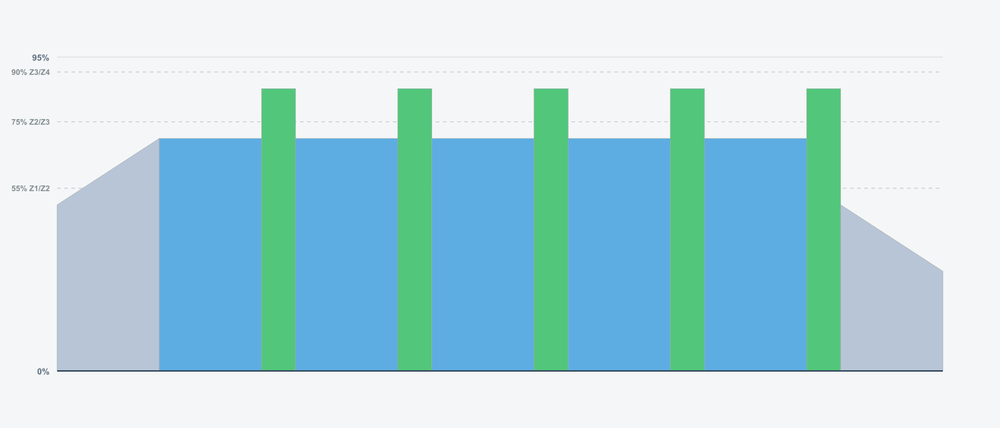 |
| **Week 8**     | REST       | **Recovery Cadence + Sprints** 60 min · 35 TSS · IF 0.58 Zone 1-2 + cadence drills + 5x10sec sprints Technique  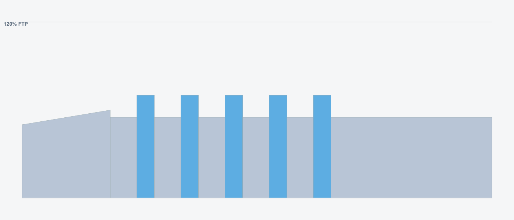                                        | REST                                                                                                                                        | **Light Tempo** 50 min · 38 TSS · IF 0.75 20min @ 80% Easy intensity 🍖 _Recovery nutrition focus_  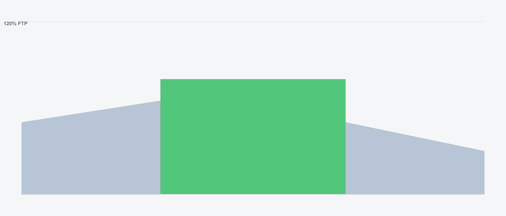                            | REST       | **Relaxed Endurance** 75 min · 45 TSS · IF 0.60 Zone 2 No structure 🍖 _Recovery nutrition focus_                    | **Active Recovery** 30-45 min · 18 TSS · IF 0.45 Optional rest 🍖 _Recovery nutrition focus_                             |
| **Week Total** |            |                                                                                                                                                                                                                                  |                                                                                                                                             |                                                                                                                                                                                                          |            |                                                                                                                                                                                                  | **Week 5:** 7.5h · 328 TSS **Week 6:** 7.5h · 354 TSS **Week 7:** 7.5h · 346 TSS **Week 8 (Recovery):** 4.5h · 136 TSS                                                       |

---

## BLOCK 3: Peak Performance (Weeks 9-12)

| **Week**       | **Monday** | **Tuesday**                                                                                                                                                                                                                        | **Wednesday**                                                                                                                               | **Thursday**                                                                                                                                                                          | **Friday** | **Saturday**                                                                                                                                                                                                           | **Sunday**                                                                                                                                                                 |
| -------------- | ---------- | ---------------------------------------------------------------------------------------------------------------------------------------------------------------------------------------------------------------------------------- | ------------------------------------------------------------------------------------------------------------------------------------------- | ------------------------------------------------------------------------------------------------------------------------------------------------------------------------------------- | ---------- | ---------------------------------------------------------------------------------------------------------------------------------------------------------------------------------------------------------------------- | -------------------------------------------------------------------------------------------------------------------------------------------------------------------------- |
| **Week 9**     | REST       | **Pyramid Intervals** 80 min · 78 TSS · IF 0.90 4-6-8-6-4 min @ 100% FTP (equal rest) Advanced mental toughness 💡 _Pre-load: Carbs 2-3hrs before_  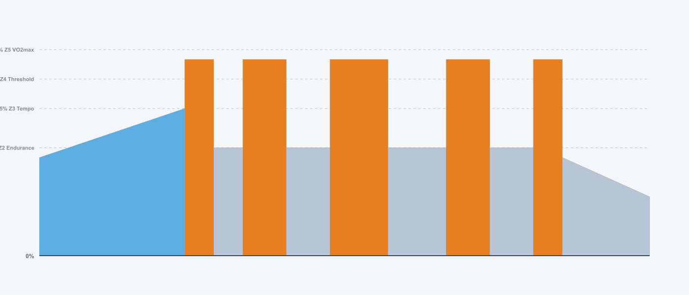 | **Easy Spin** 30 min · 12 TSS · IF 0.40 Zone 1 only Recovery focus      | **FTP Intervals 3x15** 90 min · 90 TSS · IF 0.98 3 x 15min @ 100% Threshold work 💡 _Consume 60-90g carbs/hr_  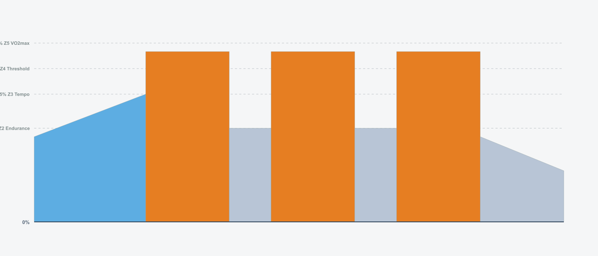 | REST       | **Tempo Endurance** 100 min · 80 TSS · IF 0.83 3 x 18min @ 85% Zone 3 💡 _Consume 60-90g carbs/hr_  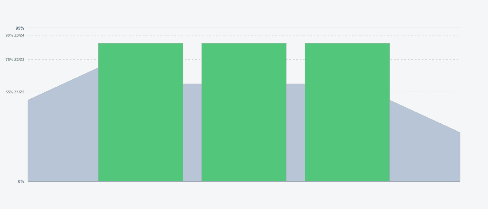                                      | **Long Endurance** 120 min · 70 TSS · IF 0.65 Zone 2 Aerobic work 💡 _Consume 60-90g carbs/hr_   |
| **Week 10**    | REST       | **VO2max 40/20s** 95 min · 85 TSS · IF 0.90 3 x (10 x 40sec @ 120% / 20sec @ 50%) Lactate handling 💡 _Pre-load: Carbs 2-3hrs before_  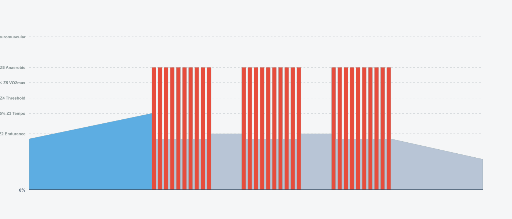                  | **Active Recovery** 45 min · 23 TSS · IF 0.50 Zone 1-2 Easy spin         | **FTP 2x25** 100 min · 98 TSS · IF 0.98 2 x 25min @ 100% Peak threshold 💡 _Consume 60-90g carbs/hr_  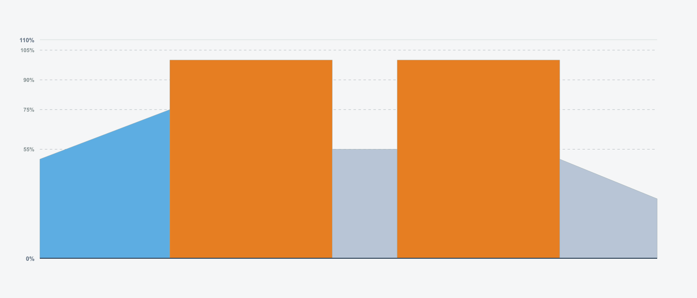          | REST       | **Sweet Spot 3x25** 110 min · 102 TSS · IF 0.90 3 x 25min @ 90% Max volume 💡 _Consume 60-90g carbs/hr_  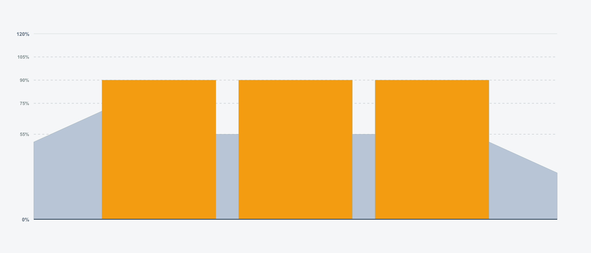                                 | **Endurance** 120 min · 70 TSS · IF 0.65 Zone 2 Steady volume 💡 _Consume 60-90g carbs/hr_            |
| **Week 11**    | REST       | **VO2max Mixed** 85 min · 80 TSS · IF 0.92 5 x 2min @ 115% + 4 x (40sec @ 120% / 20sec @ 50%) Top-end power 💡 _Pre-load: Carbs 2-3hrs before_  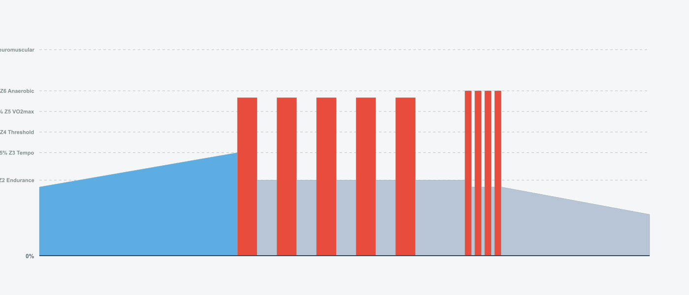          | **Easy Spin** 30 min · 12 TSS · IF 0.40 Zone 1 only Recovery priority   | **Continuous 35min** 90 min · 92 TSS · IF 1.00 35min @ 100% Max threshold 💡 _Consume 60-90g carbs/hr_  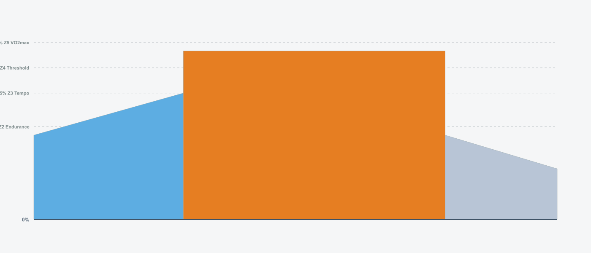       | REST       | **Race Simulation** 100 min · 88 TSS · IF 0.85 3 x (8min @ 92% + 2min @ 105% + 5min @ 75%) Mixed intensity 💡 _Consume 60-90g carbs/hr_  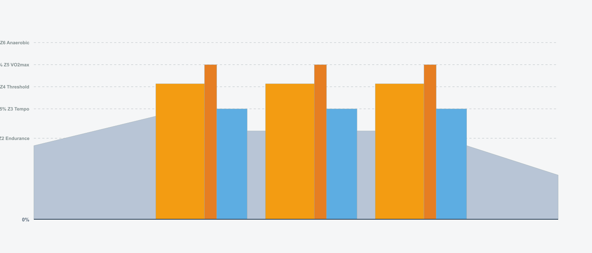 | **Steady Endurance** 120 min · 70 TSS · IF 0.65 Zone 2 Final volume 💡 _Consume 60-90g carbs/hr_      |
| **Week 12**    | REST       | **FINAL FTP TEST** 60 min · 60 TSS · IF 0.75 20-min test Measure gains! 💡 _Pre-load: Carbs 2-3hrs before_                                              | **Easy Spin** 30 min · 12 TSS · IF 0.40 Zone 1 Recovery                 | **Victory Lap** 60 min · 50 TSS · IF 0.70 Zone 2 at new FTP Celebrate!                                           | REST       | **Celebration Ride** 90 min · 55 TSS · IF 0.65 Zone 2 Enjoy fitness 💡 _Consume 60g carbs/hr_                                            | **Active Recovery** 30-45 min · 18 TSS · IF 0.45 Reflect & plan 🍖 _Recovery nutrition focus_              |
| **Week Total** |            |                                                                                                                                                                                                                                    |                                                                                                                                             |                                                                                                                                                                                       |            |                                                                                                                                                                                                                        | **Week 9:** 7.5h · 330 TSS **Week 10:** 8.0h · 378 TSS **Week 11:** 7.5h · 342 TSS **Week 12 (Taper):** 5.0h · 195 TSS                                         |

---

## Weekly Training Volume & TSS Summary

| **Week** | **Mon** | **Tue**  | **Wed**  | **Thu**  | **Fri** | **Sat**  | **Sun**  | **Total Time** | **Total TSS** | **Focus**                      |
| -------- | ------- | -------- | -------- | -------- | ------- | -------- | -------- | -------------- | ------------- | ------------------------------ |
| 1        | -       | 1:00     | 0:45     | 1:15     | -       | 1:30     | 0:45     | **6.5h**       | **231**       | FTP Test + Tempo               |
| 2        | -       | 1:10     | 0:30     | 1:25     | -       | 1:30     | 2:00     | **7.0h**       | **304**       | Sweet Spot + Threshold         |
| 3        | -       | 1:25     | 0:45     | 1:35     | -       | 1:40     | 0:30     | **7.0h**       | **306**       | Over/Unders + Long Threshold   |
| **4**    | -       | **1:00** | -        | **0:50** | -       | **1:15** | **0:45** | **4.5h**       | **136**       | **RECOVERY**                   |
| 5        | -       | 1:20     | 0:30     | 1:30     | -       | 1:40     | 2:00     | **7.5h**       | **328**       | Pyramid Intervals              |
| 6        | -       | 1:35     | 0:45     | 1:30     | -       | 1:45     | 2:00     | **7.5h**       | **354**       | Push & Pull + 2x20             |
| 7        | -       | 1:15     | 0:30     | 1:25     | -       | 1:50     | 2:00     | **7.5h**       | **346**       | VO2max 30/30s + 30min FTP      |
| **8**    | -       | **1:00** | -        | **0:50** | -       | **1:15** | **0:45** | **4.5h**       | **136**       | **RECOVERY**                   |
| 9        | -       | 1:20     | 0:30     | 1:30     | -       | 1:40     | 2:00     | **7.5h**       | **330**       | Advanced Pyramids              |
| 10       | -       | 1:35     | 0:45     | 1:40     | -       | 1:50     | 2:00     | **8.0h**       | **378**       | VO2max 40/20s + Maximum Volume |
| 11       | -       | 1:25     | 0:30     | 1:30     | -       | 1:40     | 2:00     | **7.5h**       | **342**       | 35min Threshold + Race Sim     |
| **12**   | -       | **1:00** | **0:30** | **1:00** | -       | **1:30** | **0:45** | **5.0h**       | **195**       | **FINAL TEST**                 |
|          |         |          |          |          |         |          |          | **TOTAL: 80h** | **3,386 TSS** |                                |

---

## Intensity Distribution by Week

| **Week** | **Zone 1-2 (Recovery/Endurance)** | **Zone 3 (Tempo)** | **Zone 4-5 (Threshold/VO2max)** | **Week Type**  | **TSS** |
| -------- | --------------------------------- | ------------------ | ------------------------------- | -------------- | ------- |
| 1        | 60%                               | 20%                | 20%                             | Build          | 231     |
| 2        | 52%                               | 20%                | 28%                             | Build          | 304     |
| 3        | 48%                               | 15%                | 37%                             | Build          | 306     |
| **4**    | **85%**                           | **10%**            | **5%**                          | **Recovery**   | **136** |
| 5        | 50%                               | 25%                | 25%                             | Build          | 328     |
| 6        | 48%                               | 18%                | 34%                             | Build          | 354     |
| 7        | 45%                               | 12%                | 43%                             | Build          | 346     |
| **8**    | **85%**                           | **10%**            | **5%**                          | **Recovery**   | **136** |
| 9        | 48%                               | 20%                | 32%                             | Build          | 330     |
| 10       | 42%                               | 10%                | 48%                             | Peak Build     | 378     |
| 11       | 45%                               | 10%                | 45%                             | Peak           | 342     |
| **12**   | **75%**                           | **10%**            | **15%**                         | **Test/Taper** | **195** |

---

## Key Workout Types Explained

### **FTP Intervals** (100% FTP)

Direct threshold training - the core of FTP improvement. Builds sustainable power at your lactate threshold.

- **TSS Range:** 80-100 per session
- **IF Range:** 0.95-1.00

### **Sweet Spot** (88-93% FTP)

High-intensity aerobic training that's sustainable for longer durations. Excellent for building aerobic capacity without excessive fatigue.

- **TSS Range:** 65-100 per session
- **IF Range:** 0.88-0.92

### **Over/Unders** (95%/105% FTP)

Alternating just below and above threshold. Teaches your body to clear lactate while maintaining high power output.

- **TSS Range:** 75-90 per session
- **IF Range:** 0.90-0.95

### **Pyramid Intervals** (100% FTP) 🆕

Progressive duration intervals (3-5-7-5-3 or 4-6-8-6-4 min) that build mental toughness and pacing skills. Equal rest between intervals.

- **TSS Range:** 75-85 per session
- **IF Range:** 0.88-0.92

### **Push & Pull** (88% FTP) 🆕

Alternating muscle recruitment patterns:

- High cadence (100+ rpm) for 4-5 min
- Low cadence (60 rpm) for 4-5 min
  Develops neuromuscular coordination and strength endurance.
- **TSS Range:** 70-80 per session
- **IF Range:** 0.80-0.85

### **Tempo** (83-87% FTP)

Moderate intensity that builds aerobic base and muscular endurance. Comfortably hard but sustainable.

- **TSS Range:** 60-80 per session
- **IF Range:** 0.80-0.85

### **VO2max Intervals** (106-120% FTP)

Short, high-intensity efforts that improve maximum aerobic capacity and top-end power.

- **30/30s:** 30sec @ 120% / 30sec @ 50% (neuromuscular emphasis)
- **40/20s:** 40sec @ 120% / 20sec @ 50% (classic Tabata style)
- **2-5min:** 115-120% FTP with equal rest
- **TSS Range:** 70-90 per session
- **IF Range:** 0.85-0.95

### **Endurance** (65-75% FTP)

Easy, conversational pace that builds aerobic base and promotes recovery while maintaining training stimulus.

- **TSS Range:** 50-75 per session
- **IF Range:** 0.60-0.70

### **Cadence Work** 🆕

- **Low Cadence (50-60 rpm):** Builds strength endurance at 75-85% FTP
- **High Cadence (110-120 rpm):** Develops neuromuscular efficiency at 60-70% FTP
- **Included in recovery weeks with sprint work**

// Add this section to your README after the "Key Workout Types Explained" section

---

## Alternative Workouts from MyWhoosh 🔄

Can't complete the prescribed workout? Here are equivalent MyWhoosh alternatives you can substitute:

### **FTP/Threshold Alternatives**

**If you need to replace FTP intervals:**

- **Threshold #2-#5** (52-60 min) - Progressive threshold intervals
- **Targeting FTP** (40 min) - Focused threshold work
- **20min Tempo w/15sec Accelerations** (55 min) - Threshold + surges

**For 2x20 FTP workouts:**

- **Tempo Climbing #1 or #2** (60 min) - Sustained threshold efforts
- **Tempo #3-#5** (54-62 min) - Extended tempo/threshold

### **Sweet Spot Alternatives**

**If you need to replace Sweet Spot sessions:**

- **Sweetspot Training** (41 min) - Classic sweet spot intervals
- **15min Varied Tempo #1-#3** (48-60 min) - Progressive sweet spot work
- **Tempo into Sprints** (61 min) - Sweet spot + neuromuscular

### **VO2max Alternatives**

**For 30/30s or 40/20s:**

- **30/30 Anaerobic #1-#4** (52-68 min) - Progressive 30/30 intervals
- **30/30 Efforts** (51 min) - Classic 30/30 protocol
- **12min 30/30's #1-#2** (57-74 min) - Extended 30/30 work

**For longer VO2max (2-5 min):**

- **10min Ramps** (59 min) - VO2max ramp intervals
- **11min Intensive Aerobic** (77 min) - Sustained VO2max
- **22min Intensive Aerobic** (88 min) - Extended VO2max work
- **1min Power Duration #2** (58 min) - Mixed VO2max intervals

### **Over/Under Alternatives**

**If you need to replace Over/Under sessions:**

- **Tempo with 30sec spike #1** (54 min) - Tempo with surges
- **Tempo with 15sec surges** (40 min) - Shorter over efforts
- **Tadej's Criss-cross Tempo** (34 min) - Pogačar's favorite workout

### **Pyramid/Progressive Alternatives**

**For Pyramid intervals:**

- **Capacity Pyramid #1** (70 min) - Progressive FTP pyramid
- **1min + Endurance #1** (88 min) - Progressive intervals + endurance

### **Tempo Alternatives**

**For 3x15-18 min Tempo:**

- **Tempo #1-#11** (52-76 min) - Various tempo durations
- **Tempo Climbing #1-#2** (60 min) - Sustained tempo efforts

### **Recovery/Cadence Alternatives**

**For recovery weeks:**

- **Cadence Changers #1-#2** (42-46 min) - Cadence drills
- **Power Reps #1-#2** (51-60 min) - Light power + cadence
- **Torque Changers #1** (59 min) - Strength endurance work
- **Low Cadence Steps #1-#2** (61-65 min) - Low cadence focus

### **Sprint/Power Alternatives**

**For sprint maintenance:**

- **Power Starts** - 10sec and 30sec sprint development
- **Endurance with Short Sprints** (51-62 min) - Endurance + sprints
- **Endurance with max bursts** (51 min) - Max efforts in endurance

### **Race Simulation Alternatives**

**For mixed intensity/race prep:**

- **Lactate Shuttle #1** (varies) - Lactate tolerance work
- **Mixed Intervals** (90 min) - Varied intensity like racing
- Any **"Train Like Tadej"** workout - World Tour race simulation

### **Endurance Alternatives**

**For long steady rides:**

- Any workout in the **Endurance** category (89 workouts available)
- **20sec + Endurance #1** (84 min) - Endurance with micro-bursts

---

## How to Use Alternatives

**When to substitute:**

- ✅ Traveling and don't have your workout files
- ✅ Need mental variety while maintaining training stimulus
- ✅ Feeling slightly off and want a similar but different workout
- ✅ Want to try World Tour coach-designed sessions

**How to choose:**

1. Match the **duration** (±10 minutes is fine)
2. Match the **TSS** (±10 TSS is acceptable)
3. Match the **training zone** (Tempo, Threshold, VO2max, etc.)
4. Prioritize workouts with similar IF (Intensity Factor)

**Important notes:**

- ⚠️ Don't substitute threshold work with VO2max or vice versa
- ⚠️ Keep recovery weeks truly easy - don't swap in harder alternatives
- ⚠️ FTP tests should never be substituted
- ✅ Alternatives are best used 1-2x per training block, not every week

---

## MyWhoosh Workout Categories Overview

MyWhoosh has **770+ workouts** organized into categories:

- **Threshold** (88 workouts) - FTP and sweet spot work
- **VO2 Max** (varies) - High-intensity intervals
- **Endurance** (89 workouts) - Base building
- **Tempo** (varies) - Zone 3 sustainable efforts
- **Anaerobic** (68 workouts) - High-powered efforts
- **Fast Fitness/HIIT** (50 workouts) - Time-efficient intensity
- **Taper** (10 workouts) - Pre-race preparation
- **Testing** - Various FTP test protocols
- **Beginner** (47 workouts) - New to structured training
- **Under 35 Min** (80 workouts) - Time-crunched riders
- **UAE Team Emirates** - Pro team workouts
- **Train Like Tadej** - Pogačar's actual sessions

**Pro tip:** Use the **MyWhooshInfo.com workout search** to filter by:

- Duration (exact minute ranges)
- TSS (training stress)
- IF (intensity factor)
- Specific zones

This makes finding the perfect substitute quick and easy!

---

---

## Recovery Day Strategy 🆕

**Flexible Recovery Approach:**
Unlike traditional weekly recovery, this plan uses a more frequent recovery schedule:

- **Easy Spin Days:** Zone 1 only (30 min) every 3-4 days during build weeks
- **Active Recovery:** Zone 1-2 (45 min) as needed
- **Strategic Rest:** Monday & Friday always off
- **Recovery Weeks:** Every 4th week (Weeks 4, 8, 12)

**Benefits:**

- Prevents cumulative fatigue
- Maintains consistency
- Allows harder efforts on key days
- Recovery is never more than 2-3 days away

**Recovery Week Focus:**

- Neuromuscular maintenance (5x10sec sprints)
- Cadence drills (high/low rpm work)
- Reduced volume (~40%)
- Enhanced nutrition focus

---

## Progressive Overload Pattern

### Build Weeks (1-3, 5-7, 9-11)

**Week 1 of Block:** Introduce new stimulus

- New workout type (Pyramids, Push/Pull, VO2max variants)
- Moderate volume
- Focus on technique

**Week 2 of Block:** Increase volume

- Longer intervals or more sets
- Peak weekly TSS
- Maximum training load

**Week 3 of Block:** Maintain intensity, adjust volume

- High-quality efforts
- Strategic recovery days
- Mental preparation for recovery week

### Recovery Weeks (4, 8, 12)

- **Volume reduction:** ~40-50% of peak week
- **Intensity reduction:** Mostly Zone 1-2
- **Neuromuscular work:** Sprint maintenance
- **Technique focus:** Cadence drills
- **Nutrition emphasis:** Recovery and adaptation

---

## Power Metrics & Training Zones

**Week 1 Test:**

- 20-min average power
- FTP = 20-min power × 0.95

**Week 12 Test:**

- 20-min average power
- New FTP = 20-min power × 0.95
- **Expected improvement: 5-15% FTP increase**

**Training Zones Based on FTP:**

- Zone 1 (Active Recovery): <55% FTP
- Zone 2 (Endurance): 55-75% FTP
- Zone 3 (Tempo): 76-87% FTP
- Zone 4 (Threshold): 88-105% FTP
- Zone 5 (VO2max): 106-120% FTP
- Zone 6 (Anaerobic): 121-150% FTP (sprints)

**Intensity Factor (IF):**

- Easy day: 0.40-0.60
- Endurance: 0.60-0.75
- Tempo/Moderate: 0.75-0.85
- Hard/Threshold: 0.85-0.95
- Very Hard: 0.95-1.05

**Training Stress Score (TSS):**

- Easy week: 100-180 TSS
- Moderate week: 250-325 TSS
- Hard week: 325-400 TSS

---

## Nutrition Guidelines 🆕

### **High-Intensity Sessions** (>85% FTP)

💡 **Pre-workout:** Consume carbs 2-3 hours before

- 1-2g carbs per kg body weight
- Example: 70-140g for 70kg rider
- Low fiber, easily digestible

### **Long Rides** (>90 minutes)

💡 **During workout:** Consume 60-90g carbs/hour

- Sports drinks, gels, bars, or real food
- Start fueling after 45-60 minutes
- Aim for 1g/kg/hour for efforts >2 hours

### **Moderate Sessions** (60-90 minutes at <85% FTP)

💡 **During workout:** Consume 30-60g carbs/hour

- Lower intensity = less fuel needed
- Hydration remains priority

### **Recovery Weeks** 🍖

💡 **Focus on recovery nutrition:**

- Increase protein intake (1.6-2.2g/kg/day)
- Maintain carbohydrate intake (don't cut too much)
- Prioritize sleep and hydration
- Anti-inflammatory foods (omega-3s, berries, greens)

### **General Guidelines:**

- **Hydration:** 500-750ml/hour depending on conditions
- **Post-workout:** 20-40g protein + carbs within 30-60 min
- **Daily:** 6-10g carbs/kg body weight on training days
- **Rest days:** 3-5g carbs/kg body weight

---

## Training Tips

✅ **Update your FTP** in MyWhoosh after Week 1 test
✅ **Trust the recovery weeks** - adaptation happens during rest
✅ **Embrace frequent easy days** - Zone 1 spins are intentionally easy
✅ **Consistency over intensity** - complete 90% of workouts as prescribed
✅ **Fuel properly** - follow nutrition guidelines above
✅ **Sleep 7-9 hours** during build weeks (8-9 during recovery weeks)
✅ **Listen to your body** - extra rest beats injury
✅ **Track TSS weekly** - aim for gradual increase in build weeks
✅ **Practice pacing** - Pyramid intervals teach this skill
✅ **Vary your cadence** - Push/Pull sessions develop efficiency
✅ **Sprint when fresh** - Recovery weeks include neuromuscular work

---

## Expected Outcomes

By Week 12, you should see:

- **5-15% FTP increase** (varies by training history)
- Improved ability to sustain threshold power
- Better pacing and power management
- Enhanced recovery between efforts
- Increased confidence and mental toughness
- Stronger aerobic base for future training
- Improved neuromuscular coordination (cadence work)
- Better lactate clearance (Over/Unders, 30/30s)
- Race-ready fitness (simulation workouts)

**Compare your Week 1 and Week 12 FTP tests to measure your exact gains!**
