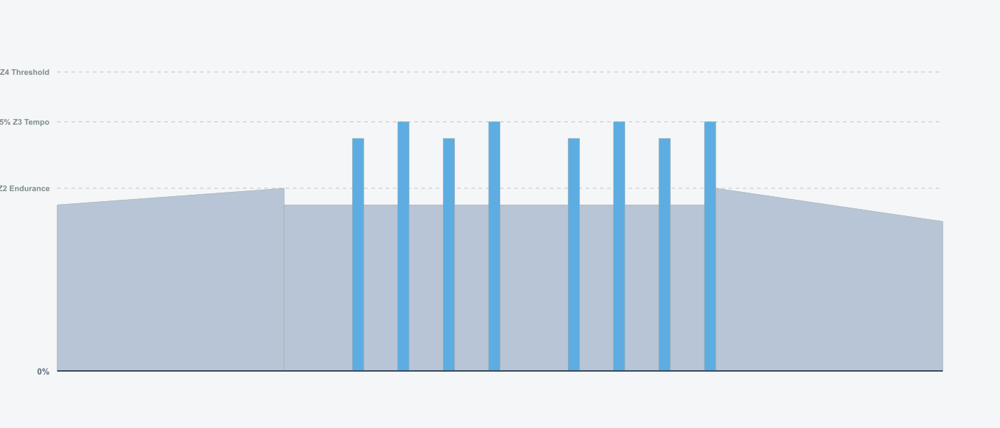
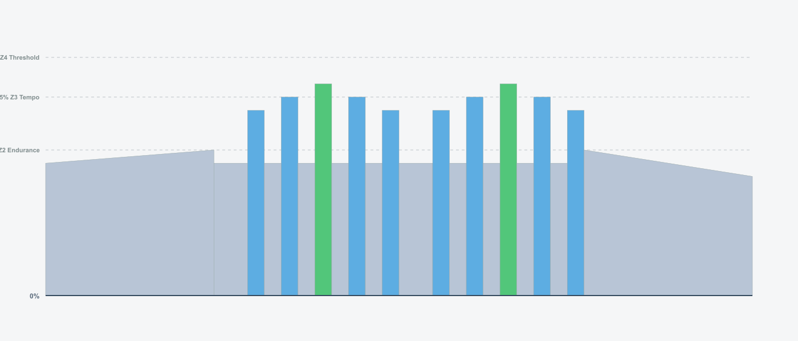
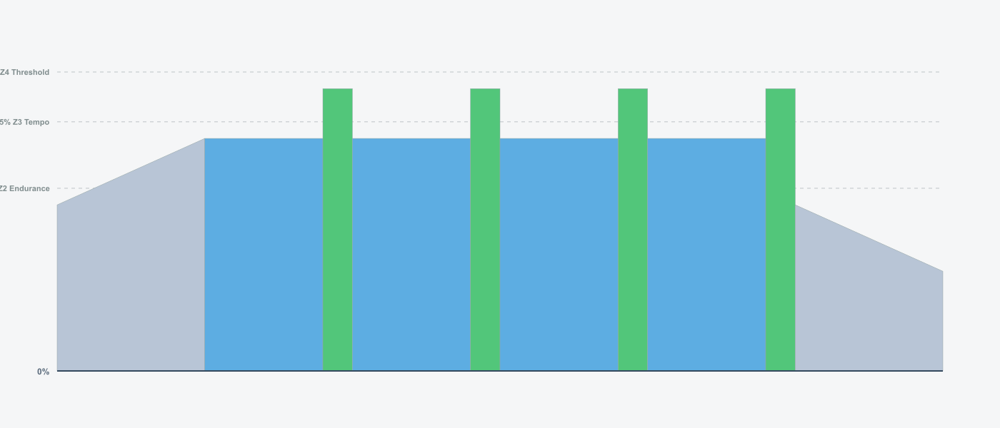
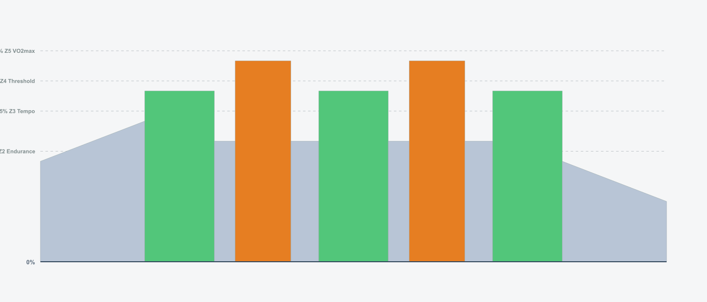

## Training Plan Overview

- **Duration:** 12 weeks
- **Weekly Hours:** 6-8 hours (4.5 hours during recovery weeks)
- **Structure:** 3 weeks build + 1 week recovery (repeated 3 times)
- **Key Sessions:** Tuesday & Thursday (intensity), Saturday (long/intensity), Sunday (endurance)

---

## BLOCK 1: Foundation Building (Weeks 1-4)

| **Week**         | **Monday**  | **Tuesday**                                                               | **Wednesday**                                                                 | **Thursday**                                                             | **Friday** | **Saturday**                                                              | **Sunday**                                                                  |
| ---------------- | ----------- | ------------------------------------------------------------------------- | ----------------------------------------------------------------------------- | ------------------------------------------------------------------------ | ---------- | ------------------------------------------------------------------------- | --------------------------------------------------------------------------- |
| **Week 1**       | REST        | **FTP Test** 60 min 20-min test effort Establish baseline      | **Active Recovery** 45 min Zone 1-2 Easy spin                      | **Tempo Building** 75 min 3 x 10min @ 85% Zone 3 work         | REST       | **Base Endurance** 90 min Zone 2 + accelerations Aerobic base  | **Active Recovery** 30-45 min Zone 1-2 Optional                  |
| **Week 2**       | REST        | **Sweet Spot** 70 min 2 x 15min @ 90% Building power           | **Recovery Spin** 45 min Zone 1-2 + accelerations Active recovery  | **FTP Intervals 4x8** 85 min 4 x 8min @ 100% Threshold work   | REST       | **Tempo Endurance** 90 min 3 x 15min @ 85% Zone 3              | **Long Endurance** 120 min Zone 2 Aerobic development            |
| **Week 3**       | REST        | **Over/Unders** 85 min 3 x 8min (95%/105%) Lactate clearance   | **Active Recovery** 45 min Zone 1-2 Easy spin                      | **Extended Threshold** 95 min 2 x 20min @ 100% FTP endurance  | REST       | **Sweet Spot 3x20** 100 min 3 x 20min @ 90% Peak sweet spot    | **Endurance + Tempo** 90 min Zone 2 + 4x3min Z3 Mixed intensity  |
| **Week 4**       | REST        | **Recovery Cadence** 60 min Zone 1-2 + drills Technique focus  | REST                                                                          | **Light Tempo** 50 min 20min @ 80% Easy intensity             | REST       | **Relaxed Endurance** 75 min Zone 2 No structure               | **Active Recovery** 30-45 min Optional rest                          |
| **Weekly Hours** | \-          | 1:00                                                                      | 0:45                                                                          | 1:15                                                                     | \-         | 1:30                                                                      | 1:00                                                                        |
| **Week Total**   | **6.5 hrs** |                                                                           |                                                                               |                                                                          |            | **RECOVERY WEEK: 4.5 hrs**                                                |                                                                             |

---

## BLOCK 2: Threshold Development (Weeks 5-8)

| **Week**         | **Monday**  | **Tuesday**                                                                 | **Wednesday**                                               | **Thursday**                                                                    | **Friday** | **Saturday**                                                             | **Sunday**                                                              |
| ---------------- | ----------- | --------------------------------------------------------------------------- | ----------------------------------------------------------- | ------------------------------------------------------------------------------- | ---------- | ------------------------------------------------------------------------ | ----------------------------------------------------------------------- |
| **Week 5**       | REST        | **Extended Sweet Spot** 80 min 2 x 20min @ 90% Longer intervals  | **Recovery Spin** 45 min Zone 1-2 Easy recovery  | **Progressive Threshold** 90 min 3 x 12min @ 100% Building duration  | REST       | **Extended Tempo** 100 min 3 x 18min @ 85% Tempo progression  | **Long Endurance** 120 min Zone 2 Aerobic base               |
| **Week 6**       | REST        | **Extended Over/Unders** 95 min 4 x 8min (95%/105%) More volume  | **Recovery Spin** 45 min Zone 1-2 Easy spin      | **FTP 25+20** 100 min 25min + 20min @ 100% Long threshold            | REST       | **Sweet Spot 3x22** 105 min 3 x 22min @ 90% Progression       | **Long Endurance** 150 min Zone 2 Big volume                 |
| **Week 7**       | REST        | **VO2max Intro** 75 min 5 x 3min @ 110% High intensity           | **Recovery Spin** 45 min Zone 1-2 Easy recovery  | **Continuous 30min** 85 min 30min @ 100% Peak threshold              | REST       | **Sweet Spot 3x25** 110 min 3 x 25min @ 90% Peak volume       | **Endurance + Tempo** 120 min Zone 2 + 5x5min Z3 Mixed work  |
| **Week 8**       | REST        | **Recovery Cadence** 60 min Zone 1-2 + drills Technique          | REST                                                        | **Light Tempo** 50 min 20min @ 80% Easy intensity                    | REST       | **Relaxed Endurance** 75 min Zone 2 No structure              | **Active Recovery** 30-45 min Optional rest                      |
| **Weekly Hours** | \-          | 1:20                                                                        | 0:45                                                        | 1:30                                                                            | \-         | 1:45                                                                     | 1:30                                                                    |
| **Week Total**   | **7.5 hrs** |                                                                             |                                                             |                                                                                 |            | **RECOVERY WEEK: 4.5 hrs**                                               |                                                                         |

---

## BLOCK 3: Peak Performance (Weeks 9-12)

| **Week**         | **Monday**  | **Tuesday**                                                                | **Wednesday**                                               | **Thursday**                                                              | **Friday** | **Saturday**                                                             | **Sunday**                                                   |
| ---------------- | ----------- | -------------------------------------------------------------------------- | ----------------------------------------------------------- | ------------------------------------------------------------------------- | ---------- | ------------------------------------------------------------------------ | ------------------------------------------------------------ |
| **Week 9**       | REST        | **Sweet Spot 2x22** 80 min 2 x 22min @ 90% Sustained power      | **Recovery Spin** 45 min Zone 1-2 Easy recovery  | **FTP Intervals 3x15** 90 min 3 x 15min @ 100% Threshold work | REST       | **Tempo Endurance** 100 min 3 x 18min @ 85% Zone 3            | **Long Endurance** 120 min Zone 2 Aerobic work    |
| **Week 10**      | REST        | **Over/Unders 4x** 95 min 4 x 8min (95%/105%) Lactate handling  | **Recovery Spin** 45 min Zone 1-2 Easy spin      | **FTP 2x25** 100 min 2 x 25min @ 100% Peak threshold           | REST       | **Sweet Spot 3x25** 110 min 3 x 25min @ 90% Max volume        | **Long Endurance** 150 min Zone 2 Big volume      |
| **Week 11**      | REST        | **VO2max 6x3** 85 min 6 x 3min @ 110% Top-end power             | **Recovery Spin** 45 min Zone 1-2 Easy recovery  | **Continuous 35min** 90 min 35min @ 100% Max threshold        | REST       | **Mixed Intensity** 90 min Tempo + Threshold Race simulation  | **Steady Endurance** 120 min Zone 2 Final volume  |
| **Week 12**      | REST        | **FINAL FTP TEST** 60 min 20-min test Measure gains!            | **Easy Spin** 30 min Zone 1 Recovery             | **Victory Lap** 60 min Zone 2 at new FTP Celebrate!            | REST       | **Celebration Ride** 90 min Zone 2 Enjoy fitness              | **Active Recovery** 30-45 min Reflect & plan          |
| **Weekly Hours** | \-          | 1:20                                                                       | 0:45                                                        | 1:30                                                                      | \-         | 1:45                                                                     | 1:30                                                         |
| **Week Total**   | **7.5 hrs** |                                                                            |                                                             |                                                                           |            | **TAPER WEEK: 4.5 hrs**                                                  |                                                              |

---

## Weekly Training Volume Summary

| **Week** | **Mon** | **Tue**  | **Wed**  | **Thu**  | **Fri** | **Sat**  | **Sun**  | **Total**        | **Focus**                    |
| -------- | ------- | -------- | -------- | -------- | ------- | -------- | -------- | ---------------- | ---------------------------- |
| 1        | \-      | 1:00     | 0:45     | 1:15     | \-      | 1:30     | 0:45     | **6.5h**         | FTP Test + Tempo             |
| 2        | \-      | 1:10     | 0:45     | 1:25     | \-      | 1:30     | 2:00     | **7.0h**         | Sweet Spot + Threshold       |
| 3        | \-      | 1:25     | 0:45     | 1:35     | \-      | 1:40     | 1:30     | **7.5h**         | Over/Unders + Long Threshold |
| **4**    | \-      | **1:00** | \-       | **0:50** | \-      | **1:15** | **0:45** | **4.5h**         | **RECOVERY**                 |
| 5        | \-      | 1:20     | 0:45     | 1:30     | \-      | 1:40     | 2:00     | **7.5h**         | Extended Sweet Spot          |
| 6        | \-      | 1:35     | 0:45     | 1:40     | \-      | 1:45     | 2:30     | **8.5h**         | Peak Build Week              |
| 7        | \-      | 1:15     | 0:45     | 1:25     | \-      | 1:50     | 2:00     | **7.5h**         | VO2max + 30min Threshold     |
| **8**    | \-      | **1:00** | \-       | **0:50** | \-      | **1:15** | **0:45** | **4.5h**         | **RECOVERY**                 |
| 9        | \-      | 1:20     | 0:45     | 1:30     | \-      | 1:40     | 2:00     | **7.5h**         | Sustained Threshold          |
| 10       | \-      | 1:35     | 0:45     | 1:40     | \-      | 1:50     | 2:30     | **8.5h**         | Maximum Volume               |
| 11       | \-      | 1:25     | 0:45     | 1:30     | \-      | 1:30     | 2:00     | **7.5h**         | 35min Threshold              |
| **12**   | \-      | **1:00** | **0:30** | **1:00** | \-      | **1:30** | **0:45** | **4.5h**         | **FINAL TEST**               |
|          |         |          |          |          |         |          |          | **TOTAL: 81.5h** |                              |

---

## Intensity Distribution by Week

| **Week** | **Zone 1-2 (Recovery/Endurance)** | **Zone 3 (Tempo)** | **Zone 4-5 (Threshold/VO2max)** | **Week Type**  |
| -------- | --------------------------------- | ------------------ | ------------------------------- | -------------- |
| 1        | 60%                               | 20%                | 20%                             | Build          |
| 2        | 55%                               | 20%                | 25%                             | Build          |
| 3        | 50%                               | 15%                | 35%                             | Build          |
| **4**    | **85%**                           | **10%**            | **5%**                          | **Recovery**   |
| 5        | 55%                               | 25%                | 20%                             | Build          |
| 6        | 50%                               | 15%                | 35%                             | Build          |
| 7        | 48%                               | 12%                | 40%                             | Build          |
| **8**    | **85%**                           | **10%**            | **5%**                          | **Recovery**   |
| 9        | 55%                               | 20%                | 25%                             | Build          |
| 10       | 48%                               | 10%                | 42%                             | Build          |
| 11       | 50%                               | 10%                | 40%                             | Peak           |
| **12**   | **80%**                           | **5%**             | **15%**                         | **Test/Taper** |

---

## Key Workout Types Explained

### **FTP Intervals** (100% FTP)

Direct threshold training - the core of FTP improvement. Builds sustainable power at your lactate threshold.

### **Sweet Spot** (88-93% FTP)

High-intensity aerobic training that's sustainable for longer durations. Excellent for building aerobic capacity without excessive fatigue.

### **Over/Unders** (95%/105% FTP)

Alternating just below and above threshold. Teaches your body to clear lactate while maintaining high power output.

### **Tempo** (83-87% FTP)

Moderate intensity that builds aerobic base and muscular endurance. Comfortably hard but sustainable.

### **VO2max Intervals** (106-120% FTP)

Short, high-intensity efforts that improve maximum aerobic capacity and top-end power.

### **Endurance** (65-75% FTP)

Easy, conversational pace that builds aerobic base and promotes recovery while maintaining training stimulus.

---

## Progressive Overload Pattern

### Build Weeks (1, 2, 3 / 5, 6, 7 / 9, 10, 11)

- Progressively increase interval duration
- Add volume to key sessions
- Introduce new stimulus (tempo → threshold → over/unders → VO2max)

### Recovery Weeks (4, 8, 12)

- Reduce volume by ~40%
- Lower intensity significantly
- Focus on technique and active recovery
- Allow adaptation and supercompensation

---

## Power Metrics Tracked

**Week 1 Test:**

- 20-min average power
- FTP = 20-min power × 0.95

**Week 12 Test:**

- 20-min average power
- New FTP = 20-min power × 0.95
- **Expected improvement: 5-15% FTP increase**

---

## Training Tips

- ✅ **Update your FTP** in MyWhoosh after Week 1 test
- ✅ **Trust the recovery weeks** - adaptation happens during rest
- ✅ **Consistency over intensity** - complete 90% of workouts as prescribed
- ✅ **Fuel properly** - carbs before/during hard sessions
- ✅ **Sleep 7-9 hours** during build weeks
- ✅ **Listen to your body** - extra rest beats injury

---

## Expected Outcomes

By Week 12, you should see:

- **5-15% FTP increase** (varies by training history)
- Improved ability to sustain threshold power
- Better pacing and power management
- Enhanced recovery between efforts
- Increased confidence and mental toughness
- Stronger aerobic base for future training

**Compare your Week 1 and Week 12 FTP tests to measure your exact gains!**
