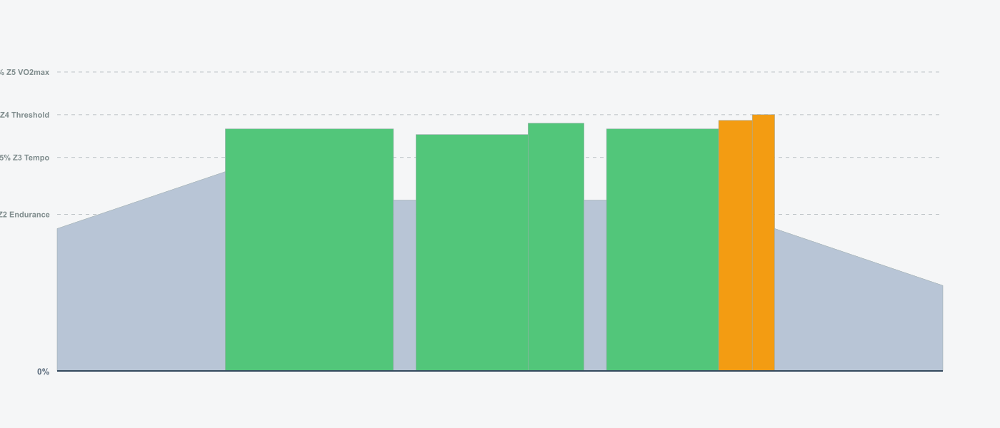

# 12-Week FTP Builder Program v2.0

## Training Plan Overview

- **Duration:** 12 weeks
- **Weekly Hours:** 6-8 hours (4.5 hours during recovery weeks)
- **Structure:** Flexible recovery approach - recovery days every 3-4 days
- **Key Sessions:** Tuesday & Thursday (intensity), Saturday (long/intensity), Sunday (endurance)
- **Rest Days:** Monday + Friday + strategic Wednesday/Sunday recovery

---

## BLOCK 1: Foundation Building (Weeks 1-4)

### Week 1 · 6.5 hours · 231 TSS

| Day           | Workout                                                                                       | Details                                                                                                                  |
| ------------- | --------------------------------------------------------------------------------------------- | ------------------------------------------------------------------------------------------------------------------------ |
| **Monday**    | REST                                                                                          | -                                                                                                                        |
| **Tuesday**   | **FTP Test**                    | • 60 min · 60 TSS · IF 0.75 • 20-min test effort - establish baseline • 💡 Pre-load: Carbs 2-3hrs before         |
| **Wednesday** | **Active Recovery**           | • 45 min · 23 TSS · IF 0.50 • Zone 1-2 easy spin                                                                     |
| **Thursday**  | **Tempo Building**                | • 75 min · 65 TSS · IF 0.82 • 3 x 10min @ 85% • Zone 3 work with varied cadence • 💡 Consume 30-40g carbs/hr |
| **Friday**    | REST                                                                                          | -                                                                                                                        |
| **Saturday**  | **Base Endurance**            | • 90 min · 55 TSS · IF 0.65 • Zone 2 + 6 accelerations • Building aerobic base • 💡 Consume 60g carbs/hr     |
| **Sunday**    | **Active Recovery**              | • 30-45 min · 18 TSS · IF 0.45 • Zone 1-2 optional spin                                                              |

---

### Week 2 · 7.0 hours · 304 TSS

| Day           | Workout                                                                                         | Details                                                                                                                  |
| ------------- | ----------------------------------------------------------------------------------------------- | ------------------------------------------------------------------------------------------------------------------------ |
| **Monday**    | REST                                                                                            | -                                                                                                                        |
| **Tuesday**   | **Sweet Spot 2x15**             | • 70 min · 68 TSS · IF 0.88 • 2 x 15min @ 90% • Building sustained power • 💡 Pre-load: Carbs 2-3hrs before  |
| **Wednesday** | **Easy Spin**                  | • 30 min · 12 TSS · IF 0.40 • Zone 1 only - recovery focus                                                           |
| **Thursday**  | **FTP Intervals 4x8**       | • 85 min · 82 TSS · IF 0.95 • 4 x 8min @ 100% • Direct threshold training • 💡 Pre-load: Carbs 2-3hrs before |
| **Friday**    | REST                                                                                            | -                                                                                                                        |
| **Saturday**  | **Tempo Endurance 3x15**  | • 90 min · 72 TSS · IF 0.83 • 3 x 15min @ 85% • Zone 3 with progressive structure • 💡 Consume 60g carbs/hr  |
| **Sunday**    | **Long Endurance**           | • 120 min · 70 TSS · IF 0.65 • Zone 2 steady • Aerobic development • 💡 Consume 60-90g carbs/hr              |

---

### Week 3 · 7.0 hours · 306 TSS

| Day           | Workout                                                                                  | Details                                                                                                                                  |
| ------------- | ---------------------------------------------------------------------------------------- | ---------------------------------------------------------------------------------------------------------------------------------------- |
| **Monday**    | REST                                                                                     | -                                                                                                                                        |
| **Tuesday**   | **Over/Unders 3x8**                  | • 85 min · 84 TSS · IF 0.92 • 3 x (4min @ 95% + 4min @ 105%) • Lactate clearance training • 💡 Pre-load: Carbs 2-3hrs before |
| **Wednesday** | **Active Recovery**                   | • 45 min · 23 TSS · IF 0.50 • Zone 1-2 easy spin                                                                                     |
| **Thursday**  | **Extended Threshold 2x20**  | • 95 min · 95 TSS · IF 1.00 • 2 x 20min @ 100% • Building threshold endurance • 💡 Consume 60-90g carbs/hr                   |
| **Friday**    | REST                                                                                     | -                                                                                                                                        |
| **Saturday**  | **Sweet Spot 3x20**      | • 100 min · 92 TSS · IF 0.90 • 3 x 20min @ 90% • Peak sweet spot work • 💡 Consume 60-90g carbs/hr                           |
| **Sunday**    | **Easy Spin**                           | • 30 min · 12 TSS · IF 0.40 • Zone 1 only - recovery priority                                                                        |

---

### Week 4 (Recovery) · 4.5 hours · 136 TSS

| Day           | Workout                                                                                  | Details                                                                                                                                         |
| ------------- | ---------------------------------------------------------------------------------------- | ----------------------------------------------------------------------------------------------------------------------------------------------- |
| **Monday**    | REST                                                                                     | -                                                                                                                                               |
| **Tuesday**   | **Recovery Cadence + Sprints**  | • 60 min · 35 TSS · IF 0.58 • Zone 1-2 + cadence drills • 5x10sec sprints - neuromuscular maintenance • 🖠Recovery nutrition focus |
| **Wednesday** | REST                                                                                     | -                                                                                                                                               |
| **Thursday**  | **Light Tempo**                     | • 50 min · 38 TSS · IF 0.75 • 20min @ 80% - easy intensity • 🖠Recovery nutrition focus                                                |
| **Friday**    | REST                                                                                     | -                                                                                                                                               |
| **Saturday**  | **Relaxed Endurance**            | • 75 min · 45 TSS · IF 0.60 • Zone 2 - no structure • 🖠Recovery nutrition focus                                                       |
| **Sunday**    | **Active Recovery**                      | • 30-45 min · 18 TSS · IF 0.45 • Optional rest • 🖠Recovery nutrition focus                                                            |

---

## BLOCK 2: Threshold Development (Weeks 5-8)

### Week 5 · 7.5 hours · 328 TSS

| Day           | Workout                                                                                        | Details                                                                                                                                        |
| ------------- | ---------------------------------------------------------------------------------------------- | ---------------------------------------------------------------------------------------------------------------------------------------------- |
| **Monday**    | REST                                                                                           | -                                                                                                                                              |
| **Tuesday**   | **Pyramid Intervals 3-5-7-5-3** 🆕   | • 80 min · 78 TSS · IF 0.90 • Progressive pyramid @ 100% FTP • Builds mental toughness & pacing • 💡 Pre-load: Carbs 2-3hrs before |
| **Wednesday** | **Easy Spin**                              | • 30 min · 12 TSS · IF 0.40 • Zone 1 only - recovery focus                                                                                 |
| **Thursday**  | **Progressive Threshold 3x12**  | • 90 min · 88 TSS · IF 0.95 • 3 x 12min @ 100% • Building duration • 💡 Consume 60-90g carbs/hr                                    |
| **Friday**    | REST                                                                                           | -                                                                                                                                              |
| **Saturday**  | **Extended Tempo 3x18**          | • 100 min · 80 TSS · IF 0.83 • 3 x 18min @ 85% • Tempo progression • 💡 Consume 60-90g carbs/hr                                    |
| **Sunday**    | **Long Endurance**                       | • 120 min · 70 TSS · IF 0.65 • Zone 2 steady • Aerobic base • 💡 Consume 60-90g carbs/hr                                           |

---

### Week 6 · 7.5 hours · 354 TSS

| Day           | Workout                                                                       | Details                                                                                                                                                    |
| ------------- | ----------------------------------------------------------------------------- | ---------------------------------------------------------------------------------------------------------------------------------------------------------- |
| **Monday**    | REST                                                                          | -                                                                                                                                                          |
| **Tuesday**   | **Push & Pull** 🆕      | • 95 min · 75 TSS · IF 0.82 • 6 x (4min high cadence 100rpm + 4min low 60rpm) @ 88% • Alternating muscle recruitment • 💡 Consume 60g carbs/hr |
| **Wednesday** | **Active Recovery**        | • 45 min · 23 TSS · IF 0.50 • Zone 1-2 easy spin                                                                                                       |
| **Thursday**  | **FTP 2x20**                | • 90 min · 88 TSS · IF 0.95 • 2 x 20min @ 100% • Threshold progression • 💡 Pre-load: Carbs 2-3hrs before                                      |
| **Friday**    | REST                                                                          | -                                                                                                                                                          |
| **Saturday**  | **Sweet Spot 3x22**  | • 105 min · 98 TSS · IF 0.90 • 3 x 22min @ 90% • Extended progression • 💡 Consume 60-90g carbs/hr                                             |
| **Sunday**    | **Endurance**                | • 120 min · 70 TSS · IF 0.65 • Zone 2 steady volume • 💡 Consume 60-90g carbs/hr                                                                   |

---

### Week 7 · 7.5 hours · 346 TSS

| Day           | Workout                                                                            | Details                                                                                                                                               |
| ------------- | ---------------------------------------------------------------------------------- | ----------------------------------------------------------------------------------------------------------------------------------------------------- |
| **Monday**    | REST                                                                               | -                                                                                                                                                     |
| **Tuesday**   | **VO2max 30/30s** 🆕         | • 75 min · 72 TSS · IF 0.88 • 3 x (8 x 30sec @ 120% / 30sec @ 50%) • High-intensity neuromuscular work • 💡 Pre-load: Carbs 2-3hrs before |
| **Wednesday** | **Easy Spin**                  | • 30 min · 12 TSS · IF 0.40 • Zone 1 only - recovery priority                                                                                     |
| **Thursday**  | **Continuous 30min Threshold**  | • 85 min · 85 TSS · IF 0.98 • 30min @ 100% FTP • Peak threshold endurance • 💡 Consume 60g carbs/hr                                       |
| **Friday**    | REST                                                                               | -                                                                                                                                                     |
| **Saturday**  | **Sweet Spot 3x25**       | • 110 min · 102 TSS · IF 0.90 • 3 x 25min @ 90% • Peak volume • 💡 Consume 60-90g carbs/hr                                                |
| **Sunday**    | **Endurance + Tempo**       | • 120 min · 75 TSS · IF 0.70 • Zone 2 + 5x5min tempo bursts • Mixed work • 💡 Consume 60-90g carbs/hr                                     |

---

### Week 8 (Recovery) · 4.5 hours · 136 TSS

| Day           | Workout                                                                                  | Details                                                                                                             |
| ------------- | ---------------------------------------------------------------------------------------- | ------------------------------------------------------------------------------------------------------------------- |
| **Monday**    | REST                                                                                     | -                                                                                                                   |
| **Tuesday**   | **Recovery Cadence + Sprints**  | • 60 min · 35 TSS · IF 0.58 • Zone 1-2 + cadence drills • 5x10sec sprints • 🖠Recovery nutrition focus |
| **Wednesday** | REST                                                                                     | -                                                                                                                   |
| **Thursday**  | **Light Tempo**                     | • 50 min · 38 TSS · IF 0.75 • 20min @ 80% • 🖠Recovery nutrition focus                                     |
| **Friday**    | REST                                                                                     | -                                                                                                                   |
| **Saturday**  | **Relaxed Endurance**            | • 75 min · 45 TSS · IF 0.60 • Zone 2 - no structure • 🖠Recovery nutrition focus                           |
| **Sunday**    | **Active Recovery**                      | • 30-45 min · 18 TSS · IF 0.45 • Optional rest • 🖠Recovery nutrition focus                                |

---

## BLOCK 3: Peak Performance (Weeks 9-12)

### Week 9 · 7.5 hours · 330 TSS

| Day           | Workout                                                                                       | Details                                                                                                                                      |
| ------------- | --------------------------------------------------------------------------------------------- | -------------------------------------------------------------------------------------------------------------------------------------------- |
| **Monday**    | REST                                                                                          | -                                                                                                                                            |
| **Tuesday**   | **Pyramid Intervals 4-6-8-6-4** 🆕  | • 80 min · 78 TSS · IF 0.90 • Advanced pyramid @ 100% FTP • Mental toughness & pacing mastery • 💡 Pre-load: Carbs 2-3hrs before |
| **Wednesday** | **Easy Spin**                             | • 30 min · 12 TSS · IF 0.40 • Zone 1 only - recovery focus                                                                               |
| **Thursday**  | **FTP Intervals 3x15**                      | • 90 min · 90 TSS · IF 0.98 • 3 x 15min @ 100% • Sustained threshold work • 💡 Consume 60-90g carbs/hr                           |
| **Friday**    | REST                                                                                          | -                                                                                                                                            |
| **Saturday**  | **Tempo Endurance 3x18**             | • 100 min · 80 TSS · IF 0.83 • 3 x 18min @ 85% • Zone 3 work • 💡 Consume 60-90g carbs/hr                                        |
| **Sunday**    | **Long Endurance**                      | • 120 min · 70 TSS · IF 0.65 • Zone 2 steady • Aerobic work • 💡 Consume 60-90g carbs/hr                                         |

---

### Week 10 (Peak Build) · 8.0 hours · 378 TSS

| Day           | Workout                                                                       | Details                                                                                                                                                                    |
| ------------- | ----------------------------------------------------------------------------- | -------------------------------------------------------------------------------------------------------------------------------------------------------------------------- |
| **Monday**    | REST                                                                          | -                                                                                                                                                                          |
| **Tuesday**   | **VO2max 40/20s** 🆕    | • 95 min · 85 TSS · IF 0.90 • 3 x (10 x 40sec @ 120% / 20sec @ 50%) • Classic Tabata-style intervals • Lactate handling • 💡 Pre-load: Carbs 2-3hrs before |
| **Wednesday** | **Active Recovery**        | • 45 min · 23 TSS · IF 0.50 • Zone 1-2 easy spin • Peak training week - stay easy                                                                                  |
| **Thursday**  | **FTP 2x25**                | • 100 min · 98 TSS · IF 0.98 • 2 x 25min @ 100% • Peak threshold work • 💡 Consume 60-90g carbs/hr                                                             |
| **Friday**    | REST                                                                          | -                                                                                                                                                                          |
| **Saturday**  | **Sweet Spot 3x25**  | • 110 min · 102 TSS · IF 0.90 • 3 x 25min @ 90% • Maximum volume • 💡 Consume 60-90g carbs/hr                                                                  |
| **Sunday**    | **Endurance**                | • 120 min · 70 TSS · IF 0.65 • Zone 2 steady volume • Reduced from 2.5hr • 💡 Consume 60-90g carbs/hr                                                          |

---

### Week 11 (Peak) · 7.5 hours · 342 TSS

| Day           | Workout                                                                            | Details                                                                                                                                                     |
| ------------- | ---------------------------------------------------------------------------------- | ----------------------------------------------------------------------------------------------------------------------------------------------------------- |
| **Monday**    | REST                                                                               | -                                                                                                                                                           |
| **Tuesday**   | **VO2max Mixed** 🆕           | • 85 min · 80 TSS · IF 0.92 • 5 x 2min @ 115% + 4 x (40sec @ 120% / 20sec @ 50%) • Top-end power development • 💡 Pre-load: Carbs 2-3hrs before |
| **Wednesday** | **Easy Spin**                  | • 30 min · 12 TSS · IF 0.40 • Zone 1 only - recovery priority • Final test next week!                                                               |
| **Thursday**  | **Continuous 35min Threshold**  | • 90 min · 92 TSS · IF 1.00 • 35min @ 100% FTP • Maximum threshold endurance • 💡 Consume 60-90g carbs/hr                                       |
| **Friday**    | REST                                                                               | -                                                                                                                                                           |
| **Saturday**  | **Race Simulation** 🆕    | • 100 min · 88 TSS · IF 0.85 • 3 x (8min @ 92% + 2min @ 105% + 5min @ 75%) • Mixed intensity - race dynamics • 💡 Consume 60-90g carbs/hr       |
| **Sunday**    | **Steady Endurance**              | • 120 min · 70 TSS · IF 0.65 • Zone 2 steady • Final volume ride • 💡 Consume 60-90g carbs/hr                                                   |

---

### Week 12 (Taper & Test) · 5.0 hours · 195 TSS

| Day           | Workout                                                                            | Details                                                                                                                                                                   |
| ------------- | ---------------------------------------------------------------------------------- | ------------------------------------------------------------------------------------------------------------------------------------------------------------------------- |
| **Monday**    | REST                                                                               | -                                                                                                                                                                         |
| **Tuesday**   | **🯠FINAL FTP TEST**       | • 60 min · 60 TSS · IF 0.75 • 20-min test - measure your gains! • Compare to Week 1 • 💡 Pre-load: Carbs 2-3hrs before • **Expected: 5-15% FTP increase** |
| **Wednesday** | **Easy Spin**                  | • 30 min · 12 TSS · IF 0.40 • Zone 1 - recovery from test • Let results sink in!                                                                                  |
| **Thursday**  | **Victory Lap** 🉠           | • 60 min · 50 TSS · IF 0.70 • Zone 2 at your NEW FTP zones • Celebrate your gains! • Feel how much stronger you are                                           |
| **Friday**    | REST                                                                               | -                                                                                                                                                                         |
| **Saturday**  | **Celebration Ride** 🉠 | • 90 min · 55 TSS · IF 0.65 • Zone 2 - enjoy your fitness • 12-week journey complete! • 💡 Consume 60g carbs/hr                                               |
| **Sunday**    | **Reflection & Planning**          | • 30-45 min · 18 TSS · IF 0.45 • Optional easy spin • Reflect on your journey • Plan what's next! • 🖠Recovery nutrition focus                           |

---

## Workout Types Reference

**FTP Intervals (100% FTP)** - Direct threshold training, builds sustainable power
**Sweet Spot (88-93% FTP)** - High-intensity aerobic work, sustainable for longer durations
**Over/Unders (95%/105% FTP)** - Lactate clearance training, alternating below/above threshold
**Pyramid Intervals (100% FTP)** - Progressive intervals (3-5-7-5-3 or 4-6-8-6-4 min), builds mental toughness
**Push & Pull (88% FTP)** - Alternating high cadence (100rpm) / low cadence (60rpm), neuromuscular development
**Tempo (83-87% FTP)** - Moderate intensity, builds aerobic base and muscular endurance
**VO2max (106-120% FTP)** - Short high-intensity efforts (30/30s, 40/20s, or 2-5min), maximum aerobic capacity
**Endurance (65-75% FTP)** - Easy conversational pace, aerobic base and recovery

---

## Alternative Workouts from MyWhoosh 🔄

Can't complete the prescribed workout? Here are equivalent MyWhoosh alternatives you can substitute:

### **FTP/Threshold Alternatives**

**If you need to replace FTP intervals:**

- **Threshold #2-#5** (52-60 min) - Progressive threshold intervals
- **Targeting FTP** (40 min) - Focused threshold work
- **20min Tempo w/15sec Accelerations** (55 min) - Threshold + surges

**For 2x20 FTP workouts:**

- **Tempo Climbing #1 or #2** (60 min) - Sustained threshold efforts
- **Tempo #3-#5** (54-62 min) - Extended tempo/threshold

### **Sweet Spot Alternatives**

**If you need to replace Sweet Spot sessions:**

- **Sweetspot Training** (41 min) - Classic sweet spot intervals
- **15min Varied Tempo #1-#3** (48-60 min) - Progressive sweet spot work
- **Tempo into Sprints** (61 min) - Sweet spot + neuromuscular

### **VO2max Alternatives**

**For 30/30s or 40/20s:**

- **30/30 Anaerobic #1-#4** (52-68 min) - Progressive 30/30 intervals
- **30/30 Efforts** (51 min) - Classic 30/30 protocol
- **12min 30/30's #1-#2** (57-74 min) - Extended 30/30 work

**For longer VO2max (2-5 min):**

- **10min Ramps** (59 min) - VO2max ramp intervals
- **11min Intensive Aerobic** (77 min) - Sustained VO2max
- **22min Intensive Aerobic** (88 min) - Extended VO2max work
- **1min Power Duration #2** (58 min) - Mixed VO2max intervals

### **Over/Under Alternatives**

**If you need to replace Over/Under sessions:**

- **Tempo with 30sec spike #1** (54 min) - Tempo with surges
- **Tempo with 15sec surges** (40 min) - Shorter over efforts
- **Tadej's Criss-cross Tempo** (34 min) - Pogačar's favorite workout

### **Pyramid/Progressive Alternatives**

**For Pyramid intervals:**

- **Capacity Pyramid #1** (70 min) - Progressive FTP pyramid
- **1min + Endurance #1** (88 min) - Progressive intervals + endurance

### **Tempo Alternatives**

**For 3x15-18 min Tempo:**

- **Tempo #1-#11** (52-76 min) - Various tempo durations
- **Tempo Climbing #1-#2** (60 min) - Sustained tempo efforts

### **Recovery/Cadence Alternatives**

**For recovery weeks:**

- **Cadence Changers #1-#2** (42-46 min) - Cadence drills
- **Power Reps #1-#2** (51-60 min) - Light power + cadence
- **Torque Changers #1** (59 min) - Strength endurance work
- **Low Cadence Steps #1-#2** (61-65 min) - Low cadence focus

### **Sprint/Power Alternatives**

**For sprint maintenance:**

- **Power Starts** - 10sec and 30sec sprint development
- **Endurance with Short Sprints** (51-62 min) - Endurance + sprints
- **Endurance with max bursts** (51 min) - Max efforts in endurance

### **Race Simulation Alternatives**

**For mixed intensity/race prep:**

- **Lactate Shuttle #1** (varies) - Lactate tolerance work
- **Mixed Intervals** (90 min) - Varied intensity like racing
- Any **"Train Like Tadej"** workout - World Tour race simulation

### **Endurance Alternatives**

**For long steady rides:**

- Any workout in the **Endurance** category (89 workouts available)
- **20sec + Endurance #1** (84 min) - Endurance with micro-bursts

---

## How to Use Alternatives

**When to substitute:**

- ✅ Traveling and don't have your workout files
- ✅ Need mental variety while maintaining training stimulus
- ✅ Feeling slightly off and want a similar but different workout
- ✅ Want to try World Tour coach-designed sessions

**How to choose:**

1. Match the **duration** (±10 minutes is fine)
2. Match the **TSS** (±10 TSS is acceptable)
3. Match the **training zone** (Tempo, Threshold, VO2max, etc.)
4. Prioritize workouts with similar IF (Intensity Factor)

**Important notes:**

- ⚠️ Don't substitute threshold work with VO2max or vice versa
- ⚠️ Keep recovery weeks truly easy - don't swap in harder alternatives
- ⚠️ FTP tests should never be substituted
- ✅ Alternatives are best used 1-2x per training block, not every week

---

## Recovery Day Strategy 🆕

**Flexible Recovery Approach:**
Unlike traditional weekly recovery, this plan uses a more frequent recovery schedule:

- **Easy Spin Days:** Zone 1 only (30 min) every 3-4 days during build weeks
- **Active Recovery:** Zone 1-2 (45 min) as needed
- **Strategic Rest:** Monday & Friday always off
- **Recovery Weeks:** Every 4th week (Weeks 4, 8, 12)

**Benefits:**

- Prevents cumulative fatigue
- Maintains consistency
- Allows harder efforts on key days
- Recovery is never more than 2-3 days away

**Recovery Week Focus:**

- Neuromuscular maintenance (5x10sec sprints)
- Cadence drills (high/low rpm work)
- Reduced volume (~40%)
- Enhanced nutrition focus

---

## Training Zones

| Zone | Name            | % FTP     | Purpose                  |
| ---- | --------------- | --------- | ------------------------ |
| 1    | Active Recovery | <55%      | Easy recovery            |
| 2    | Endurance       | 55-75%    | Aerobic base building    |
| 3    | Tempo           | 76-87%    | Muscular endurance       |
| 4    | Threshold       | 88-105%   | FTP development          |
| 5    | VO2max          | 106-120%  | Max aerobic capacity     |
| 6    | Anaerobic       | 121-150%  | Sprint/neuromuscular     |

**FTP Calculation:** 20-min test average power × 0.95

---

## Nutrition Guidelines

**High-Intensity Sessions (>85% FTP)**
💡 Pre-load: 1-2g carbs/kg body weight 2-3 hours before (e.g., 70-140g for 70kg rider)

**Long Rides (>90 min)**
💡 During: 60-90g carbs/hour via sports drinks, gels, bars, or real food

**Moderate Sessions (60-90 min, <85% FTP)**
💡 During: 30-60g carbs/hour - hydration priority

**Recovery Weeks**
🍖 Increase protein (1.6-2.2g/kg/day), maintain carbs, prioritize sleep, anti-inflammatory foods

**General**
Hydration: 500-750ml/hr | Post-workout: 20-40g protein + carbs within 60 min

---

## Expected Outcomes

By Week 12, you should see:

- **5-15% FTP increase** (varies by training history)
- Improved ability to sustain threshold power
- Better pacing and power management
- Enhanced recovery between efforts
- Increased confidence and mental toughness
- Stronger aerobic base for future training
- Improved neuromuscular coordination (cadence work)
- Better lactate clearance (Over/Unders, 30/30s)
- Race-ready fitness (simulation workouts)

**Compare your Week 1 and Week 12 FTP tests to measure your exact gains!**
