# 8 Weeks Road Builder

## Overview

- **Total Weeks:** 8
- **Total Workouts:** 66
- **Total TSS:** 4117
- **Total Hours:** 77.4
- **Average TSS/Week:** 515
- **Average Hours/Week:** 9.7

## Intensity Distribution

- **Recovery (<60% FTP):** 29.6%
- **Endurance (60-75% FTP):** 58.5%
- **Tempo (76-87% FTP):** 1.7%
- **Threshold (88-105% FTP):** 1.6%
- **VO2max (>105% FTP):** 8.6%

## Program Calendar

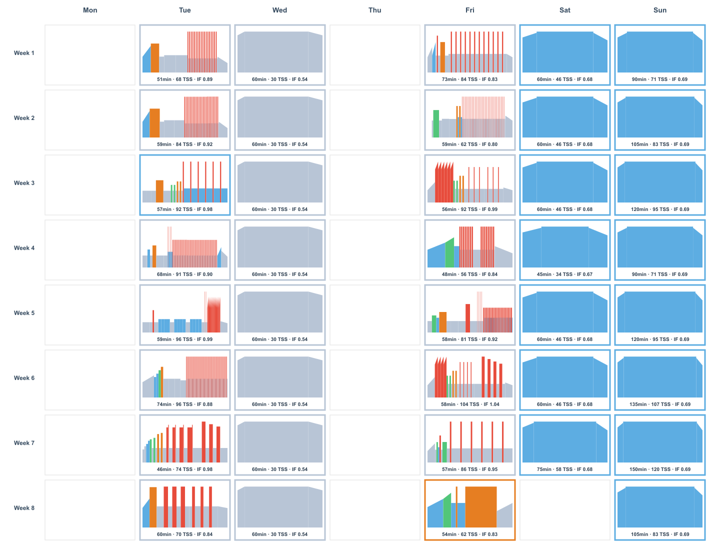

## Progression Analysis

## Weekly Breakdown

### Week 1

**Weekly Total:** 440 TSS, 8.4 hours

- **Day 1 (Tuesday):** VO2max 30 30s - 87 TSS, 72 min
  

- **Day 2 (Wednesday):** Recovery Easy 2 - 30 TSS, 60 min
  

- **Day 4 (Friday):** VO2max 3x6min 2 - 65 TSS, 52 min
  

- **Day 5 (Saturday):** Easy Z2 2 - 46 TSS, 60 min
  

- **Day 6 (Sunday):** Long Endurance - 71 TSS, 90 min
  

### Week 2

**Weekly Total:** 576 TSS, 10.0 hours

- **Day 1 (Tuesday):** VO2max 40 20s 2 - 115 TSS, 80 min
  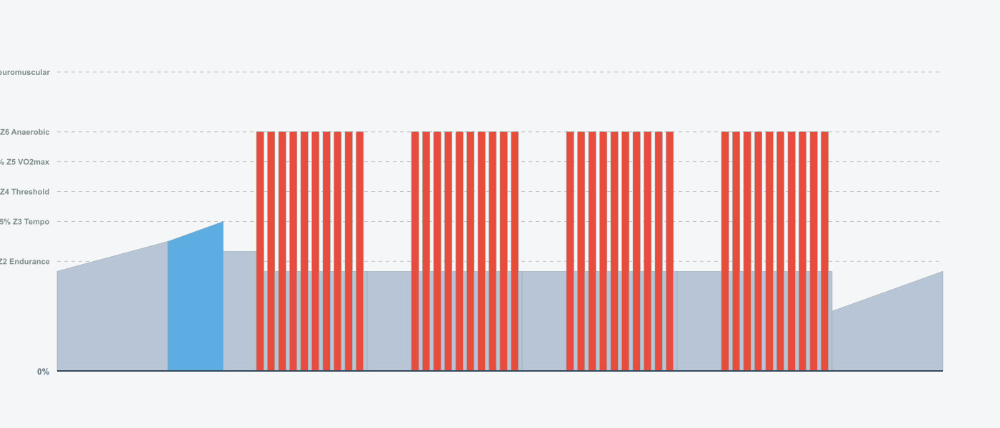

- **Day 2 (Wednesday):** Recovery Easy - 30 TSS, 60 min
  

- **Day 4 (Friday):** VO2max Mixed - 58 TSS, 50 min
  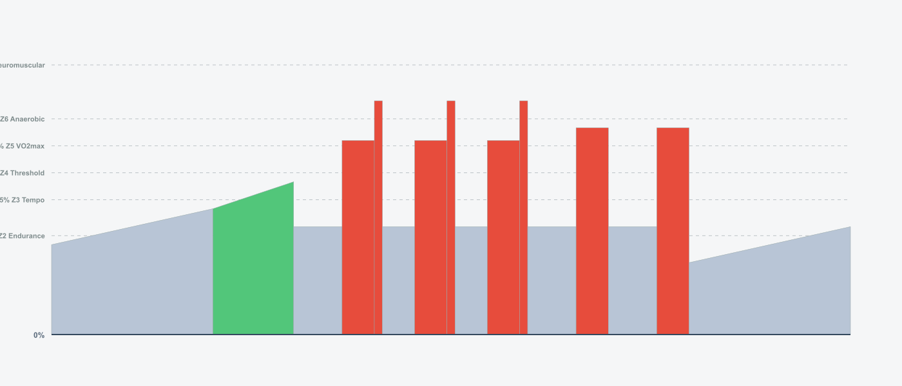

- **Day 5 (Saturday):** Easy Z2 - 46 TSS, 60 min
  

- **Day 6 (Sunday):** Long Endurance 2 - 83 TSS, 105 min
  

### Week 3

**Weekly Total:** 483 TSS, 9.1 hours

- **Day 1 (Tuesday):** VO2max 4x4min - 64 TSS, 53 min
  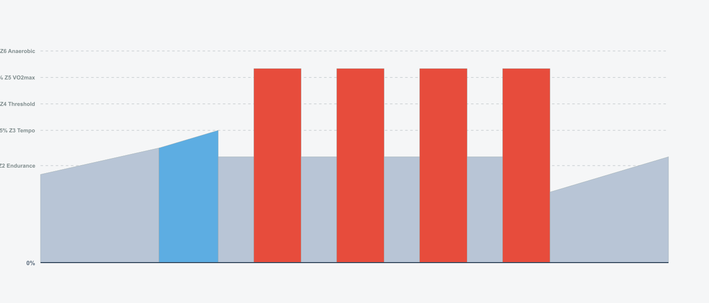

- **Day 2 (Wednesday):** Recovery Easy - 30 TSS, 60 min
  

- **Day 4 (Friday):** VO2max 40 20s 2 - 86 TSS, 66 min
  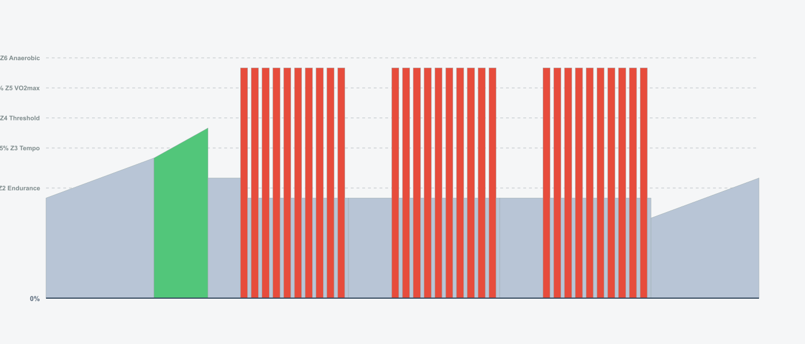

- **Day 5 (Saturday):** Easy Z2 2 - 46 TSS, 60 min
  

- **Day 6 (Sunday):** Long Endurance - 95 TSS, 120 min
  

### Week 4

**Weekly Total:** 434 TSS, 8.9 hours

- **Day 1 (Tuesday):** VO2max Recovery - 52 TSS, 48 min
  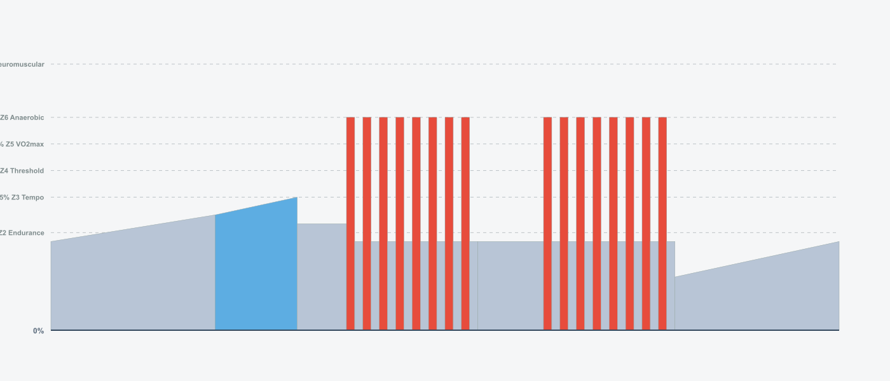

- **Day 2 (Wednesday):** Recovery Easy - 30 TSS, 60 min
  

- **Day 4 (Friday):** VO2max 40 20s Recovery - 56 TSS, 48 min
  

- **Day 5 (Saturday):** Easy Z2 2 - 34 TSS, 45 min
  

- **Day 6 (Sunday):** Long Endurance 2 - 71 TSS, 90 min
  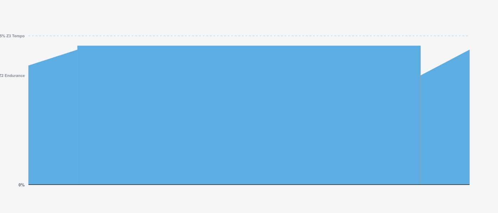

### Week 5

**Weekly Total:** 571 TSS, 10.3 hours

- **Day 1 (Tuesday):** VO2max 5x5min 2 - 85 TSS, 65 min
  

- **Day 2 (Wednesday):** Recovery Easy - 30 TSS, 60 min
  

- **Day 4 (Friday):** VO2max Surges - 89 TSS, 65 min
  

- **Day 5 (Saturday):** Easy Z2 - 46 TSS, 60 min
  

- **Day 6 (Sunday):** Long Endurance - 95 TSS, 120 min
  

### Week 6

**Weekly Total:** 582 TSS, 11.1 hours

- **Day 1 (Tuesday):** VO2max LowCadence 2 - 64 TSS, 53 min
  

- **Day 2 (Wednesday):** Recovery Easy 2 - 30 TSS, 60 min
  

- **Day 4 (Friday):** VO2max Progressive Mixed - 67 TSS, 54 min
  

- **Day 5 (Saturday):** Easy Z2 - 46 TSS, 60 min
  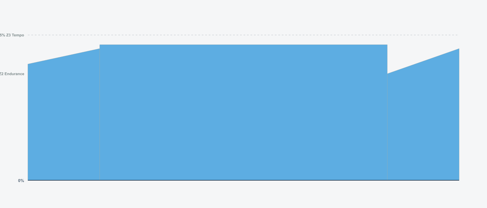

- **Day 6 (Sunday):** Long Endurance - 107 TSS, 135 min
  

### Week 7

**Weekly Total:** 641 TSS, 12.3 hours

- **Day 1 (Tuesday):** VO2max Mixed - 73 TSS, 55 min
  

- **Day 2 (Wednesday):** Recovery Easy - 30 TSS, 60 min
  

- **Day 4 (Friday):** VO2max PEAK - 79 TSS, 60 min
  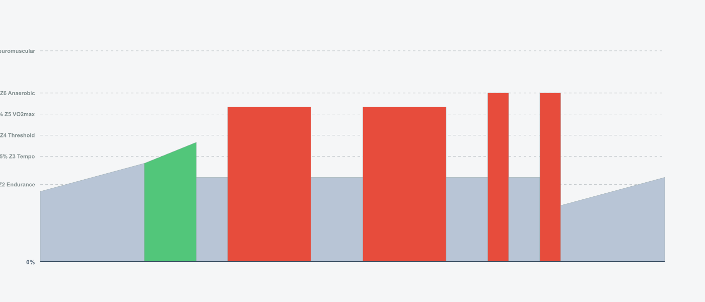

- **Day 5 (Saturday):** Easy Z2 - 58 TSS, 75 min
  

- **Day 6 (Sunday):** Long Endurance - 120 TSS, 150 min
  

### Week 8

**Weekly Total:** 390 TSS, 7.4 hours

- **Day 1 (Tuesday):** VO2max Taper - 44 TSS, 44 min
  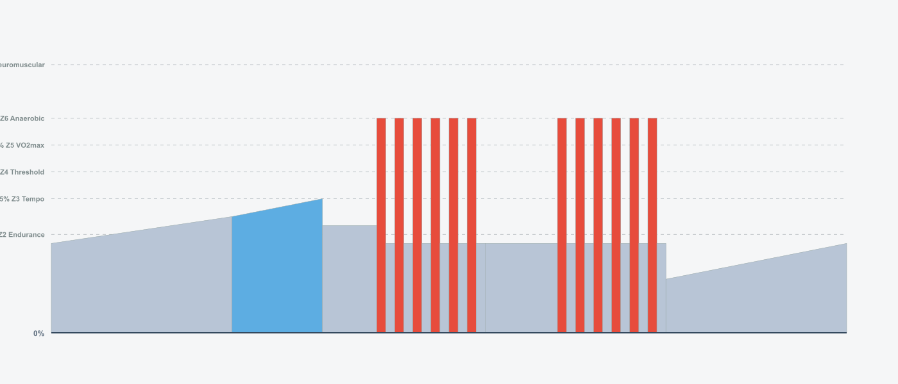

- **Day 2 (Wednesday):** Recovery Easy - 30 TSS, 60 min
  

- **Day 4 (Friday):** FTP Test 2x15min - 79 TSS, 66 min
  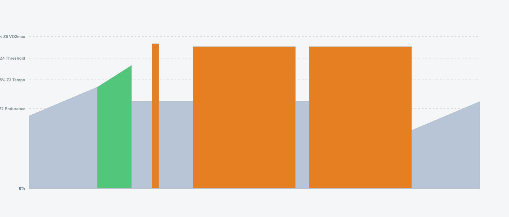

- **Day 6 (Sunday):** Long Endurance - 83 TSS, 105 min
  

## Usage

### Import ZWO Files

The `.zwo` files in the `zwo_files/` directory can be imported into:

- **Zwift** - Import custom workouts
- **MyWhoosh** - Import workout files
- **TrainingPeaks** - Upload ZWO files
- Any other platform that supports the ZWO format

### Interactive Viewer

Open `docs/index.html` in your browser for an interactive workout calendar and statistics dashboard.
