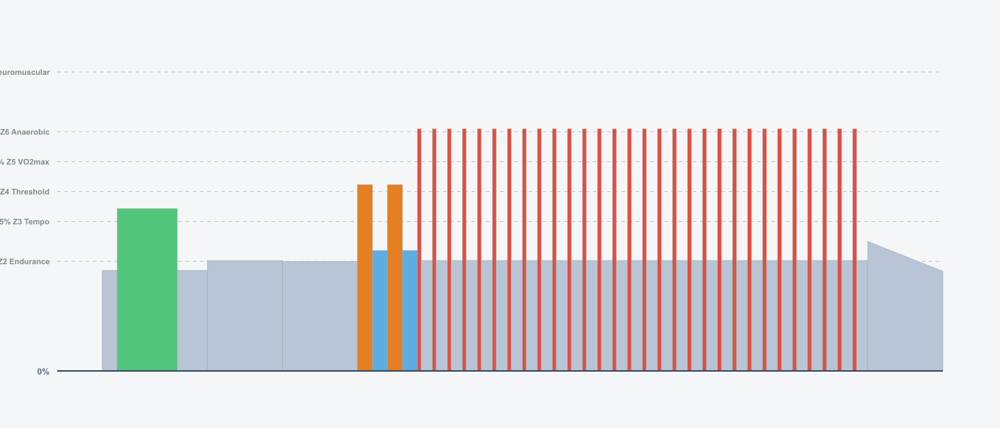
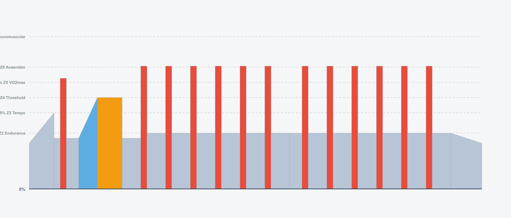
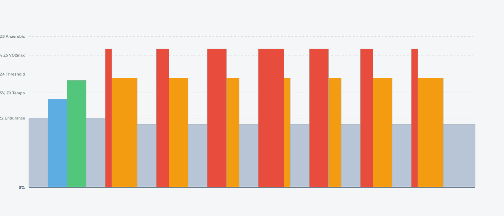

# 8 Weeks Road Builder

## Overview

- **Total Weeks:** 8
- **Total Workouts:** 39
- **Total TSS:** 2635
- **Total Hours:** 46.6
- **Average TSS/Week:** 329
- **Average Hours/Week:** 5.8

## Intensity Distribution

- **Recovery (<60% FTP):** 0.0%
- **Endurance (60-75% FTP):** 0.0%
- **Tempo (76-87% FTP):** 0.0%
- **Threshold (88-105% FTP):** 0.0%
- **VO2max (>105% FTP):** 0.0%

## Program Calendar

## Weekly Breakdown

### Week 1

**Weekly Total:** 296 TSS, 5.7 hours

| Day | Workout | Details |
| --- | ------- | ------- |
| **2** | **W1-Tue: 30/30s Introduction**  | • 72 min · 87 TSS · IF 0.85 |
| **3** | **W1-Wed: Easy Recovery**  | • 60 min · 30 TSS · IF 0.54 |
| **5** | **Neuromuscular Power Surges #2**  | • 59 min · 62 TSS · IF 0.80 |
| **6** | **W1-Sat: Easy Z2 Ride**  | • 60 min · 46 TSS · IF 0.68 |
| **7** | **W1-Sun: Long Endurance 90min**  | • 90 min · 71 TSS · IF 0.69 |

### Week 2

**Weekly Total:** 327 TSS, 6.0 hours

| Day | Workout | Details |
| --- | ------- | ------- |
| **2** | **Controlled 30/30's #2**  | • 59 min · 84 TSS · IF 0.92 |
| **3** | **W2-Wed: Easy Recovery**  | • 60 min · 30 TSS · IF 0.54 |
| **5** | **Anaerobic Endurance #2**  | • 73 min · 84 TSS · IF 0.83 |
| **6** | **W2-Sat: Easy Z2 Ride**  | • 60 min · 46 TSS · IF 0.68 |
| **7** | **W2-Sun: Long Endurance 105min**  | • 105 min · 83 TSS · IF 0.69 |

### Week 3

**Weekly Total:** 355 TSS, 5.9 hours

| Day | Workout | Details |
| --- | ------- | ------- |
| **2** | **HIIT 45sec #1**  | • 57 min · 92 TSS · IF 0.98 |
| **3** | **W3-Wed: Easy Recovery**  | • 60 min · 30 TSS · IF 0.54 |
| **5** | **Power Intervals #1**  | • 56 min · 92 TSS · IF 0.99 |
| **6** | **W3-Sat: Easy Z2 Ride**  | • 60 min · 46 TSS · IF 0.68 |
| **7** | **W3-Sun: Long Endurance 120min**  | • 120 min · 95 TSS · IF 0.69 |

### Week 4

**Weekly Total:** 313 TSS, 5.5 hours

| Day | Workout | Details |
| --- | ------- | ------- |
| **2** | **30/30's Anaerobic #3**  | • 68 min · 91 TSS · IF 0.90 |
| **3** | **W4-Wed: Easy Recovery**  | • 60 min · 30 TSS · IF 0.54 |
| **5** | **Capacity Pyramid #2**  | • 70 min · 87 TSS · IF 0.86 |
| **6** | **W4-Sat: Easy Z2 Ride (Reduced)**  | • 45 min · 34 TSS · IF 0.67 |
| **7** | **W4-Sun: Long Endurance 90min (Reduced)**  | • 90 min · 71 TSS · IF 0.69 |

### Week 5

**Weekly Total:** 348 TSS, 6.0 hours

| Day | Workout | Details |
| --- | ------- | ------- |
| **2** | **Intensive Capacity #2**  | • 59 min · 96 TSS · IF 0.99 |
| **3** | **W5-Wed: Easy Recovery**  | • 60 min · 30 TSS · IF 0.54 |
| **5** | **40/20's #2**  | • 58 min · 81 TSS · IF 0.92 |
| **6** | **W5-Sat: Easy Z2 Ride**  | • 60 min · 46 TSS · IF 0.68 |
| **7** | **W5-Sun: Long Endurance 120min**  | • 120 min · 95 TSS · IF 0.69 |

### Week 6

**Weekly Total:** 383 TSS, 6.5 hours

| Day | Workout | Details |
| --- | ------- | ------- |
| **2** | **12min 30/30's #2**  | • 74 min · 96 TSS · IF 0.88 |
| **3** | **W6-Wed: Easy Recovery**  | • 60 min · 30 TSS · IF 0.54 |
| **5** | **Power Intervals #3**  | • 58 min · 104 TSS · IF 1.04 |
| **6** | **W6-Sat: Easy Z2 Ride**  | • 60 min · 46 TSS · IF 0.68 |
| **7** | **W6-Sun: Long Endurance 135min**  | • 135 min · 107 TSS · IF 0.69 |

### Week 7

**Weekly Total:** 368 TSS, 6.5 hours

| Day | Workout | Details |
| --- | ------- | ------- |
| **2** | **Pace is the trick**  | • 46 min · 74 TSS · IF 0.98 |
| **3** | **W7-Wed: Easy Recovery**  | • 60 min · 30 TSS · IF 0.54 |
| **5** | **Extensive Anaerobic 6 x 1min**  | • 57 min · 86 TSS · IF 0.95 |
| **6** | **W7-Sat: Easy Z2 Ride (Extended)**  | • 75 min · 58 TSS · IF 0.68 |
| **7** | **W7-Sun: Long Endurance 150min (PEAK)**  | • 150 min · 120 TSS · IF 0.69 |

### Week 8

**Weekly Total:** 245 TSS, 4.7 hours

| Day | Workout | Details |
| --- | ------- | ------- |
| **2** | **VO2max Climbing #1**  | • 60 min · 70 TSS · IF 0.84 |
| **3** | **W8-Wed: Easy Recovery**  | • 60 min · 30 TSS · IF 0.54 |
| **5** | **W8-Fri: FTP Test 20min**  | • 54 min · 62 TSS · IF 0.83 |
| **7** | **W8-Sun: Long Endurance 105min**  | • 105 min · 83 TSS · IF 0.69 |

## Usage

### Import ZWO Files

The `.zwo` files in the `zwo_files/` directory can be imported into:

- **Zwift** - Import custom workouts
- **MyWhoosh** - Import workout files
- **TrainingPeaks** - Upload ZWO files
- Any other platform that supports the ZWO format

### Interactive Viewer

Open `docs/index.html` in your browser for an interactive workout calendar and statistics dashboard.
