# 8 Weeks Road Builder

## Overview

- **Total Weeks:** 8
- **Total Workouts:** 43
- **Total TSS:** 2924
- **Total Hours:** 50.4
- **Average TSS/Week:** 366
- **Average Hours/Week:** 6.3

## Intensity Distribution

- **Recovery (<60% FTP):** 0.0%
- **Endurance (60-75% FTP):** 0.0%
- **Tempo (76-87% FTP):** 0.0%
- **Threshold (88-105% FTP):** 0.0%
- **VO2max (>105% FTP):** 0.0%

## Program Calendar

## Progression Analysis

## Weekly Breakdown

### Week 1

**Weekly Total:** 386 TSS, 6.8 hours

| Day | Workout | Details |
| --- | ------- | ------- |
| **Tuesday** | **controlled-30-30-s-1** 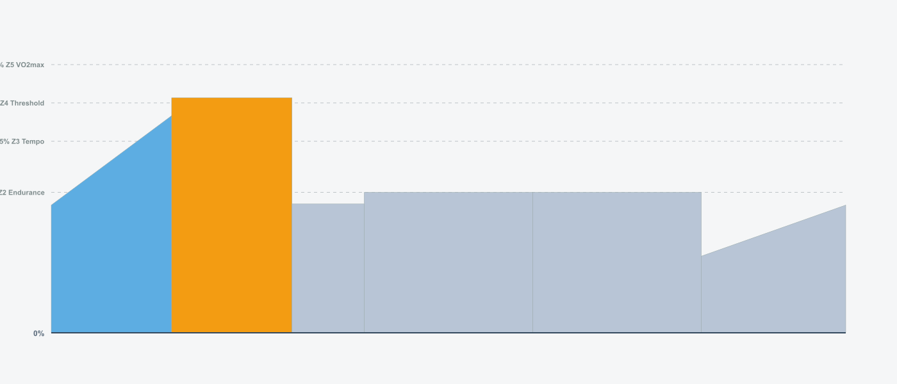 | • 51 min · 68 TSS · IF 0.89 |
| **Wednesday** | **Recovery Easy**  | • 60 min · 30 TSS · IF 0.54 |
| **Friday** | **anaerobic-endurance-2** 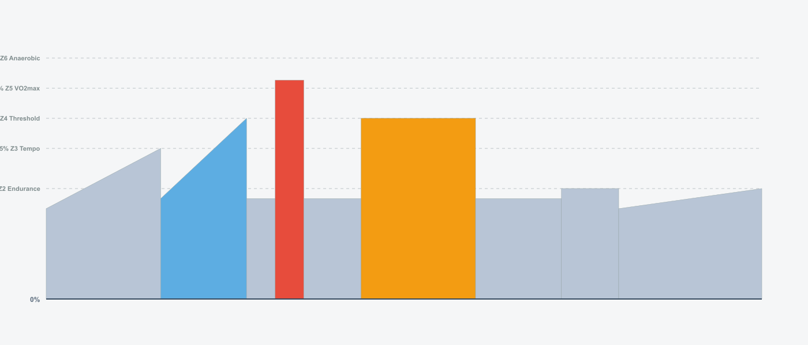 | • 73 min · 84 TSS · IF 0.83 |
| **Saturday** | **Easy Z2** 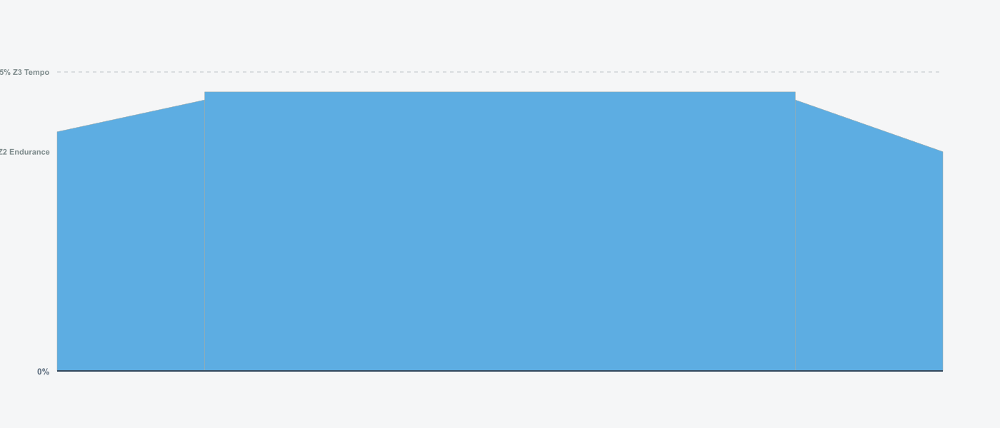 | • 60 min · 46 TSS · IF 0.68 |
| **Sunday** | **Long Endurance**  | • 90 min · 71 TSS · IF 0.69 |

### Week 2

**Weekly Total:** 305 TSS, 5.7 hours

| Day | Workout | Details |
| --- | ------- | ------- |
| **Tuesday** | **controlled-30-30-s-2**  | • 59 min · 84 TSS · IF 0.92 |
| **Wednesday** | **Recovery Easy**  | • 60 min · 30 TSS · IF 0.54 |
| **Friday** | **neuromuscular-power-surges-2** 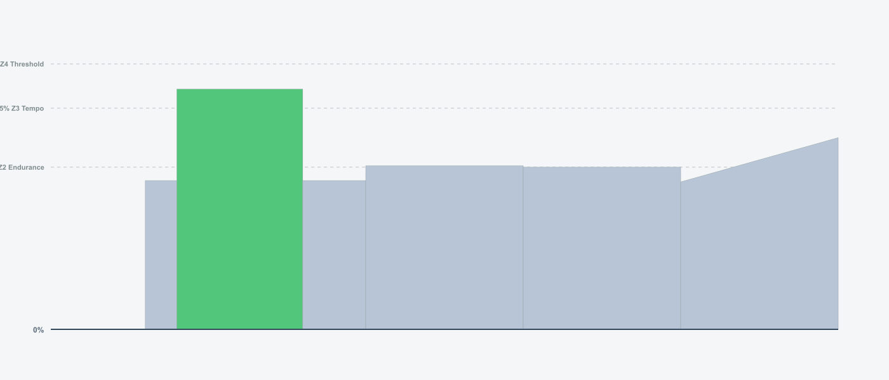 | • 59 min · 62 TSS · IF 0.80 |
| **Saturday** | **Easy Z2**  | • 60 min · 46 TSS · IF 0.68 |
| **Sunday** | **Long Endurance**  | • 105 min · 83 TSS · IF 0.69 |

### Week 3

**Weekly Total:** 441 TSS, 7.0 hours

| Day | Workout | Details |
| --- | ------- | ------- |
| **Tuesday** | **hiit-45sec-1** 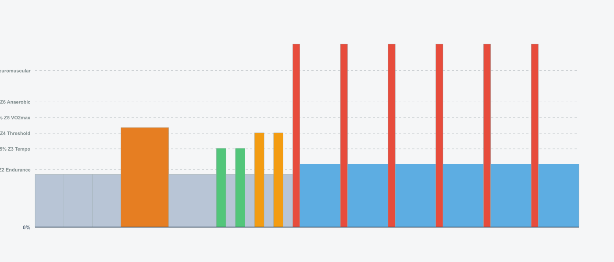 | • 57 min · 92 TSS · IF 0.98 |
| **Wednesday** | **Recovery Easy**  | • 60 min · 30 TSS · IF 0.54 |
| **Friday** | **power-intervals-1** 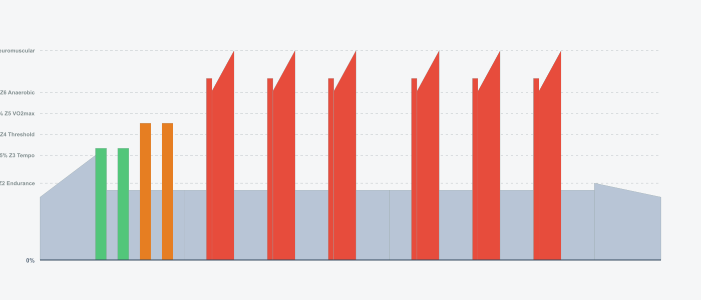 | • 56 min · 92 TSS · IF 0.99 |
| **Saturday** | **Easy Z2**  | • 60 min · 46 TSS · IF 0.68 |
| **Sunday** | **Long Endurance**  | • 120 min · 95 TSS · IF 0.69 |

### Week 4

**Weekly Total:** 369 TSS, 6.3 hours

| Day | Workout | Details |
| --- | ------- | ------- |
| **Tuesday** | **30-30-s-anaerobic-3** 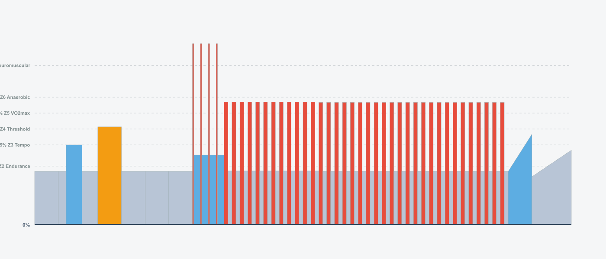 | • 68 min · 91 TSS · IF 0.90 |
| **Wednesday** | **Recovery Easy**  | • 60 min · 30 TSS · IF 0.54 |
| **Friday** | **VO2max 40 20s Recovery** 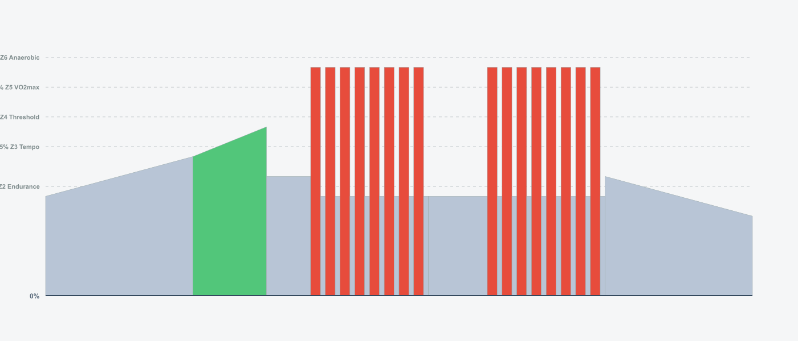 | • 48 min · 56 TSS · IF 0.84 |
| **Saturday** | **Easy Z2**  | • 45 min · 34 TSS · IF 0.67 |
| **Sunday** | **Long Endurance**  | • 90 min · 71 TSS · IF 0.69 |

### Week 5

**Weekly Total:** 348 TSS, 6.0 hours

| Day | Workout | Details |
| --- | ------- | ------- |
| **Tuesday** | **intensive-capacity-2** 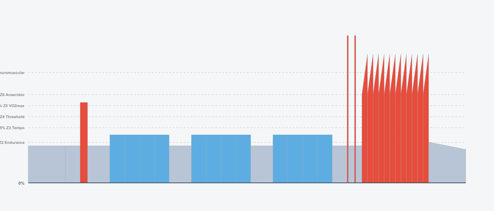 | • 59 min · 96 TSS · IF 0.99 |
| **Wednesday** | **Recovery Easy**  | • 60 min · 30 TSS · IF 0.54 |
| **Friday** | **40-20-s-2** 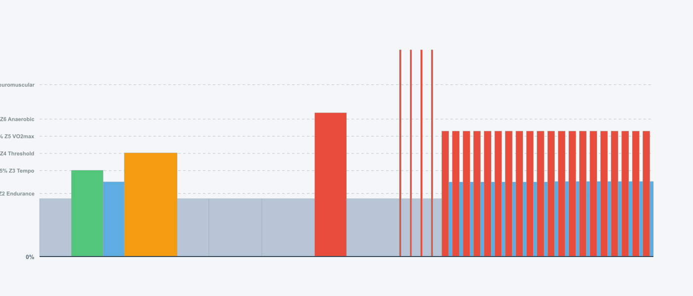 | • 58 min · 81 TSS · IF 0.92 |
| **Saturday** | **Easy Z2**  | • 60 min · 46 TSS · IF 0.68 |
| **Sunday** | **Long Endurance**  | • 120 min · 95 TSS · IF 0.69 |

### Week 6

**Weekly Total:** 383 TSS, 6.5 hours

| Day | Workout | Details |
| --- | ------- | ------- |
| **Tuesday** | **12min-30-30-s-2** 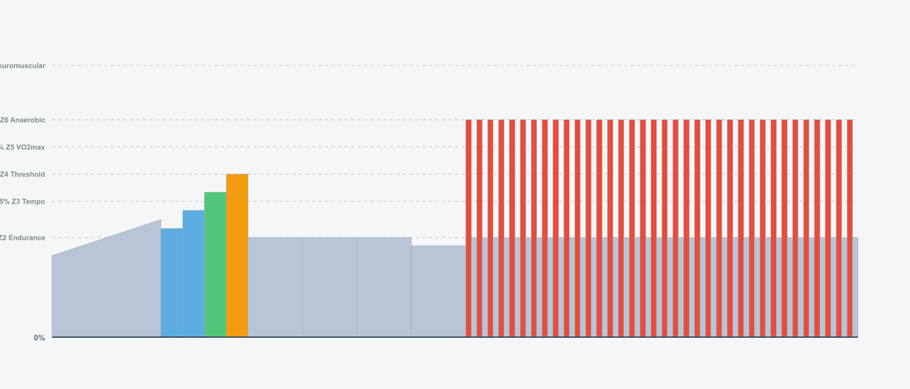 | • 74 min · 96 TSS · IF 0.88 |
| **Wednesday** | **Recovery Easy** 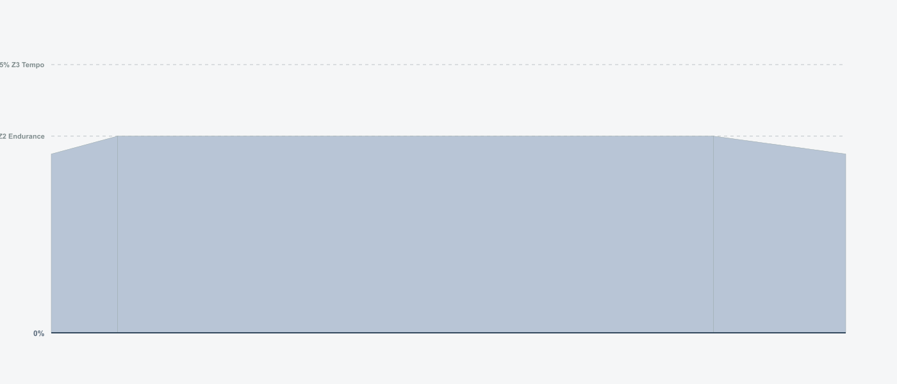 | • 60 min · 30 TSS · IF 0.54 |
| **Friday** | **power-intervals-3** 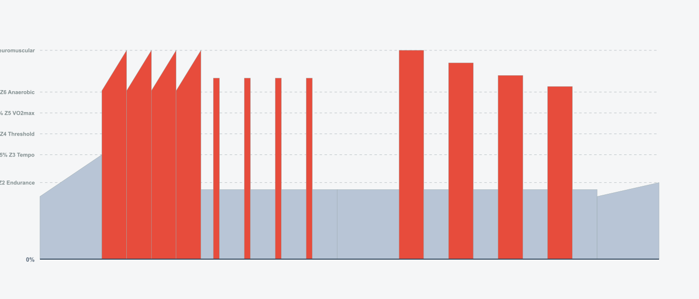 | • 58 min · 104 TSS · IF 1.04 |
| **Saturday** | **Easy Z2**  | • 60 min · 46 TSS · IF 0.68 |
| **Sunday** | **Long Endurance**  | • 135 min · 107 TSS · IF 0.69 |

### Week 7

**Weekly Total:** 368 TSS, 6.5 hours

| Day | Workout | Details |
| --- | ------- | ------- |
| **Tuesday** | **pace-is-the-trick** 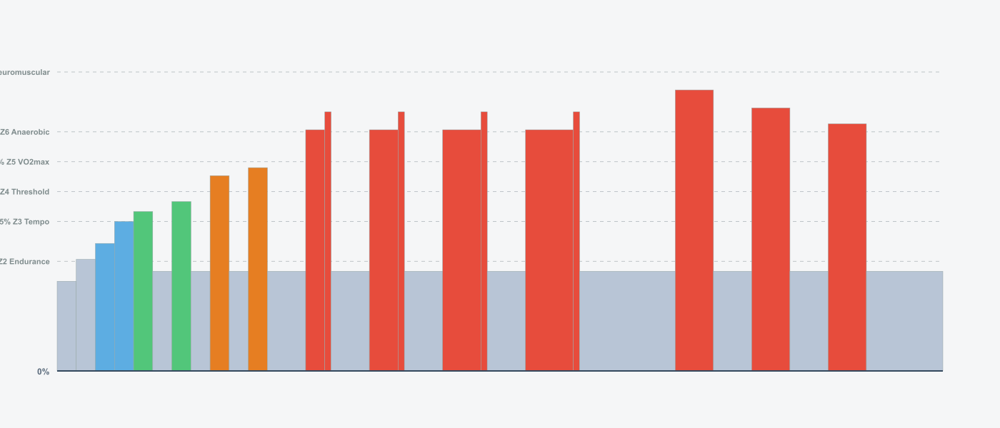 | • 46 min · 74 TSS · IF 0.98 |
| **Wednesday** | **Recovery Easy**  | • 60 min · 30 TSS · IF 0.54 |
| **Friday** | **extensive-anaerobic-6-x-1min** 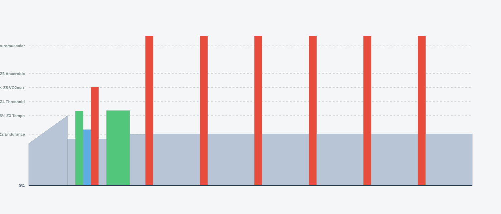 | • 57 min · 86 TSS · IF 0.95 |
| **Saturday** | **Easy Z2**  | • 75 min · 58 TSS · IF 0.68 |
| **Sunday** | **Long Endurance** 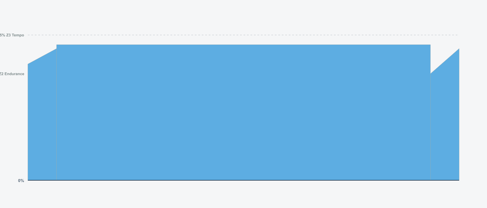 | • 150 min · 120 TSS · IF 0.69 |

### Week 8

**Weekly Total:** 324 TSS, 5.8 hours

| Day | Workout | Details |
| --- | ------- | ------- |
| **Tuesday** | **vo2max-climbing-1** 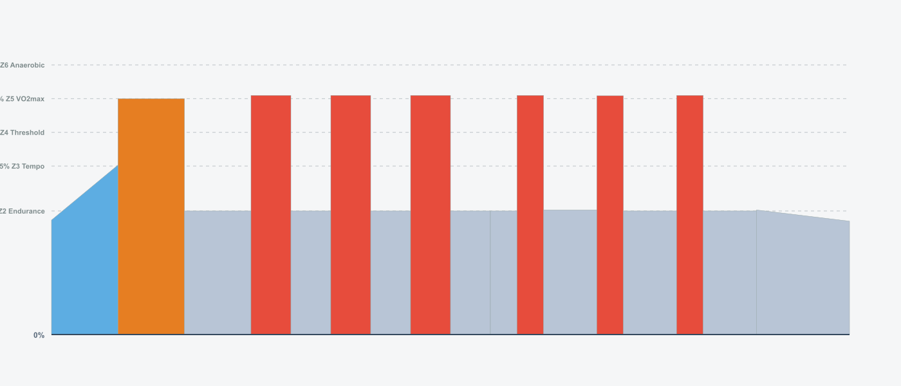 | • 60 min · 70 TSS · IF 0.84 |
| **Wednesday** | **Recovery Easy**  | • 60 min · 30 TSS · IF 0.54 |
| **Friday** | **FTP Test 20min** 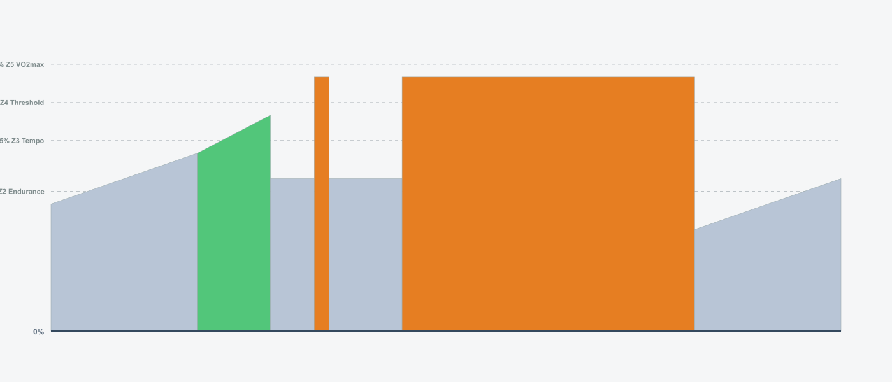 | • 54 min · 62 TSS · IF 0.83 |
| **Sunday** | **Long Endurance** 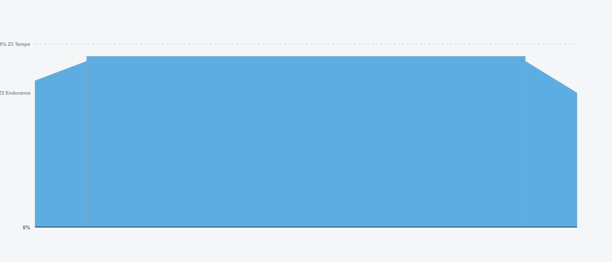 | • 105 min · 83 TSS · IF 0.69 |

## Usage

### Import ZWO Files

The `.zwo` files in the `zwo_files/` directory can be imported into:

- **Zwift** - Import custom workouts
- **MyWhoosh** - Import workout files
- **TrainingPeaks** - Upload ZWO files
- Any other platform that supports the ZWO format

### Interactive Viewer

Open `docs/index.html` in your browser for an interactive workout calendar and statistics dashboard.
