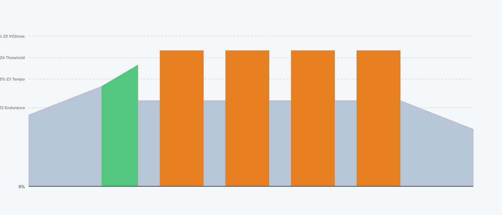
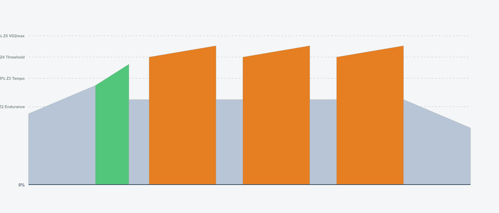

# 8-Week Road Builder Program v1.0

## Training Plan Overview

- **Duration:** 8 weeks
- **Weekly Hours:** 6-8.5 hours (5-5.5 hours during recovery weeks)
- **Structure:** Polarized training (80/20 split)
- **Key Sessions:** Tuesday (VO2max), Friday (Threshold), Sunday (Long Endurance)
- **Weekly TSS:** 240-360 TSS (build weeks), 200-220 TSS (recovery weeks)
- **Rest Days:** Thursday + Monday (full rest)

---

## Training Philosophy

**Polarized Training (80/20)**
- 80% training time at low intensity (Z1-Z2)
- 15-20% at high intensity (Z4-Z5)
- <5% moderate intensity (Z3)

**Progressive Threshold Loading**
- Build sustained power from 24min → 40min time-at-threshold
- Targets punchers/explosive riders who need durability

**Varied VO2max Protocols**
- Different protocol each week (30/30s, 40/20s, 4x4, 5x8, etc.)
- Based on 2020-2024 research

**Recovery Integration**
- Week 4 & 8: Recovery weeks (35% volume reduction)
- 8 Wednesday recovery options (choose based on feel)

---

## Weekly Schedule

| Day | Session Type | Purpose |
|-----|-------------|---------|
| **Tuesday (D1)** | VO2max Intervals | High intensity - max aerobic capacity |
| **Wednesday (D2)** | Recovery Ride (8 options) | Active recovery - choose based on feel |
| **Thursday (D3)** | Rest | Complete rest |
| **Friday (D4)** | Threshold Intervals | High intensity - FTP development |
| **Saturday (D5)** | Easy Z2 Ride | Low intensity - aerobic base |
| **Sunday (D6)** | Long Endurance | Low intensity - volume/duration |
| **Monday (D7)** | Rest | Complete rest |

---

## BLOCK 1: Foundation Build (Weeks 1-3)

### Week 1 · 6.0 hours · 240 TSS

| Day | Workout | Details | Alternative (MyWhoosh) |
|-----|---------|---------|----------------------|
| **Tuesday** | **30/30s Introduction**<br/> | • 60 min · 65 TSS · IF 0.82<br/>• 3 x (8 x 30sec @ 120% / 30sec @ 50%)<br/>• Billat protocol micro-intervals<br/>• 💡 Pre-load: Carbs 2-3hrs before | [30/30 Anaerobic #3](https://mywhooshinfo.com/workouts/workout/30-30-anaerobic-3)<br/>[Anaerobic Intensive 30sec](https://mywhooshinfo.com/workouts/workout/anaerobic-intensive-30sec) |
| **Wednesday** | **Easy Recovery**<br/> | • 45 min · 22 TSS · IF 0.55<br/>• Zone 1 easy spin | [Active Recovery](https://mywhooshinfo.com/workouts/workout/active-recovery-trha)<br/>[Base Miles](https://mywhooshinfo.com/workouts/workout/base-miles) |
| **Thursday** | REST | - | - |
| **Friday** | **Cruise Intervals 4x6min**<br/> | • 65 min · 70 TSS · IF 0.80<br/>• 4 x 6min @ 95% (3min recovery)<br/>• Threshold introduction<br/>• 💡 Pre-load: Carbs 2-3hrs before | [Cruise Intervals #1](https://mywhooshinfo.com/workouts/workout/cruise-intervals-1-rofa)<br/>[Threshold #1](https://mywhooshinfo.com/workouts/workout/threshold-1-vjl3) |
| **Saturday** | **Easy Z2 Ride**<br/> | • 60 min · 46 TSS · IF 0.68<br/>• Zone 2 aerobic base<br/>• 💡 Consume 30g carbs/hr | [Endurance #1](https://mywhooshinfo.com/workouts/workout/endurance-1-rbh3)<br/>[Zone 2 Endurance #1](https://mywhooshinfo.com/workouts/workout/zone-2-endurance-1-l5eu) |
| **Sunday** | **Long Endurance 90min**<br/> | • 90 min · 72 TSS · IF 0.70<br/>• Zone 2 steady<br/>• 💡 Consume 60g carbs/hr | [90 Minute Endurance](https://mywhooshinfo.com/workouts/workout/90-minute-endurance-uumz)<br/>[Tri Endurance #6](https://mywhooshinfo.com/workouts/workout/tri-endurance-6-2n9w) |
| **Monday** | REST | - | - |

---

### Week 2 · 6.5 hours · 278 TSS

| Day | Workout | Details | Alternative (MyWhoosh) |
|-----|---------|---------|----------------------|
| **Tuesday** | **40/20s**<br/> | • 65 min · 72 TSS · IF 0.84<br/>• 3 x (10 x 40sec @ 120% / 20sec @ 50%)<br/>• Tabata-inspired protocol<br/>• 💡 Pre-load: Carbs 2-3hrs before | [40/20 Efforts](https://mywhooshinfo.com/workouts/workout/40-20-efforts-22sx)<br/>[VO2max Descending](https://mywhooshinfo.com/workouts/workout/vo2max-descending-f10x) |
| **Wednesday** | **Easy Recovery**<br/> | • 45 min · 22 TSS · IF 0.55<br/>• Zone 1 easy spin | [Active Recovery](https://mywhooshinfo.com/workouts/workout/active-recovery-trha)<br/>[Fat for Fuel](https://mywhooshinfo.com/workouts/workout/fat-for-fuel) |
| **Thursday** | REST | - | - |
| **Friday** | **Over/Unders**<br/> | • 70 min · 75 TSS · IF 0.82<br/>• 3 x (3min @ 95% / 2min @ 105% / 3min @ 95%)<br/>• Lactate clearance training<br/>• 💡 Pre-load: Carbs 2-3hrs before | [Extended Over Unders](https://mywhooshinfo.com/workouts/workout/extended-over-unders)<br/>[Threshold #1](https://mywhooshinfo.com/workouts/workout/threshold-1-vjl3) |
| **Saturday** | **Easy Z2 Ride**<br/> | • 60 min · 46 TSS · IF 0.68<br/>• Zone 2 aerobic base | [Endurance #1](https://mywhooshinfo.com/workouts/workout/endurance-1-rbh3)<br/>[Zone 2 Endurance #1](https://mywhooshinfo.com/workouts/workout/zone-2-endurance-1-l5eu) |
| **Sunday** | **Long Endurance 105min**<br/> | • 105 min · 85 TSS · IF 0.70<br/>• Volume increase week<br/>• 💡 Consume 60g carbs/hr | [90 Minute Endurance](https://mywhooshinfo.com/workouts/workout/90-minute-endurance-uumz)<br/>[Tri Endurance #6](https://mywhooshinfo.com/workouts/workout/tri-endurance-6-2n9w) |
| **Monday** | REST | - | - |

---

### Week 3 · 7.0 hours · 310 TSS

| Day | Workout | Details | Alternative (MyWhoosh) |
|-----|---------|---------|----------------------|
| **Tuesday** | **4x4min Seiler Protocol**<br/> | • 60 min · 68 TSS · IF 0.83<br/>• 4 x 4min @ 110% (3min recovery)<br/>• Classic VO2max intervals<br/>• 💡 Pre-load: Carbs 2-3hrs before | [4min FTP #1](https://mywhooshinfo.com/workouts/workout/4min-ftp-1-p354)<br/>[VO2max 3min #1](https://mywhooshinfo.com/workouts/workout/vo2max-3min-1-atma) |
| **Wednesday** | **Easy Recovery**<br/> | • 45 min · 22 TSS · IF 0.55<br/>• Zone 1 easy spin | [Active Recovery](https://mywhooshinfo.com/workouts/workout/active-recovery-trha)<br/>[Base Miles](https://mywhooshinfo.com/workouts/workout/base-miles) |
| **Thursday** | REST | - | - |
| **Friday** | **Progressive Build 3x10min**<br/> | • 75 min · 78 TSS · IF 0.83<br/>• 3 x 10min (90% → 98%)<br/>• Progressive threshold intervals<br/>• 💡 Pre-load: Carbs 2-3hrs before | [Sweet Spot 15](https://mywhooshinfo.com/workouts/workout/sweet-spot-15-2ot0)<br/>[Threshold #1](https://mywhooshinfo.com/workouts/workout/threshold-1-vjl3) |
| **Saturday** | **Easy Z2 Ride**<br/> | • 60 min · 46 TSS · IF 0.68<br/>• Zone 2 aerobic base | [Endurance #1](https://mywhooshinfo.com/workouts/workout/endurance-1-rbh3)<br/>[Zone 2 Endurance #1](https://mywhooshinfo.com/workouts/workout/zone-2-endurance-1-l5eu) |
| **Sunday** | **Long Endurance 120min**<br/> | • 120 min · 96 TSS · IF 0.70<br/>• Building volume<br/>• 💡 Consume 60g carbs/hr | [90 Minute Endurance](https://mywhooshinfo.com/workouts/workout/90-minute-endurance-uumz)<br/>[Tri Endurance #6](https://mywhooshinfo.com/workouts/workout/tri-endurance-6-2n9w) |
| **Monday** | REST | - | - |

---

## BLOCK 2: Recovery & Build (Weeks 4-6)

### Week 4 · 5.0 hours · 218 TSS (Recovery Week)

| Day | Workout | Details | Alternative (MyWhoosh) |
|-----|---------|---------|----------------------|
| **Tuesday** | **30/30s Recovery Volume**<br/> | • 50 min · 48 TSS · IF 0.78<br/>• 2 x (8 x 30sec @ 120% / 30sec @ 50%)<br/>• Reduced volume, same intensity<br/>• 💡 Pre-load: Carbs 2-3hrs before | [30/30 Anaerobic #3](https://mywhooshinfo.com/workouts/workout/30-30-anaerobic-3)<br/>[Anaerobic Intensive 30sec](https://mywhooshinfo.com/workouts/workout/anaerobic-intensive-30sec) |
| **Wednesday** | **Easy Recovery**<br/> | • 45 min · 22 TSS · IF 0.55<br/>• Zone 1 easy spin | [Active Recovery](https://mywhooshinfo.com/workouts/workout/active-recovery-trha)<br/>[Fat for Fuel](https://mywhooshinfo.com/workouts/workout/fat-for-fuel) |
| **Thursday** | REST | - | - |
| **Friday** | **Sweet Spot 2x12min**<br/> | • 60 min · 62 TSS · IF 0.76<br/>• 2 x 12min @ 88% (4min recovery)<br/>• Recovery week threshold work<br/>• 💡 Pre-load: Carbs 2-3hrs before | [Sweet Spot 15](https://mywhooshinfo.com/workouts/workout/sweet-spot-15-2ot0)<br/>[Sweetspot 20 minute](https://mywhooshinfo.com/workouts/workout/sweetspot-20-minute-aapf) |
| **Saturday** | **Easy Z2 Ride (Reduced)**<br/> | • 45 min · 35 TSS · IF 0.68<br/>• Reduced volume for recovery | [Endurance #1](https://mywhooshinfo.com/workouts/workout/endurance-1-rbh3)<br/>[Base Miles](https://mywhooshinfo.com/workouts/workout/base-miles) |
| **Sunday** | **Long Endurance 90min (Reduced)**<br/> | • 90 min · 72 TSS · IF 0.70<br/>• Recovery week - reduced from 120min<br/>• 💡 Consume 60g carbs/hr | [90 Minute Endurance](https://mywhooshinfo.com/workouts/workout/90-minute-endurance-uumz)<br/>[Tri Endurance #6](https://mywhooshinfo.com/workouts/workout/tri-endurance-6-2n9w) |
| **Monday** | REST | - | - |

---

### Week 5 · 7.0 hours · 319 TSS

| Day | Workout | Details | Alternative (MyWhoosh) |
|-----|---------|---------|----------------------|
| **Tuesday** | **Sub-Threshold 5x8min**<br/> | • 70 min · 75 TSS · IF 0.82<br/>• 5 x 8min @ 95% (3min recovery)<br/>• Building threshold durability<br/>• 💡 Pre-load: Carbs 2-3hrs before | [Cruise Intervals #1](https://mywhooshinfo.com/workouts/workout/cruise-intervals-1-rofa)<br/>[Threshold #1](https://mywhooshinfo.com/workouts/workout/threshold-1-vjl3) |
| **Wednesday** | **Easy Recovery**<br/> | • 45 min · 22 TSS · IF 0.55<br/>• Zone 1 easy spin | [Active Recovery](https://mywhooshinfo.com/workouts/workout/active-recovery-trha)<br/>[Base Miles](https://mywhooshinfo.com/workouts/workout/base-miles) |
| **Thursday** | REST | - | - |
| **Friday** | **Threshold + Surges**<br/> | • 75 min · 80 TSS · IF 0.84<br/>• 4 x (8min @ 95% + 1min @ 110%)<br/>• Race simulation - surge response<br/>• 💡 Pre-load: Carbs 2-3hrs before | [Threshold #1](https://mywhooshinfo.com/workouts/workout/threshold-1-vjl3)<br/>[Extended Over Unders](https://mywhooshinfo.com/workouts/workout/extended-over-unders) |
| **Saturday** | **Easy Z2 Ride**<br/> | • 60 min · 46 TSS · IF 0.68<br/>• Zone 2 aerobic base | [Endurance #1](https://mywhooshinfo.com/workouts/workout/endurance-1-rbh3)<br/>[Zone 2 Endurance #1](https://mywhooshinfo.com/workouts/workout/zone-2-endurance-1-l5eu) |
| **Sunday** | **Long Endurance 120min**<br/> | • 120 min · 96 TSS · IF 0.70<br/>• Building aerobic base<br/>• 💡 Consume 60g carbs/hr | [90 Minute Endurance](https://mywhooshinfo.com/workouts/workout/90-minute-endurance-uumz)<br/>[Tri Endurance #6](https://mywhooshinfo.com/workouts/workout/tri-endurance-6-2n9w) |
| **Monday** | REST | - | - |

---

### Week 6 · 7.5 hours · 342 TSS

| Day | Workout | Details | Alternative (MyWhoosh) |
|-----|---------|---------|----------------------|
| **Tuesday** | **4x4min Low Cadence**<br/> | • 60 min · 70 TSS · IF 0.83<br/>• 4 x 4min @ 110% @ 60rpm<br/>• Neuromuscular + aerobic stress<br/>• 💡 Pre-load: Carbs 2-3hrs before | [4min FTP #1](https://mywhooshinfo.com/workouts/workout/4min-ftp-1-p354)<br/>[VO2max 3min #1](https://mywhooshinfo.com/workouts/workout/vo2max-3min-1-atma) |
| **Wednesday** | **Easy Recovery**<br/> | • 45 min · 22 TSS · IF 0.55<br/>• Zone 1 easy spin | [Active Recovery](https://mywhooshinfo.com/workouts/workout/active-recovery-trha)<br/>[Fat for Fuel](https://mywhooshinfo.com/workouts/workout/fat-for-fuel) |
| **Thursday** | REST | - | - |
| **Friday** | **Extended Over/Unders**<br/> | • 70 min · 78 TSS · IF 0.83<br/>• 2 x (5min @ 92% / 3min @ 102% / 5min @ 92%)<br/>• Lactate clearance with longer efforts<br/>• 💡 Pre-load: Carbs 2-3hrs before | [Extended Over Unders](https://mywhooshinfo.com/workouts/workout/extended-over-unders)<br/>[Threshold #1](https://mywhooshinfo.com/workouts/workout/threshold-1-vjl3) |
| **Saturday** | **Easy Z2 Ride**<br/> | • 60 min · 46 TSS · IF 0.68<br/>• Zone 2 aerobic base | [Endurance #1](https://mywhooshinfo.com/workouts/workout/endurance-1-rbh3)<br/>[Zone 2 Endurance #1](https://mywhooshinfo.com/workouts/workout/zone-2-endurance-1-l5eu) |
| **Sunday** | **Long Endurance 135min**<br/> | • 135 min · 108 TSS · IF 0.70<br/>• Volume building week<br/>• 💡 Consume 60g carbs/hr | [90 Minute Endurance](https://mywhooshinfo.com/workouts/workout/90-minute-endurance-uumz)<br/>[Tri Endurance #6](https://mywhooshinfo.com/workouts/workout/tri-endurance-6-2n9w) |
| **Monday** | REST | - | - |

---

## BLOCK 3: Peak & Taper (Weeks 7-8)

### Week 7 · 8.5 hours · 363 TSS (PEAK WEEK)

| Day | Workout | Details | Alternative (MyWhoosh) |
|-----|---------|---------|----------------------|
| **Tuesday** | **Mixed VO2max Protocol**<br/> | • 70 min · 78 TSS · IF 0.86<br/>• 2 x (8x40/20 @ 120% + 3min @ 110%)<br/>• Mixed protocol - micro + sustained<br/>• 💡 Pre-load: Carbs 2-3hrs before | [40/20 Efforts](https://mywhooshinfo.com/workouts/workout/40-20-efforts-22sx)<br/>[Escalating 3min VO2max](https://mywhooshinfo.com/workouts/workout/escalating-3min-vo2max-9xlv) |
| **Wednesday** | **Easy Recovery**<br/> | • 45 min · 22 TSS · IF 0.55<br/>• Zone 1 easy spin | [Active Recovery](https://mywhooshinfo.com/workouts/workout/active-recovery-trha)<br/>[Base Miles](https://mywhooshinfo.com/workouts/workout/base-miles) |
| **Thursday** | REST | - | - |
| **Friday** | **2x20min Low Cadence (PEAK)**<br/> | • 75 min · 85 TSS · IF 0.82<br/>• 2 x 20min @ 88% @ 65rpm<br/>• Maximum durability stress<br/>• 💡 Pre-load: Carbs 2-3hrs before | [Sweetspot 20 minute](https://mywhooshinfo.com/workouts/workout/sweetspot-20-minute-aapf)<br/>[Threshold #1](https://mywhooshinfo.com/workouts/workout/threshold-1-vjl3) |
| **Saturday** | **Easy Z2 Ride (Extended)**<br/> | • 75 min · 58 TSS · IF 0.68<br/>• Extended Saturday ride - peak week<br/>• 💡 Consume 30g carbs/hr | [Endurance #1](https://mywhooshinfo.com/workouts/workout/endurance-1-rbh3)<br/>[Zone 2 Endurance #1](https://mywhooshinfo.com/workouts/workout/zone-2-endurance-1-l5eu) |
| **Sunday** | **Long Endurance 150min (PEAK)**<br/> | • 150 min · 120 TSS · IF 0.70<br/>• PEAK VOLUME - Maximum aerobic stress<br/>• 💡 Consume 60g carbs/hr | [90 Minute Endurance](https://mywhooshinfo.com/workouts/workout/90-minute-endurance-uumz)<br/>[Tri Endurance #6](https://mywhooshinfo.com/workouts/workout/tri-endurance-6-2n9w) |
| **Monday** | REST | - | - |

---

### Week 8 · 5.5 hours · 239 TSS (Taper/Test Week)

| Day | Workout | Details | Alternative (MyWhoosh) |
|-----|---------|---------|----------------------|
| **Tuesday** | **30/30s Taper**<br/> | • 50 min · 42 TSS · IF 0.76<br/>• 2 x (6 x 30sec @ 120% / 30sec @ 50%)<br/>• Taper - reduced volume<br/>• 💡 Pre-load: Carbs 2-3hrs before | [30/30 Anaerobic #3](https://mywhooshinfo.com/workouts/workout/30-30-anaerobic-3)<br/>[Anaerobic Intensive 30sec](https://mywhooshinfo.com/workouts/workout/anaerobic-intensive-30sec) |
| **Wednesday** | **Easy Recovery**<br/> | • 45 min · 22 TSS · IF 0.55<br/>• Zone 1 easy spin | [Active Recovery](https://mywhooshinfo.com/workouts/workout/active-recovery-trha)<br/>[Fat for Fuel](https://mywhooshinfo.com/workouts/workout/fat-for-fuel) |
| **Thursday** | REST | - | - |
| **Friday** | **FTP Test 20min**<br/> | • 65 min · 68 TSS · IF 0.95<br/>• 1 x 20min @ 100% (all-out effort)<br/>• New FTP = avg power × 0.95<br/>• 💡 Pre-load: Carbs 2-3hrs before | [Threshold #1](https://mywhooshinfo.com/workouts/workout/threshold-1-vjl3) |
| **Friday ALT** | **FTP Test 2x15min (Alternative)**<br/> | • 70 min · 70 TSS · IF 0.92<br/>• 2 x 15min @ 98% (2min recovery)<br/>• Average both intervals for FTP estimate<br/>• 💡 Pre-load: Carbs 2-3hrs before | [Sweet Spot 15](https://mywhooshinfo.com/workouts/workout/sweet-spot-15-2ot0) |
| **Saturday** | REST or very easy spin | - | - |
| **Sunday** | **Long Endurance 105min**<br/> | • 105 min · 85 TSS · IF 0.70<br/>• Taper week - reduced volume<br/>• 💡 Consume 60g carbs/hr | [90 Minute Endurance](https://mywhooshinfo.com/workouts/workout/90-minute-endurance-uumz)<br/>[Tri Endurance #6](https://mywhooshinfo.com/workouts/workout/tri-endurance-6-2n9w) |
| **Monday** | REST | - | - |

---

## Training Zones

| Zone | Name | % FTP | RPE | Purpose |
|------|------|-------|-----|---------|
| **Z1** | Active Recovery | <55% | 1-2 | Recovery, warmup |
| **Z2** | Endurance | 56-75% | 3-4 | Aerobic base, fat oxidation |
| **Z3** | Tempo | 76-87% | 5-6 | Muscular endurance (minimal use) |
| **Z4** | Threshold | 88-105% | 7-8 | FTP development |
| **Z5** | VO2max | 106-120% | 9-10 | Max aerobic capacity |

**FTP Calculation:** 20-min test average power × 0.95

---

## Nutrition Guidelines

**High-Intensity Sessions (>85% FTP)**
💡 Pre-load: 1-2g carbs/kg body weight 2-3 hours before

**Long Rides (>90 min)**
💡 During: 60-90g carbs/hour via sports drinks, gels, bars

**Moderate Sessions (60-90 min, <85% FTP)**
💡 During: 30-60g carbs/hour

**Recovery Weeks (Week 4 & 8)**
🍖 Increase protein (1.6-2.2g/kg/day), maintain carbs, prioritize sleep

**General**
- Hydration: 500-750ml/hr
- Post-workout: 20-40g protein + carbs within 60 min

---

## Recovery & Fatigue Management

**Fatigue Warning Signs:**
- Elevated resting heart rate (+5-10 bpm)
- Difficulty hitting power targets on easy rides
- Poor sleep quality 2+ consecutive nights
- Persistent muscle soreness beyond 48 hours
- Mood changes (irritability, low motivation)

**Fatigue Protocol:**
- **Minor:** Skip Wednesday recovery ride, extend Thursday rest
- **Moderate:** Convert Friday threshold to easy Z2 ride
- **Significant:** Take 2-3 complete rest days, resume with easy week

**Recovery Week Strategy (Weeks 4 & 8):**
- Volume reduced by 35-40%
- Intensity maintained (intervals shorter, not easier)
- Extra focus on sleep (9+ hours), nutrition, stress management

---

## Wednesday Recovery Options

Choose based on fatigue level and preference:

**Option A: Easy Z1** - 45min @ 50-60% FTP (pure recovery)
**Option B: With Sprints** - 45min @ 55-65% + 5x10sec sprints (neuromuscular maintenance)
**Option C: High Cadence** - 45min @ 100-110rpm @ 60% (leg speed)
**Option D: Low Cadence** - 45min @ 60-70rpm @ 65% (muscular endurance)
**Option E: Cadence Mix** - Alternate 5min high/low @ 60% (varied stimulus)
**Option F: Micro-bursts** - 45min @ 55% + 8x(30sec @ 75% / 90sec @ 55%)
**Option G: Rest** - Skip if fatigued (optional day)
**Option H: Easy + Stretch** - 30min @ 55% + 15min mobility

---

## Expected Outcomes

By Week 8, you should experience:

**Physiological Adaptations:**
- 5-15% FTP increase (varies by training history)
- Improved VO2max (2-5% increase typical)
- Enhanced threshold durability (24min → 40min sustained power)
- Greater aerobic efficiency
- Improved lactate clearance

**Performance Improvements:**
- Better pacing and power management
- Stronger finishing efforts
- Reduced fatigue on long rides
- Faster recovery between hard efforts

**Compare your Week 1 and Week 8 performance to measure gains!**

---

## Research References (2020-2024)

**Polarized Training:**
- Systematic review (2023): Training periodization and intensity distribution in trained cyclists
- Meta-analysis (2024): Polarized vs non-polarized training yield comparable VO2max gains

**VO2max Protocols:**
- 2024 research: Higher fraction of VO2max during intervals = greater performance gains (R² = 0.54)
- 2024 study: Low cadence (50-70 RPM) high-intensity shows superior aerobic improvements
- 2021: Self-paced 4x4 and 4x8min protocols effective for VO2max development

**Threshold & Durability:**
- 2022 review: Power-duration relationship and durability critical for endurance performance
- 2024: Lactate threshold modeling emphasizes sustainable power development
- 2020: Over/under protocols with active recovery improve lactate clearance

---

## Program Structure Summary

```
programs/8_weeks_road_builder/
├── 8_weeks_road_builder.ts (main aggregator)
├── README.md (this file)
├── weeks/
│   ├── week1.ts
│   ├── week2.ts
│   ├── week3.ts
│   ├── week4.ts
│   ├── week5.ts
│   ├── week6.ts
│   ├── week7.ts
│   └── week8.ts
├── images/ (40 PNG files)
└── zwo_files/ (40 ZWO files - Zwift compatible)
```

**Total Workouts:** 40 (5 per week × 8 weeks)
**File Formats:** TypeScript source, ZWO (Zwift), PNG (workout profiles)

---

**Good luck with your training! 🚴💪**
