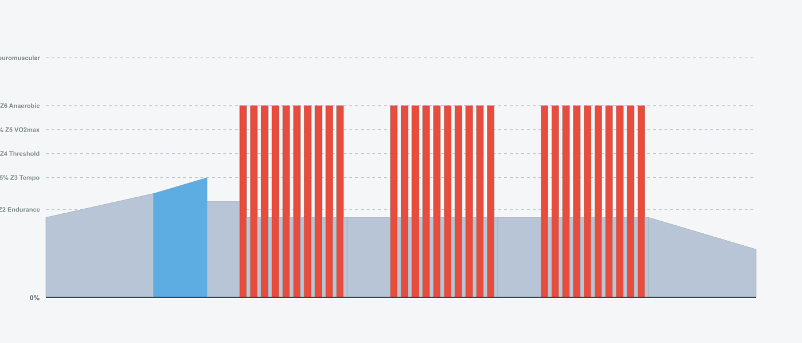
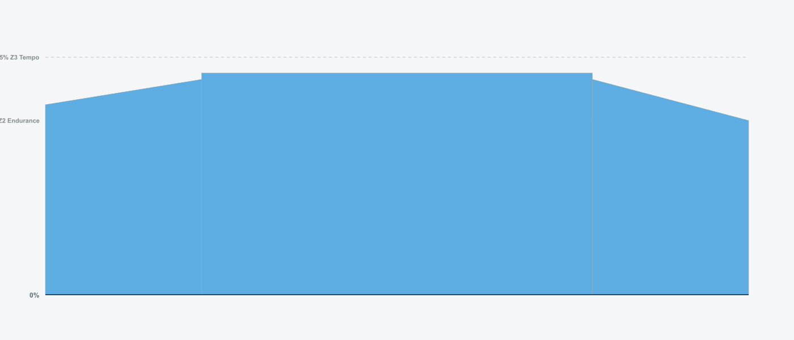
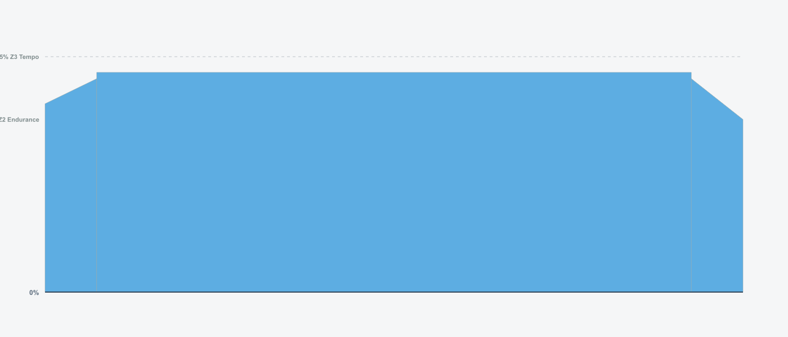

# 8-Week Road Builder Program v1.0

## Training Plan Overview

- **Duration:** 8 weeks
- **Weekly Hours:** 6.5-8.5 hours (5-5.5 hours during recovery weeks)
- **Structure:** True Polarized Training - Seiler 3-Zone Model (80% Zone 1, <5% Zone 2, 15-20% Zone 3)
- **Key Sessions:** Tuesday (VO2max @ 105-120% FTP), Friday (VO2max @ 105-120% FTP), Sunday (Long Endurance @ 65-75% FTP)
- **Weekly TSS:** 300-350 TSS (build weeks), 210-235 TSS (recovery weeks)
- **Rest Days:** Thursday + Monday (full rest)

---

## Training Philosophy

**Polarized Training (80/20) - Seiler Model**
- **80% training time at LOW intensity (50-79% FTP)** - Zone 1-2, easy aerobic rides
- **15-20% at HIGH intensity (105-120% FTP)** - Zone 3, VO2max work
- **<5% moderate intensity (80-104% FTP)** - "Gray zone" minimized to avoid chronic fatigue

This program follows Dr. Stephen Seiler's 3-zone polarized model:
- **Zone 1 (50-79% FTP):** Easy/conversational - recovery and endurance rides
- **Zone 2 (80-99% FTP):** AVOID - the "gray zone" creates fatigue without optimal adaptation
- **Zone 3 (100%+ FTP):** High intensity - Tuesday/Friday interval sessions at 105-120% FTP

**VO2max Development**
- All high-intensity sessions target 105-120% FTP (true Zone 3)
- Varied protocols: 30/30s, 40/20s, 4x4min Seiler, 5x5min, mixed intervals
- Based on research showing 105-110% FTP optimal for VO2max adaptation

**Recovery Integration**
- Week 4 & 8: Recovery weeks (35% volume reduction)
- 8 Wednesday recovery options (choose based on feel)

---

## Weekly Schedule

| Day | Session Type | Purpose |
|-----|-------------|---------|
| **Tuesday (D1)** | VO2max Intervals | High intensity - max aerobic capacity |
| **Wednesday (D2)** | Recovery Ride (8 options) | Active recovery - choose based on feel |
| **Thursday (D3)** | Rest | Complete rest |
| **Friday (D4)** | VO2max Intervals | High intensity - Zone 3 @ 105-120% FTP |
| **Saturday (D5)** | Easy Z2 Ride | Low intensity - aerobic base |
| **Sunday (D6)** | Long Endurance | Low intensity - volume/duration |
| **Monday (D7)** | Rest | Complete rest |

---

## BLOCK 1: Foundation Build (Weeks 1-3)

### Week 1 · 6.5 hours · 326 TSS

| Day | Workout | Details | Alternative (MyWhoosh) |
|-----|---------|---------|----------------------|
| **Tuesday** | **30/30s Introduction**  | • 72 min · 87 TSS · IF 0.85 • 4 x (8 x 30sec @ 120% / 30sec @ 50%) • Billat protocol micro-intervals • 💡 Pre-load: Carbs 2-3hrs before | [30/30 Anaerobic #3](https://mywhooshinfo.com/workouts/workout/30-30-anaerobic-3) [Anaerobic Intensive 30sec](https://mywhooshinfo.com/workouts/workout/anaerobic-intensive-30sec) |
| **Wednesday** | **Easy Recovery**  | • 60 min · 30 TSS · IF 0.54 • Zone 1 easy spin | [Active Recovery](https://mywhooshinfo.com/workouts/workout/active-recovery-trha) [Base Miles](https://mywhooshinfo.com/workouts/workout/base-miles) |
| **Thursday** | REST | - | - |
| **Friday** | **Sustained VO2max 3x6min**  | • 58 min · 67 TSS · IF 0.84 • 3 x 6min @ 108% (3min recovery) • Sustained efforts contrast Tuesday micro-intervals - 18min Zone 3 • 💡 Pre-load: Carbs 2-3hrs before | [6min Max Aerobic Power](https://mywhooshinfo.com/workouts/workout/max-aerobic-power-6min-1-bk9f) [VO2max 6min #1](https://mywhooshinfo.com/workouts/workout/vo2max-6min-1-pw42) |
| **Saturday** | **Easy Z2 Ride**  | • 60 min · 46 TSS · IF 0.68 • Zone 2 aerobic base • 💡 Consume 30g carbs/hr | [Endurance #1](https://mywhooshinfo.com/workouts/workout/endurance-1-rbh3) [Zone 2 Endurance #1](https://mywhooshinfo.com/workouts/workout/zone-2-endurance-1-l5eu) |
| **Sunday** | **Long Endurance 90min**  | • 90 min · 71 TSS · IF 0.69 • Zone 2 steady • 💡 Consume 60g carbs/hr | [90 Minute Endurance](https://mywhooshinfo.com/workouts/workout/90-minute-endurance-uumz) [Tri Endurance #6](https://mywhooshinfo.com/workouts/workout/tri-endurance-6-2n9w) |
| **Monday** | REST | - | - |

---

### Week 2 · 7.0 hours · 343 TSS

| Day | Workout | Details | Alternative (MyWhoosh) |
|-----|---------|---------|----------------------|
| **Tuesday** | **40/20s**  | • 80 min · 115 TSS · IF 0.93 • 4 x (10 x 40sec @ 120% / 20sec @ 50%) • Tabata-inspired protocol • 💡 Pre-load: Carbs 2-3hrs before | [40/20 Efforts](https://mywhooshinfo.com/workouts/workout/40-20-efforts-22sx) [VO2max Descending](https://mywhooshinfo.com/workouts/workout/vo2max-descending-f10x) |
| **Wednesday** | **Easy Recovery**  | • 60 min · 30 TSS · IF 0.54 • Zone 1 easy spin | [Active Recovery](https://mywhooshinfo.com/workouts/workout/active-recovery-trha) [Fat for Fuel](https://mywhooshinfo.com/workouts/workout/fat-for-fuel) |
| **Thursday** | REST | - | - |
| **Friday** | **Mixed VO2max Protocol**  | • 54 min · 62 TSS · IF 0.84 • 3x(2min @ 108% + 30sec @ 130%) + 2x2min @ 115% • Sustained + explosive VO2max - ~10min Zone 3 • 💡 Pre-load: Carbs 2-3hrs before | [Pace is the Trick](https://mywhooshinfo.com/workouts/workout/pace-is-the-trick) [VO2max Mixed](https://mywhooshinfo.com/workouts/workout/vo2max-mixed-q6al) |
| **Saturday** | **Easy Z2 Ride**  | • 60 min · 46 TSS · IF 0.68 • Zone 2 aerobic base | [Endurance #1](https://mywhooshinfo.com/workouts/workout/endurance-1-rbh3) [Zone 2 Endurance #1](https://mywhooshinfo.com/workouts/workout/zone-2-endurance-1-l5eu) |
| **Sunday** | **Long Endurance 105min**  | • 105 min · 83 TSS · IF 0.69 • Volume increase week • 💡 Consume 60g carbs/hr | [90 Minute Endurance](https://mywhooshinfo.com/workouts/workout/90-minute-endurance-uumz) [Tri Endurance #6](https://mywhooshinfo.com/workouts/workout/tri-endurance-6-2n9w) |
| **Monday** | REST | - | - |

---

### Week 3 · 6.3 hours · 299 TSS

| Day | Workout | Details | Alternative (MyWhoosh) |
|-----|---------|---------|----------------------|
| **Tuesday** | **4x4min Seiler Protocol**  | • 53 min · 64 TSS · IF 0.85 • 4 x 4min @ 110% (3min recovery) • Classic VO2max intervals • 💡 Pre-load: Carbs 2-3hrs before | [4min FTP #1](https://mywhooshinfo.com/workouts/workout/4min-ftp-1-p354) [VO2max 3min #1](https://mywhooshinfo.com/workouts/workout/vo2max-3min-1-atma) |
| **Wednesday** | **Easy Recovery**  | • 60 min · 30 TSS · IF 0.54 • Zone 1 easy spin | [Active Recovery](https://mywhooshinfo.com/workouts/workout/active-recovery-trha) [Base Miles](https://mywhooshinfo.com/workouts/workout/base-miles) |
| **Thursday** | REST | - | - |
| **Friday** | **VO2max 40/20s**  | • 68 min · 82 TSS · IF 0.87 • 3 sets x 10x40sec @ 115% / 20sec @ 50% • Micro-intervals contrast Tuesday sustained - 20min Zone 3 • 💡 Pre-load: Carbs 2-3hrs before | [40/20 Efforts](https://mywhooshinfo.com/workouts/workout/40-20-efforts-22sx) [VO2max 40/20 #1](https://mywhooshinfo.com/workouts/workout/vo2max-40-20-1-k3sx) |
| **Saturday** | **Easy Z2 Ride**  | • 60 min · 46 TSS · IF 0.68 • Zone 2 aerobic base | [Endurance #1](https://mywhooshinfo.com/workouts/workout/endurance-1-rbh3) [Zone 2 Endurance #1](https://mywhooshinfo.com/workouts/workout/zone-2-endurance-1-l5eu) |
| **Sunday** | **Long Endurance 120min**  | • 120 min · 95 TSS · IF 0.69 • Building volume • 💡 Consume 60g carbs/hr | [90 Minute Endurance](https://mywhooshinfo.com/workouts/workout/90-minute-endurance-uumz) [Tri Endurance #6](https://mywhooshinfo.com/workouts/workout/tri-endurance-6-2n9w) |
| **Monday** | REST | - | - |

---

## BLOCK 2: Recovery & Build (Weeks 4-6)

### Week 4 · 4.9 hours · 233 TSS (Recovery Week)

| Day | Workout | Details | Alternative (MyWhoosh) |
|-----|---------|---------|----------------------|
| **Tuesday** | **30/30s Recovery Volume**  | • 48 min · 52 TSS · IF 0.81 • 2 x (8 x 30sec @ 120% / 30sec @ 50%) • Reduced volume, same intensity • 💡 Pre-load: Carbs 2-3hrs before | [30/30 Anaerobic #3](https://mywhooshinfo.com/workouts/workout/30-30-anaerobic-3) [Anaerobic Intensive 30sec](https://mywhooshinfo.com/workouts/workout/anaerobic-intensive-30sec) |
| **Wednesday** | **Easy Recovery**  | • 60 min · 30 TSS · IF 0.54 • Zone 1 easy spin | [Active Recovery](https://mywhooshinfo.com/workouts/workout/active-recovery-trha) [Fat for Fuel](https://mywhooshinfo.com/workouts/workout/fat-for-fuel) |
| **Thursday** | REST | - | - |
| **Friday** | **40/20s Recovery Volume**  | • 56 min · 61 TSS · IF 0.81 • 2 sets x 8x40sec @ 115% / 20sec @ 50% • Recovery week - quality maintained, ~10min Zone 3 • 💡 Pre-load: Carbs 2-3hrs before | [40/20 Efforts](https://mywhooshinfo.com/workouts/workout/40-20-efforts-22sx) [VO2max 40/20 #2](https://mywhooshinfo.com/workouts/workout/vo2max-40-20-2-s90x) |
| **Saturday** | **Easy Z2 Ride (Reduced)**  | • 45 min · 34 TSS · IF 0.67 • Reduced volume for recovery | [Endurance #1](https://mywhooshinfo.com/workouts/workout/endurance-1-rbh3) [Base Miles](https://mywhooshinfo.com/workouts/workout/base-miles) |
| **Sunday** | **Long Endurance 90min (Reduced)**  | • 90 min · 71 TSS · IF 0.69 • Recovery week - reduced from 120min • 💡 Consume 60g carbs/hr | [90 Minute Endurance](https://mywhooshinfo.com/workouts/workout/90-minute-endurance-uumz) [Tri Endurance #6](https://mywhooshinfo.com/workouts/workout/tri-endurance-6-2n9w) |
| **Monday** | REST | - | - |

---

### Week 5 · 6.5 hours · 344 TSS

| Day | Workout | Details | Alternative (MyWhoosh) |
|-----|---------|---------|----------------------|
| **Tuesday** | **Max Aerobic Power 5x5min**  | • 66 min · 79 TSS · IF 0.87 • 5 x 5min @ 108% (3min recovery) • Extended VO2max endurance - 25min Zone 3 • 💡 Pre-load: Carbs 2-3hrs before | [5min Max Aerobic Power](https://mywhooshinfo.com/workouts/workout/max-aerobic-power-5min-1-xhk8) [VO2max 5min #1](https://mywhooshinfo.com/workouts/workout/vo2max-5min-1-yg98) |
| **Wednesday** | **Easy Recovery**  | • 60 min · 30 TSS · IF 0.54 • Zone 1 easy spin | [Active Recovery](https://mywhooshinfo.com/workouts/workout/active-recovery-trha) [Base Miles](https://mywhooshinfo.com/workouts/workout/base-miles) |
| **Thursday** | REST | - | - |
| **Friday** | **VO2max + Surges**  | • 66 min · 79 TSS · IF 0.87 • 4 x (6min @ 106% + 1min @ 120% surge) • Race simulation - 24min Zone 3 • 💡 Pre-load: Carbs 2-3hrs before | [Go Slowly](https://mywhooshinfo.com/workouts/workout/go-slowly) [VO2max Surges](https://mywhooshinfo.com/workouts/workout/vo2max-surges-kzn1) |
| **Saturday** | **Easy Z2 Ride**  | • 60 min · 46 TSS · IF 0.68 • Zone 2 aerobic base | [Endurance #1](https://mywhooshinfo.com/workouts/workout/endurance-1-rbh3) [Zone 2 Endurance #1](https://mywhooshinfo.com/workouts/workout/zone-2-endurance-1-l5eu) |
| **Sunday** | **Long Endurance 120min**  | • 120 min · 95 TSS · IF 0.69 • Building aerobic base • 💡 Consume 60g carbs/hr | [90 Minute Endurance](https://mywhooshinfo.com/workouts/workout/90-minute-endurance-uumz) [Tri Endurance #6](https://mywhooshinfo.com/workouts/workout/tri-endurance-6-2n9w) |
| **Monday** | REST | - | - |

---

### Week 6 · 6.5 hours · 304 TSS

| Day | Workout | Details | Alternative (MyWhoosh) |
|-----|---------|---------|----------------------|
| **Tuesday** | **4x4min Low Cadence**  | • 53 min · 64 TSS · IF 0.85 • 4 x 4min @ 110% @ 60rpm • Neuromuscular + aerobic stress • 💡 Pre-load: Carbs 2-3hrs before | [4min FTP #1](https://mywhooshinfo.com/workouts/workout/4min-ftp-1-p354) [VO2max 3min #1](https://mywhooshinfo.com/workouts/workout/vo2max-3min-1-atma) |
| **Wednesday** | **Easy Recovery**  | • 60 min · 30 TSS · IF 0.54 • Zone 1 easy spin | [Active Recovery](https://mywhooshinfo.com/workouts/workout/active-recovery-trha) [Fat for Fuel](https://mywhooshinfo.com/workouts/workout/fat-for-fuel) |
| **Thursday** | REST | - | - |
| **Friday** | **Progressive VO2max + Sprints**  | • 52 min · 63 TSS · IF 0.86 • 3min+4min+5min @ 110% + 2x1min @ 135% • Peak week variety - 14min Zone 3 • 💡 Pre-load: Carbs 2-3hrs before | [Pace is the Trick](https://mywhooshinfo.com/workouts/workout/pace-is-the-trick) [VO2max Progressive](https://mywhooshinfo.com/workouts/workout/vo2max-progressive-9d2k) |
| **Saturday** | **Easy Z2 Ride**  | • 60 min · 46 TSS · IF 0.68 • Zone 2 aerobic base | [Endurance #1](https://mywhooshinfo.com/workouts/workout/endurance-1-rbh3) [Zone 2 Endurance #1](https://mywhooshinfo.com/workouts/workout/zone-2-endurance-1-l5eu) |
| **Sunday** | **Long Endurance 135min**  | • 135 min · 107 TSS · IF 0.69 • Volume building week • 💡 Consume 60g carbs/hr | [90 Minute Endurance](https://mywhooshinfo.com/workouts/workout/90-minute-endurance-uumz) [Tri Endurance #6](https://mywhooshinfo.com/workouts/workout/tri-endurance-6-2n9w) |
| **Monday** | REST | - | - |

---

## BLOCK 3: Peak & Taper (Weeks 7-8)

### Week 7 · 7.0 hours · 349 TSS (PEAK WEEK)

| Day | Workout | Details | Alternative (MyWhoosh) |
|-----|---------|---------|----------------------|
| **Tuesday** | **Mixed VO2max Protocol**  | • 55 min · 73 TSS · IF 0.89 • 2 x (8x40/20 @ 120% + 3min @ 110%) • Mixed protocol - micro + sustained • 💡 Pre-load: Carbs 2-3hrs before | [40/20 Efforts](https://mywhooshinfo.com/workouts/workout/40-20-efforts-22sx) [Escalating 3min VO2max](https://mywhooshinfo.com/workouts/workout/escalating-3min-vo2max-9xlv) |
| **Wednesday** | **Easy Recovery**  | • 60 min · 30 TSS · IF 0.54 • Zone 1 easy spin | [Active Recovery](https://mywhooshinfo.com/workouts/workout/active-recovery-trha) [Base Miles](https://mywhooshinfo.com/workouts/workout/base-miles) |
| **Thursday** | REST | - | - |
| **Friday** | **Extended VO2max PEAK**  | • 59 min · 74 TSS · IF 0.89 • 2x8min @ 110% + 2x2min @ 120% • Maximum Zone 3 load - 20min total • 💡 Pre-load: Carbs 2-3hrs before | [Max Aerobic Power 8min](https://mywhooshinfo.com/workouts/workout/max-aerobic-power-8min-1-ttm3) [VO2max Extended](https://mywhooshinfo.com/workouts/workout/vo2max-extended-w8dk) |
| **Saturday** | **Easy Z2 Ride (Extended)**  | • 75 min · 58 TSS · IF 0.68 • Extended Saturday ride - peak week • 💡 Consume 30g carbs/hr | [Endurance #1](https://mywhooshinfo.com/workouts/workout/endurance-1-rbh3) [Zone 2 Endurance #1](https://mywhooshinfo.com/workouts/workout/zone-2-endurance-1-l5eu) |
| **Sunday** | **Long Endurance 150min (PEAK)**  | • 150 min · 120 TSS · IF 0.69 • PEAK VOLUME - Maximum aerobic stress • 💡 Consume 60g carbs/hr | [90 Minute Endurance](https://mywhooshinfo.com/workouts/workout/90-minute-endurance-uumz) [Tri Endurance #6](https://mywhooshinfo.com/workouts/workout/tri-endurance-6-2n9w) |
| **Monday** | REST | - | - |

---

### Week 8 · 5.2 hours · 211-228 TSS (Taper/Test Week)

| Day | Workout | Details | Alternative (MyWhoosh) |
|-----|---------|---------|----------------------|
| **Tuesday** | **30/30s Taper**  | • 44 min · 44 TSS · IF 0.78 • 2 x (6 x 30sec @ 120% / 30sec @ 50%) • Taper - reduced volume • 💡 Pre-load: Carbs 2-3hrs before | [30/30 Anaerobic #3](https://mywhooshinfo.com/workouts/workout/30-30-anaerobic-3) [Anaerobic Intensive 30sec](https://mywhooshinfo.com/workouts/workout/anaerobic-intensive-30sec) |
| **Wednesday** | **Easy Recovery**  | • 60 min · 30 TSS · IF 0.54 • Zone 1 easy spin | [Active Recovery](https://mywhooshinfo.com/workouts/workout/active-recovery-trha) [Fat for Fuel](https://mywhooshinfo.com/workouts/workout/fat-for-fuel) |
| **Thursday** | REST | - | - |
| **Friday** | **FTP Test 20min**  | • 54 min · 62 TSS · IF 0.83 • 1 x 20min @ 100% (all-out effort) • New FTP = avg power × 0.95 • 💡 Pre-load: Carbs 2-3hrs before | [Threshold #1](https://mywhooshinfo.com/workouts/workout/threshold-1-vjl3) |
| **Friday ALT** | **FTP Test 2x15min (Alternative)**  | • 66 min · 79 TSS · IF 0.85 • 2 x 15min @ 98% (2min recovery) • Average both intervals for FTP estimate • 💡 Pre-load: Carbs 2-3hrs before | [Sweet Spot 15](https://mywhooshinfo.com/workouts/workout/sweet-spot-15-2ot0) |
| **Saturday** | REST or very easy spin | - | - |
| **Sunday** | **Long Endurance 105min**  | • 105 min · 83 TSS · IF 0.69 • Taper week - reduced volume • 💡 Consume 60g carbs/hr | [90 Minute Endurance](https://mywhooshinfo.com/workouts/workout/90-minute-endurance-uumz) [Tri Endurance #6](https://mywhooshinfo.com/workouts/workout/tri-endurance-6-2n9w) |
| **Monday** | REST | - | - |

---

## Training Zones (Seiler 3-Zone Polarized Model)

| Zone | Name | % FTP | RPE | Purpose | Usage in Program |
|------|------|-------|-----|---------|------------------|
| **Zone 1** | Low Intensity | 50-79% | 1-4 | Aerobic base, recovery, fat oxidation | 80% of training time |
| **Zone 2** | Moderate Intensity | 80-99% | 5-7 | **GRAY ZONE - MINIMIZE** | <5% (avoid chronic fatigue) |
| **Zone 3** | High Intensity | 100-120% | 8-10 | VO2max, anaerobic capacity | 15-20% of training time |

**Polarized Training Zones Explained:**
- **Zone 1 (50-79% FTP):** All easy rides, recovery, warm-up/cool-down. Should feel conversational.
- **Zone 2 (80-99% FTP):** The "gray zone" - hard enough to create fatigue, not hard enough for optimal adaptation. Minimized in polarized training.
- **Zone 3 (100-120% FTP):** True high intensity. All interval sessions (Tuesday/Friday) target 105-120% FTP.

**Traditional 5-Zone vs Seiler 3-Zone Comparison:**
- Traditional Z1-Z2 = Seiler Zone 1 (Low)
- Traditional Z3-Z4 = Seiler Zone 2 (Gray Zone - avoid)
- Traditional Z5+ = Seiler Zone 3 (High)

**FTP Calculation:** 20-min test average power × 0.95

---

## Nutrition Guidelines

**High-Intensity Sessions (>85% FTP)**
💡 Pre-load: 1-2g carbs/kg body weight 2-3 hours before

**Long Rides (>90 min)**
💡 During: 60-90g carbs/hour via sports drinks, gels, bars

**Moderate Sessions (60-90 min, <85% FTP)**
💡 During: 30-60g carbs/hour

**Recovery Weeks (Week 4 & 8)**
🍖 Increase protein (1.6-2.2g/kg/day), maintain carbs, prioritize sleep

**General**
- Hydration: 500-750ml/hr
- Post-workout: 20-40g protein + carbs within 60 min

---

## Recovery & Fatigue Management

**Fatigue Warning Signs:**
- Elevated resting heart rate (+5-10 bpm)
- Difficulty hitting power targets on easy rides
- Poor sleep quality 2+ consecutive nights
- Persistent muscle soreness beyond 48 hours
- Mood changes (irritability, low motivation)

**Fatigue Protocol:**
- **Minor:** Skip Wednesday recovery ride, extend Thursday rest
- **Moderate:** Convert Friday threshold to easy Z2 ride
- **Significant:** Take 2-3 complete rest days, resume with easy week

**Recovery Week Strategy (Weeks 4 & 8):**
- Volume reduced by 35-40%
- Intensity maintained (intervals shorter, not easier)
- Extra focus on sleep (9+ hours), nutrition, stress management

---

## Wednesday Recovery Options

Choose based on fatigue level and preference:

**Option A: Easy Z1** - 45min @ 50-60% FTP (pure recovery)
**Option B: With Sprints** - 45min @ 55-65% + 5x10sec sprints (neuromuscular maintenance)
**Option C: High Cadence** - 45min @ 100-110rpm @ 60% (leg speed)
**Option D: Low Cadence** - 45min @ 60-70rpm @ 65% (muscular endurance)
**Option E: Cadence Mix** - Alternate 5min high/low @ 60% (varied stimulus)
**Option F: Micro-bursts** - 45min @ 55% + 8x(30sec @ 75% / 90sec @ 55%)
**Option G: Rest** - Skip if fatigued (optional day)
**Option H: Easy + Stretch** - 30min @ 55% + 15min mobility

---

## Expected Outcomes

By Week 8, you should experience:

**Physiological Adaptations:**
- 5-15% FTP increase (varies by training history)
- Improved VO2max (2-5% increase typical)
- Enhanced threshold durability (24min → 40min sustained power)
- Greater aerobic efficiency
- Improved lactate clearance

**Performance Improvements:**
- Better pacing and power management
- Stronger finishing efforts
- Reduced fatigue on long rides
- Faster recovery between hard efforts

**Compare your Week 1 and Week 8 performance to measure gains!**

---

## Research References

**Polarized Training Foundation (Seiler Model):**
- **Seiler, S. (2010):** "What is best practice for training intensity and duration distribution in endurance athletes?" - Established the 3-zone polarized model (Zone 1: 50-79% FTP, Zone 2: 80-99% FTP, Zone 3: 100%+ FTP)
- **Seiler & Tønnessen (2009):** "Intervals, Thresholds, and Long Slow Distance" - Found elite endurance athletes use 75-80% Zone 1, ~5% Zone 2, 15-20% Zone 3
- **Stöggl & Sperlich (2014):** "Polarized training has greater impact on key endurance variables than threshold, high volume, or high intensity training alone"
- **Sports Medicine Meta-Analysis (May 2024):** "Comparison of Polarized Versus Other Types of Endurance Training Intensity Distribution on Athletes' Endurance Performance" - Systematic review showing polarized training superiority

**Zone 3 Intensity Guidelines:**
- **Seiler research on Norwegian Olympic athletes:** High-intensity work performed at 105-110% FTP for 4-10 minute intervals
- **Seiler on 4x4 protocol:** "The goal is 40-60 minutes of work above FTP, with intensity in the range 105-110% of FTP, and interval length between 4 and 10 minutes"
- **VO2max optimization research:** Intervals at 105-120% FTP provide maximal VO2max stimulus while maintaining work quality

**Why Avoid Zone 2 (80-99% FTP - The "Gray Zone"):**
- **Seiler's observation:** Zone 2 work is "too hard to recover from, not hard enough for optimal adaptation"
- **Polarized training research:** Zone 2 (threshold/tempo) produces high autonomic stress without proportional training benefits
- **Optimal distribution:** 80% Zone 1 (50-79%), 5% Zone 2 (80-99%), 15% Zone 3 (105-120%)

**VO2max Protocols:**
- **Rønnestad et al. (2020):** "Superior performance improvements in elite cyclists from short (4-min) vs long (16-min) intervals"
- **2024 research:** Higher fraction of VO2max during intervals = greater performance gains (R² = 0.54)
- **2024 study:** Low cadence (50-70 RPM) high-intensity shows superior aerobic improvements
- **Helgerud et al. (2007):** "Aerobic high-intensity intervals improve VO2max more than threshold training" - Basis for 4x4 Seiler protocol

**Additional References:**
- **TrainerRoad, Fast Talk Labs, EVOQ.BIKE:** Practical applications of Seiler's polarized training zones for cyclists
- Power-duration modeling and FTP-based zone calculations for polarized training implementation

---

**Good luck with your training! 🚴💪**
