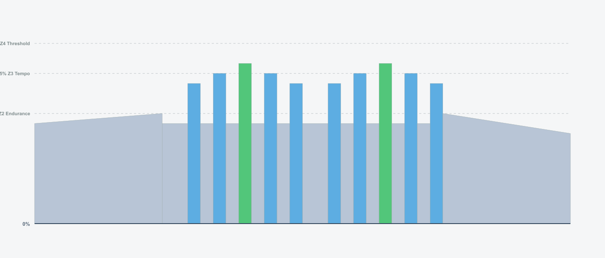
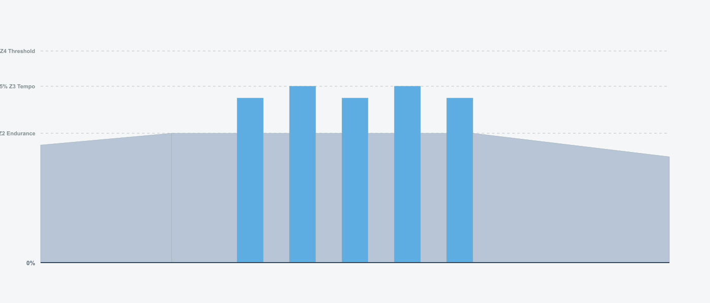
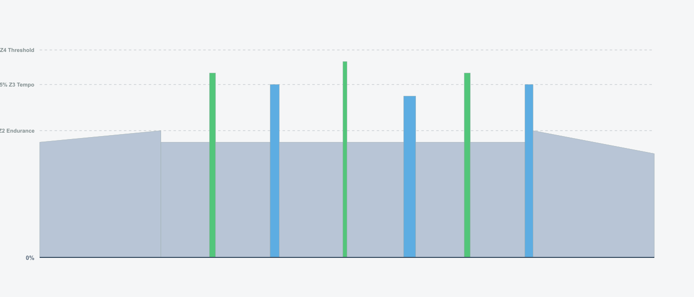

# Recoveries

## Overview

- **Total Weeks:** 1
- **Total Workouts:** 4
- **Total TSS:** 97
- **Total Hours:** 3.0
- **Average TSS/Week:** 97
- **Average Hours/Week:** 3.0

## Intensity Distribution

- **Recovery (<60% FTP):** 83.3%
- **Endurance (60-75% FTP):** 13.7%
- **Tempo (76-87% FTP):** 3.0%
- **Threshold (88-105% FTP):** 0.0%
- **VO2max (>105% FTP):** 0.0%

## Program Calendar

## Weekly Breakdown

### Week 1

**Weekly Total:** 97 TSS, 3.0 hours

| Day | Workout | Details |
| --- | ------- | ------- |
| **1** | **BONUS: Short Bursts Recovery**  | • 38 min · 20 TSS · IF 0.57 |
| **2** | **BONUS: Pyramid Recovery**  | • 42 min · 25 TSS · IF 0.59 |
| **3** | **BONUS: High Cadence Recovery**  | • 48 min · 27 TSS · IF 0.58 |
| **4** | **BONUS: Fun Recovery Ride**  | • 51 min · 25 TSS · IF 0.54 |

## Usage

### Import ZWO Files

The `.zwo` files in the `zwo_files/` directory can be imported into:

- **Zwift** - Import custom workouts
- **MyWhoosh** - Import workout files
- **TrainingPeaks** - Upload ZWO files
- Any other platform that supports the ZWO format

### Interactive Viewer

Open `docs/index.html` in your browser for an interactive workout calendar and statistics dashboard.
