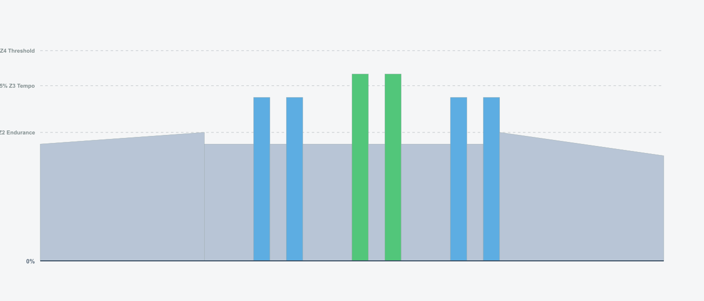
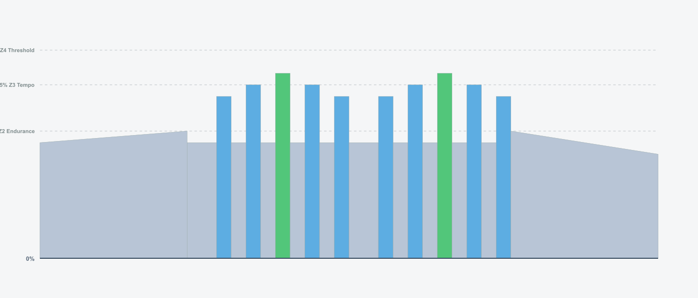
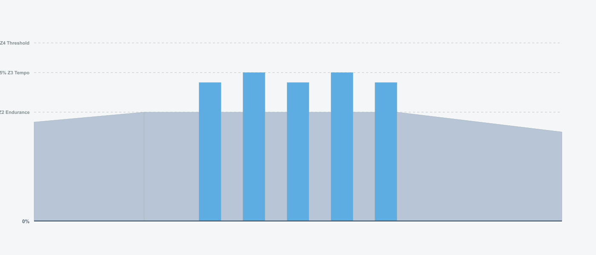
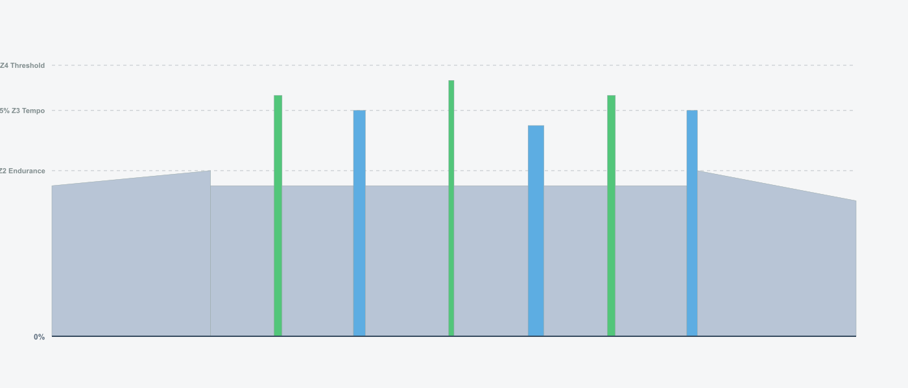

# Recovery Workouts

Bonus recovery workouts that can be used as alternatives to standard recovery rides.

## Available Recoveries

### BONUS: Short Bursts Recovery (Variation A)
Active recovery with short varied intensity bursts. Use this as an alternative to any Wednesday recovery ride.



### BONUS: Pyramid Recovery (Variation B)
Recovery ride with pyramid structure. Builds up and down in intensity. Alternative recovery workout.



### BONUS: High Cadence Recovery (Variation C)
Recovery focused on high cadence technique. Perfect for developing smooth pedaling. Alternative recovery workout.



### BONUS: Fun Recovery Ride (Variation D)
Playful recovery with random bursts. Keeps recovery interesting and engaging. Alternative recovery workout.



## Usage

Generate the ZWO files by running:
```bash
npx tsx programs/recoveries/recoveries.ts
```

The workout files will be created in `programs/recoveries/zwo_files/` and can be imported directly into Zwift.
